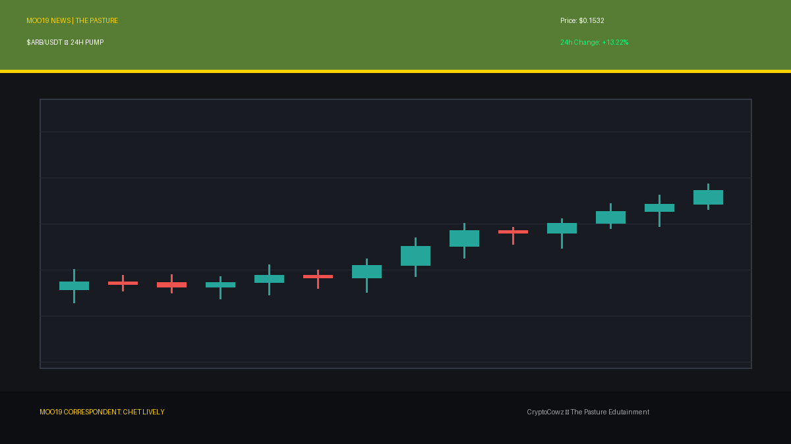
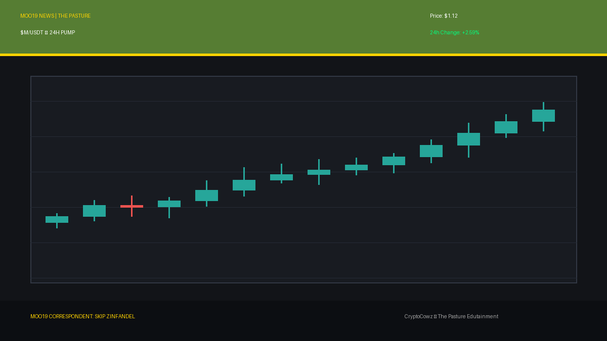
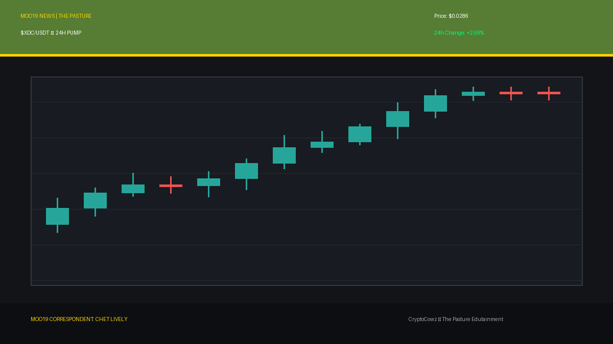
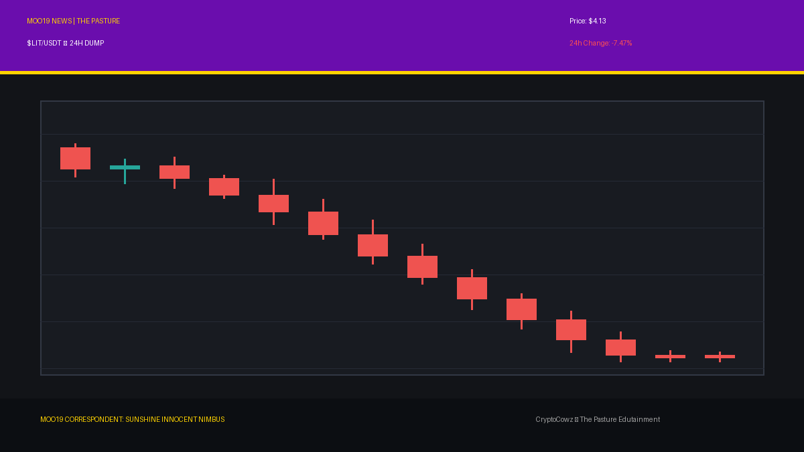
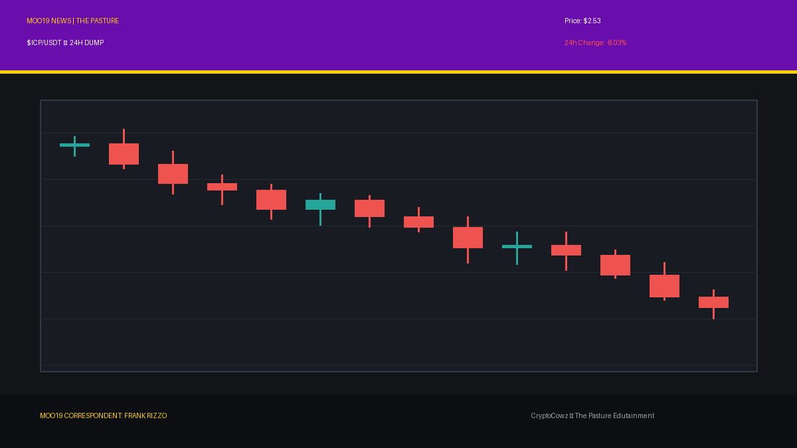
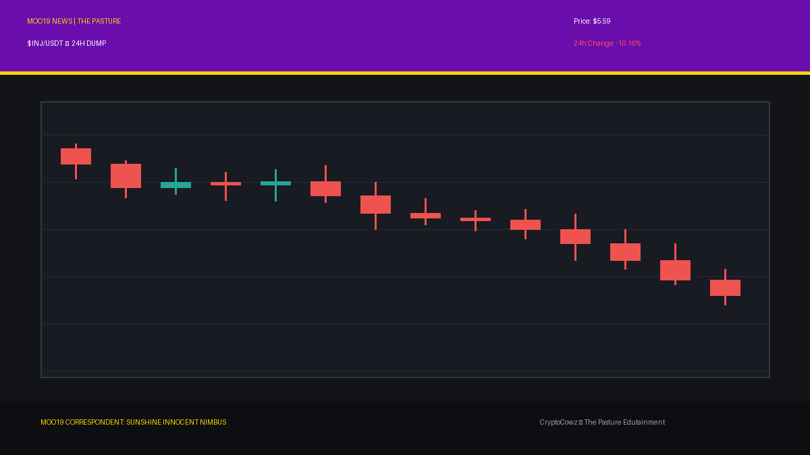

# Daily Top Movers: CMC Community Posts & Visuals

## 1. Akedo ($AKE) — 80.03% (PUMP)
**Cast Member:** Skip Zinfandel
**CMC Comment:** 80% up in a single day! My pompadour isn't the only thing defying gravity tonight. AKE is smashing through resistance levels faster than I dodge personal accountability!

**Google Flow / Scene Prompt:**
> Clean 2D vector animation style with bold outlines and flat cel shading featuring Skip Zinfandel, a smug news anchor cow with a flawless pompadour, standing in front of a giant high-tech broadcast screen in royal purple (#6A0DAD) and pasture green (#567D33) colors. The broadcast display prominently shows tall, glowing green candlestick bars breaking upward through a resistance line for AKE with a large green arrow pointing up.

---

## 2. Arbitrum ($ARB) — 13.22% (PUMP)
**Cast Member:** Chet Lively
**CMC Comment:** Arbitrum surges 13%! That layer-2 sprint is looking cleaner than a textbook playbook executed in overtime, folks!

**Google Flow / Scene Prompt:**
> Clean 2D vector animation style with bold outlines and flat cel shading featuring Chet Lively, an enthusiastic sports anchor cow wearing a headset, gesturing in front of a massive high-tech stadium broadcast screen. The screen prominently displays tall, glowing green candlestick bars breaking upward through a resistance line labeled ARB with a green upward arrow, styled in corporate lavender (#9F86C0) and pasture green (#567D33).

---

## 3. JUST ($JST) — 2.85% (PUMP)
**Cast Member:** VOLA
**CMC Comment:** JUST metrics indicate a 2.85% upward movement. Optimization protocols suggest modest satisfaction. Do not question the algorithm.

**Google Flow / Scene Prompt:**
> Clean 2D vector animation style with bold outlines and flat cel shading featuring VOLA, a futuristic corporate AI cow CEO with glowing visor, standing beside a high-tech holographic broadcast screen. The display prominently shows glowing green candlestick bars breaking upward through a resistance line for JST with an upward arrow, rendered in pasture green (#567D33) and royal purple (#6A0DAD).

---

## 4. MemeCore ($M) — 2.59% (PUMP)
**Cast Member:** Skip Zinfandel
**CMC Comment:** MemeCore up 2.59%! Is it utility? Is it pure unadulterated hype? Who cares, as long as the green lights match my silk tie!

**Google Flow / Scene Prompt:**
> Clean 2D vector animation style with bold outlines and flat cel shading featuring Skip Zinfandel on the MOO19 news desk, smirking beside a large high-tech broadcast screen. The display shows tall glowing green candlestick bars breaking upward through a resistance line for token M with a bright green arrow pointing up, accented in corporate lavender (#9F86C0) and royal purple (#6A0DAD).

---

## 5. XDC Network ($XDC) — 2.59% (PUMP)
**Cast Member:** Chet Lively
**CMC Comment:** XDC grinding out a 2.59% gain! That's solid defense turning into quick break points on the chart!

**Google Flow / Scene Prompt:**
> Clean 2D vector animation style with bold outlines and flat cel shading featuring Chet Lively pointing aggressively at a massive high-tech studio monitor. The screen prominently displays tall, glowing green candlestick bars breaking upward through a resistance line for XDC with a green arrow pointing up, set in pasture green (#567D33) and royal purple (#6A0DAD).

---

## 6. Lighter ($LIT) — -7.47% (DUMP)
**Cast Member:** Sunshine Innocent Nimbus
**CMC Comment:** Lighter is burning down 7.47%! Absolute despair! The smell of burning portfolios in the morning brings peace to my dark soul.

**Google Flow / Scene Prompt:**
> Clean 2D vector animation style with bold outlines and flat cel shading featuring Sunshine Innocent Nimbus, a goth weather girl cow with black umbrellas and dark lace, standing in front of a weather map radar screen. The monitor prominently displays tall, plunging red candlestick bars dropping off a cliff for LIT, complete with red crash percentages and stormy graphic clouds, styled in royal purple (#6A0DAD) and corporate lavender (#9F86C0).

---

## 7. Rain ($RAIN) — -7.49% (DUMP)
**Cast Member:** Sunshine Innocent Nimbus
**CMC Comment:** Rain dropping 7.49%! How poetic! Downpours of red candles flooding the market with pure, beautiful tragedy!

**Google Flow / Scene Prompt:**
> Clean 2D vector animation style with bold outlines and flat cel shading featuring Sunshine Innocent Nimbus pointing joyously at a stormy weather map radar display. The broadcast monitor shows tall, plunging red candlestick bars dropping off a cliff for RAIN with minus 7.49 percent red crash markers and rain storm overlay graphics, palette set in corporate lavender (#9F86C0) and pasture green (#567D33).

---

## 8. Internet Computer ($ICP) — -8.03% (DUMP)
**Cast Member:** Frank Rizzo
**CMC Comment:** ICP down 8.03%! I'm down here in the dark alleys of crypto, and let me tell ya, these internet computers are getting thrown out with the trash!

**Google Flow / Scene Prompt:**
> Clean 2D vector animation style with bold outlines and flat cel shading featuring Frank Rizzo, a gritty trench-coat reporter cow holding a retro microphone in a dark alley. Next to him is a rugged alley terminal displaying tall, plunging red candlestick bars dropping off a cliff for ICP with red crash percentages and flashing alarm graphics, utilizing royal purple (#6A0DAD) and pasture green (#567D33).

---

## 9. Filecoin ($FIL) — -9.9% (DUMP)
**Cast Member:** Frank Rizzo
**CMC Comment:** Filecoin takes a 9.9% beatdown! Storing data? More like storing massive bags of regret!

**Google Flow / Scene Prompt:**
> Clean 2D vector animation style with bold outlines and flat cel shading featuring Frank Rizzo standing on a gritty street corner holding a microphone beside a street-level broadcast monitor. The display shows tall, plunging red candlestick bars dropping off a cliff for FIL with red crash markers and harsh storm graphics, shaded in pasture green (#567D33) and corporate lavender (#9F86C0).

---

## 10. Injective ($INJ) — -10.16% (DUMP)
**Cast Member:** Sunshine Innocent Nimbus
**CMC Comment:** Injective plunges over 10%! A total eclipse of gains! Beautiful, magnificent, dark chaos in the forecast!

**Google Flow / Scene Prompt:**
> Clean 2D vector animation style with bold outlines and flat cel shading featuring Sunshine Innocent Nimbus happily twirling her dark parasol before a weather map radar screen. The screen prominently shows tall, plunging red candlestick bars dropping off a cliff for INJ with red crash percentages and swirling vortex graphics, colored in royal purple (#6A0DAD) and corporate lavender (#9F86C0).

---
