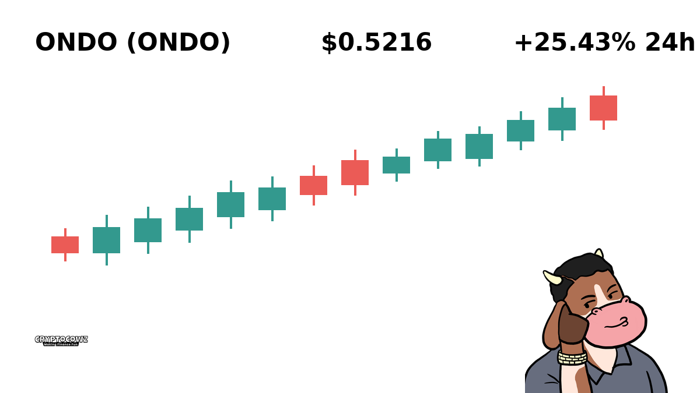
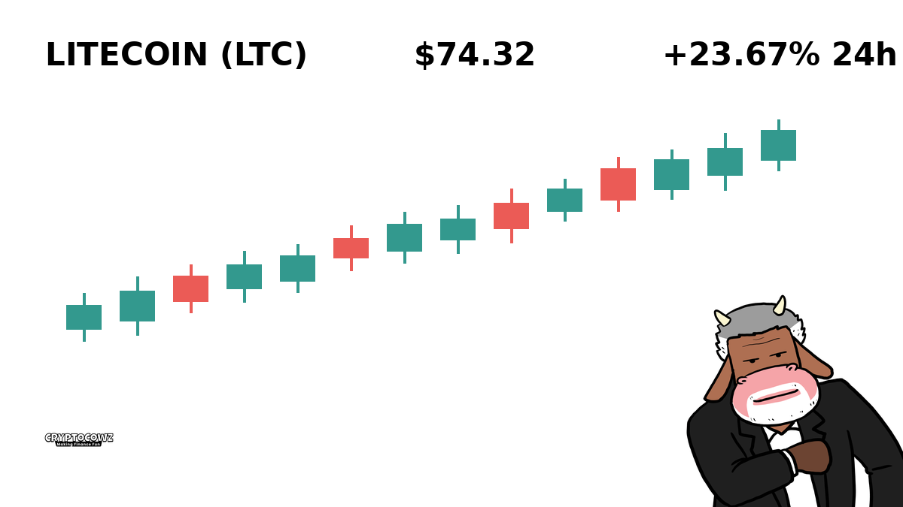
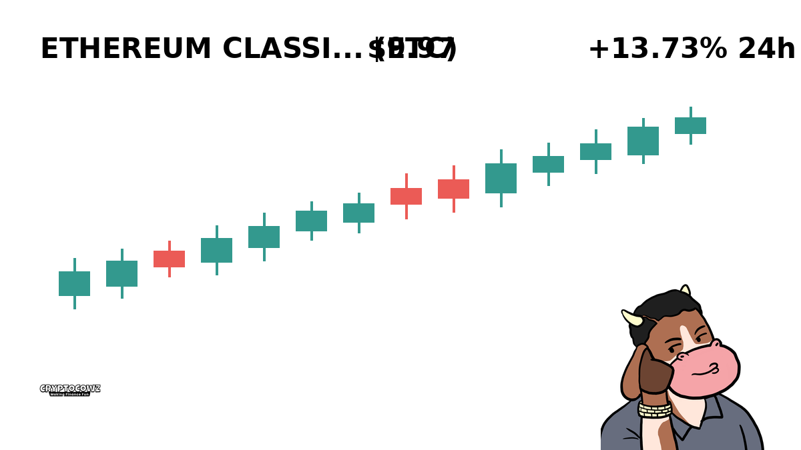
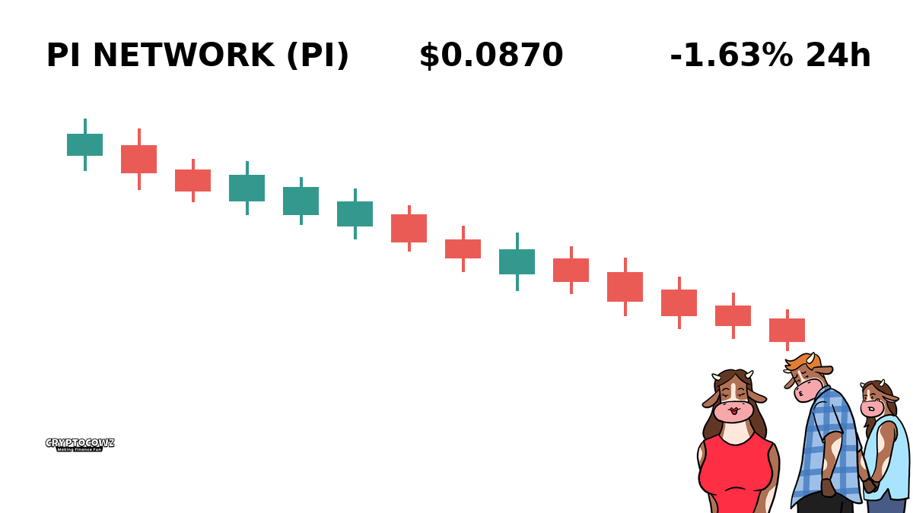
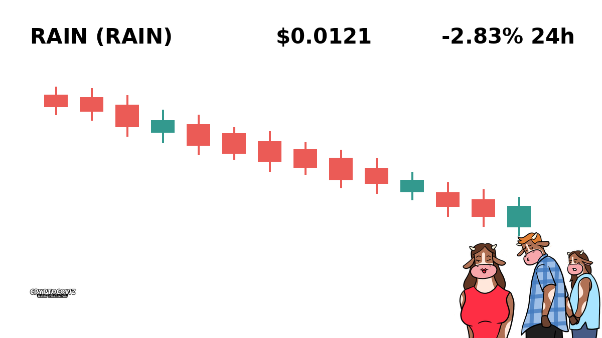
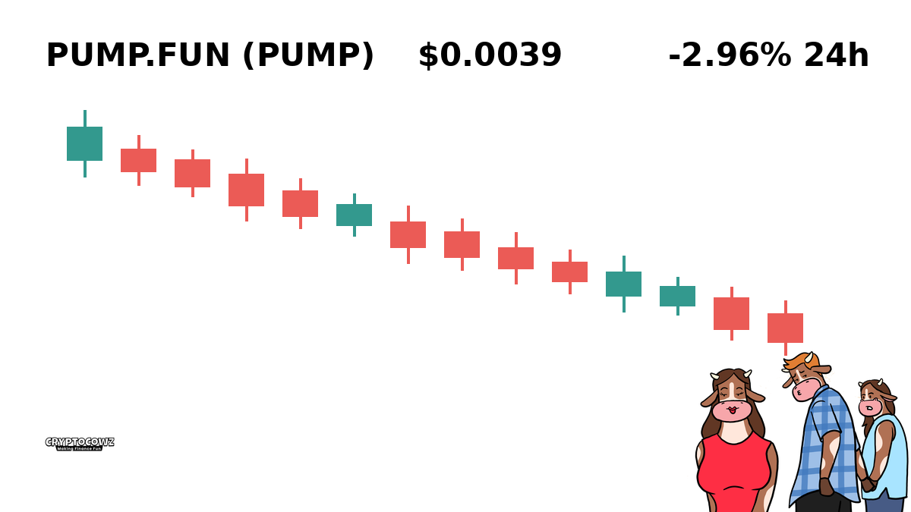
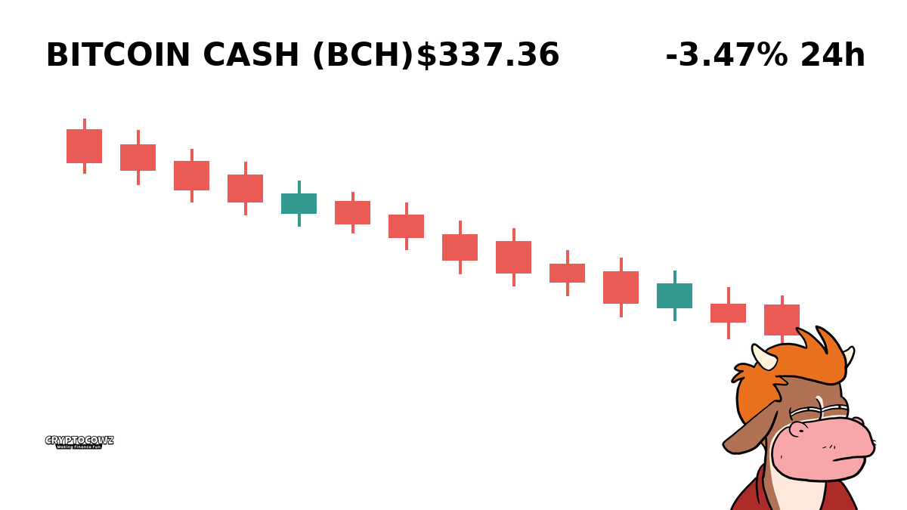

# Daily Top Movers: CMC Community Visuals & Posts

## 1. Ondo ($ONDO) — +25.43% (PUMP)
**Cast Member:** Skip Zinfandel
**CMC Comment:** Just refinanced the farm to ape into ONDO because institutional yield sounds like something my accountant wouldn't yell at me for. Up 25% today and I'm already shopping for luxury tractor accessories!

---

## 2. Litecoin ($LTC) — +23.67% (PUMP)
**Cast Member:** Frank Rizzo
**CMC Comment:** Litecoin rising from the dead like my ex-wife's lawyer requesting another audit! Digital silver is pumping, so I'm cashing out before the grandkids realize I spent their inheritance.

---

## 3. Quant ($QNT) — +18.08% (PUMP)
**Cast Member:** Professor Hartmut
**CMC Comment:** Interoperability theory dictates that an 18% surge is statistically indicative of speculative mania overriding rational valuations. Naturally, I am now double-leveraged.

---

## 4. Ethereum Classic ($ETC) — +13.73% (PUMP)
**Cast Member:** Sunshine Innocent Nimbus
**CMC Comment:** Code is law, sweet babies, and the universe says we are going to the moon on vintage Ethereum! Sending positive aura energy to everyone who held this since 2016!

---

## 5. Injective ($INJ) — +12.13% (PUMP)
**Cast Member:** Skip Zinfandel
**CMC Comment:** Injective is injecting pure adrenaline directly into my liquidity pool! Who needs risk management when green candles look this gorgeous on a chart?

---

## 6. Pi Network ($PI) — -1.63% (DUMP)
**Cast Member:** Frank Rizzo
**CMC Comment:** You spent three years tapping a button on your phone every morning for a coin dumping today? My guy, even my local bodega runs a better loyalty program.

---

## 7. Rain ($RAIN) — -2.83% (DUMP)
**Cast Member:** Sunshine Innocent Nimbus
**CMC Comment:** Oh no, RAIN is falling and it washed away our yield farm profits! Don't worry sweet soul, every storm clears eventually even if your portfolio is a puddle.

---

## 8. Pump.fun ($PUMP) — -2.96% (DUMP)
**Cast Member:** Professor Hartmut
**CMC Comment:** The irony of a token explicitly named PUMP experiencing a downward trajectory is a fascinating study in market psychology. Participants remain thoroughly disappointed.

---

## 9. Bitcoin Cash ($BCH) — -3.47% (DUMP)
**Cast Member:** Frank Rizzo
**CMC Comment:** Bitcoin Cash dropping again? I told Tony down at the docks that Satoshi's real vision wasn't bagholding through a red Wednesday!

---

## 10. Akedo ($AKE) — -6.93% (DUMP)
**Cast Member:** Skip Zinfandel
**CMC Comment:** Down nearly 7% in a single day? Looks like my high-conviction Akedo play just instantly pivoted into a long-term tax-loss harvesting strategy!

---
