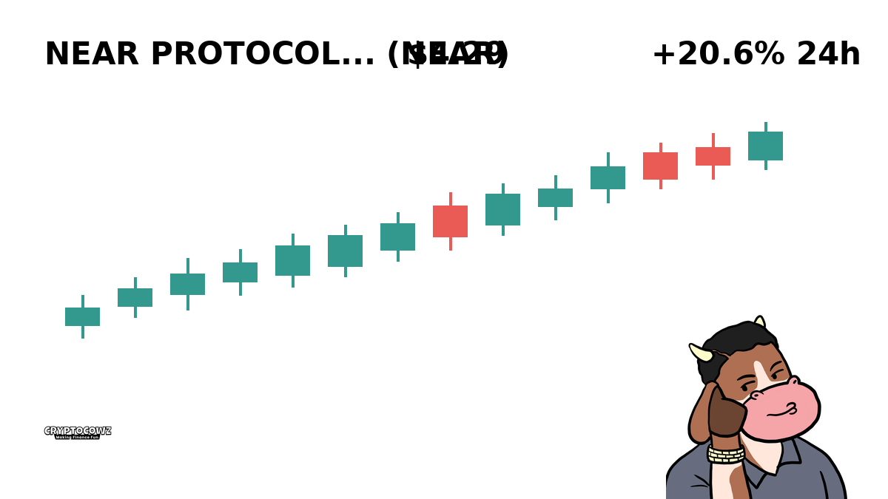
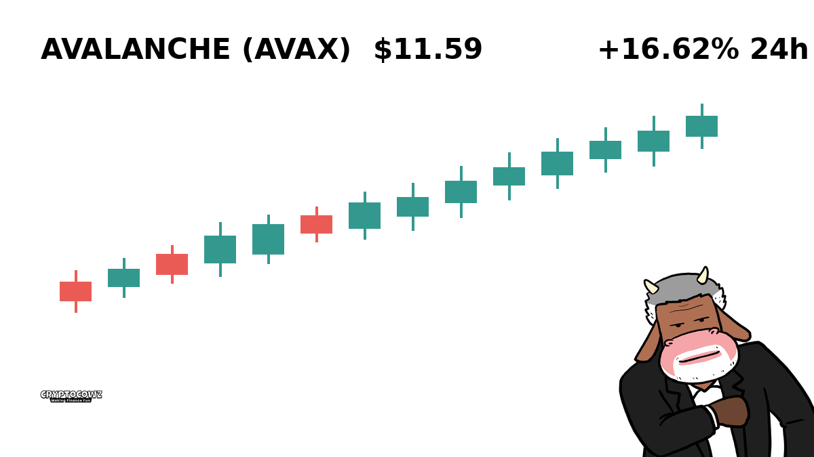
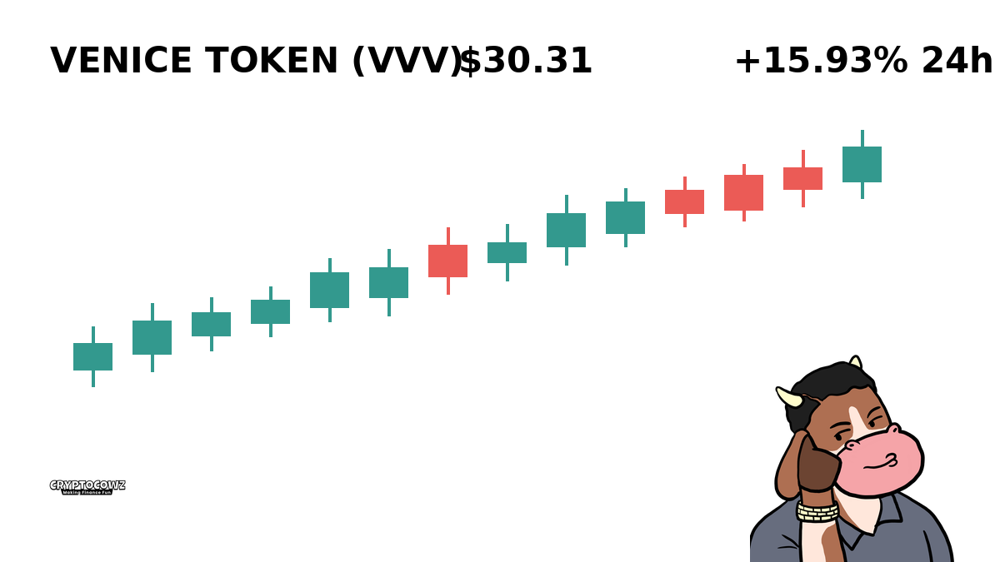
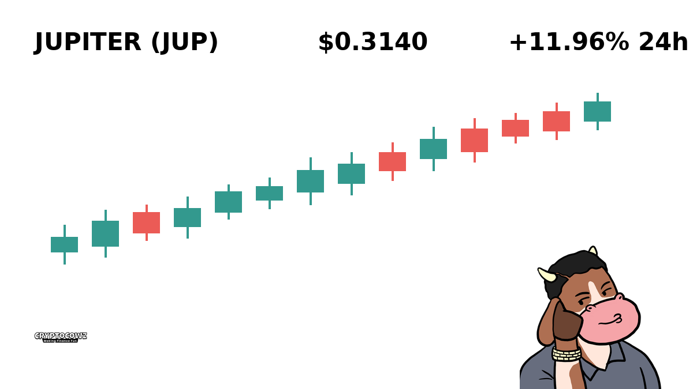
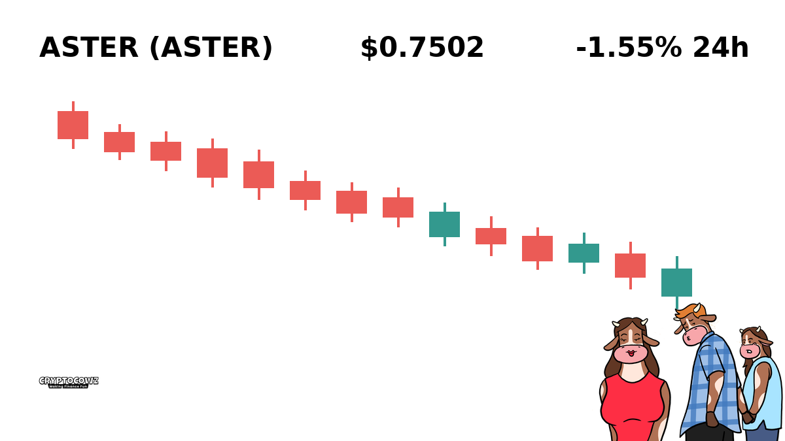
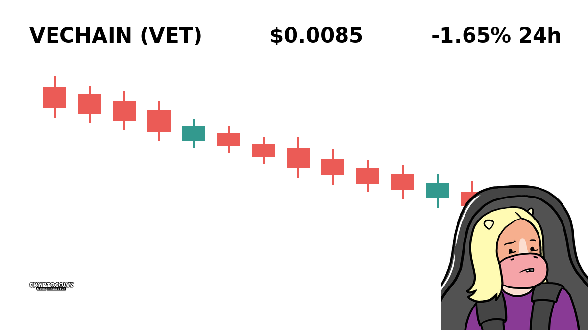
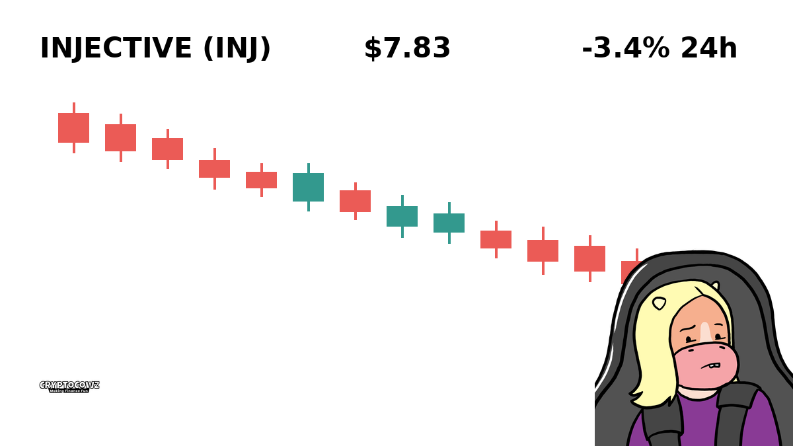

# Daily Top Movers: CMC Community Visuals & Posts

## 1. Bitway ($BTW) — +24.51% (PUMP)
**Cast Member:** Skip Zinfandel
**CMC Comment:** Just quit my job as a barista because my BTW bag pumped 24 percent, time to lease a Lambo in electric lime.

---

## 2. NEAR Protocol ($NEAR) — +20.6% (PUMP)
**Cast Member:** Sunshine Innocent Nimbus
**CMC Comment:** The universe is aligning and NEAR is shooting straight to the sky, sending pure green candle blessings to all of us!

---

## 3. Avalanche ($AVAX) — +16.62% (PUMP)
**Cast Member:** Frank Rizzo
**CMC Comment:** Listen to me, you buy AVAX right now or you sit there crying while I eat caviar on my new speedboat.

---

## 4. Venice Token ($VVV) — +15.93% (PUMP)
**Cast Member:** Professor Hartmut
**CMC Comment:** Empirical observation confirms that VVV is undergoing an acute episode of parabolic retail mania defying logical asset valuation.

---

## 5. Jupiter ($JUP) — +11.96% (PUMP)
**Cast Member:** Skip Zinfandel
**CMC Comment:** JUP is escaping planetary gravity today boys, we are all about to buy our own private islands!

---

## 6. Aster ($ASTER) — -1.55% (DUMP)
**Cast Member:** Frank Rizzo
**CMC Comment:** Down over one percent and people are already dumping like the sky is falling, absolute pathetic cowards.

---

## 7. VeChain ($VET) — -1.65% (DUMP)
**Cast Member:** Professor Hartmut
**CMC Comment:** Statistical analysis indicates VET bagholders are entering phase two of market grief, commonly known as acute denial.

---

## 8. JUST ($JST) — -2.53% (DUMP)
**Cast Member:** Sunshine Innocent Nimbus
**CMC Comment:** This little downward slope on JST is just the market giving us a gentle cosmic hug to test our inner strength.

---

## 9. Injective ($INJ) — -3.4% (DUMP)
**Cast Member:** Skip Zinfandel
**CMC Comment:** Panic sold my INJ bag at a loss so I can make rent on my studio apartment this month.

---

## 10. Akedo ($AKE) — -18.19% (DUMP)
**Cast Member:** Frank Rizzo
**CMC Comment:** Eighteen percent down in twenty four hours is not a correction, it is a certified financial disaster scene.

---
