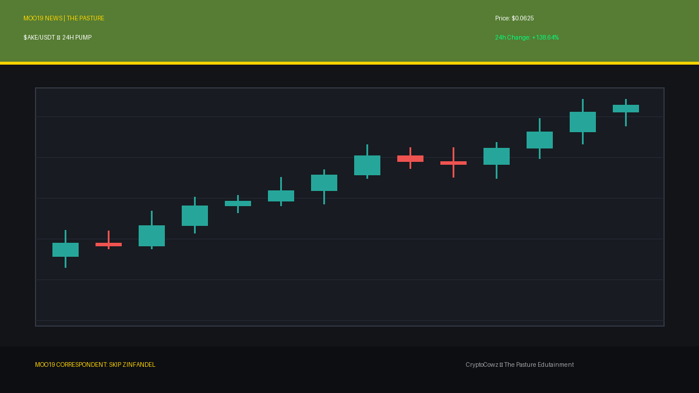
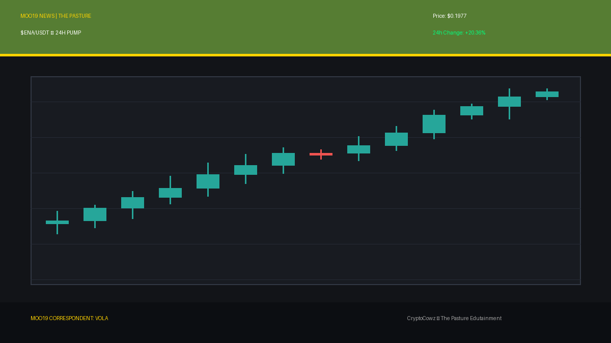
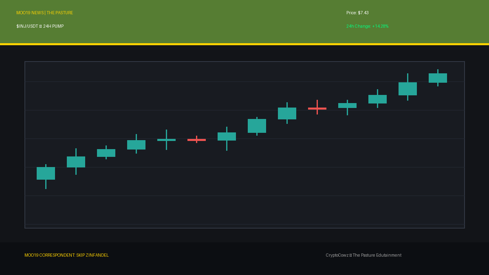
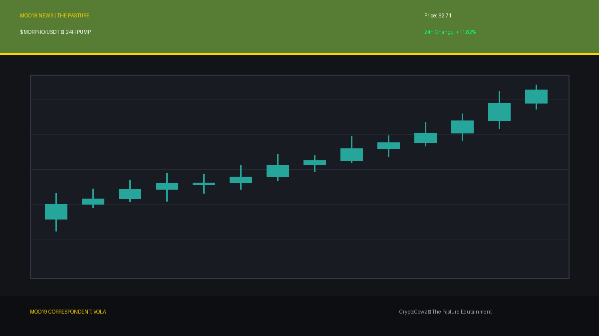
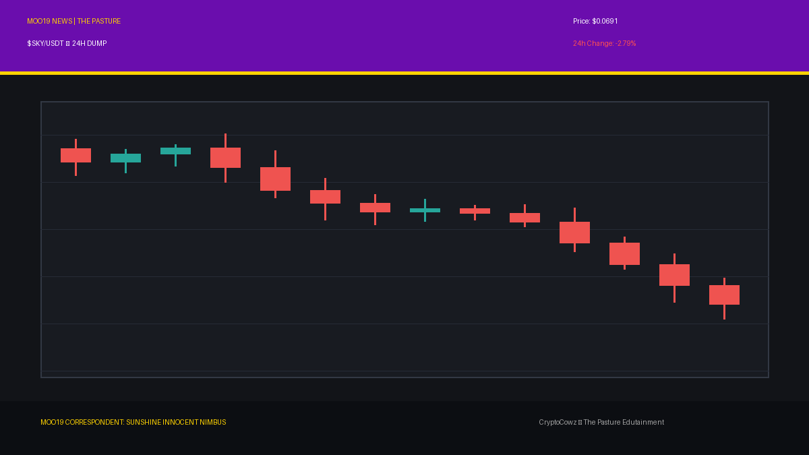
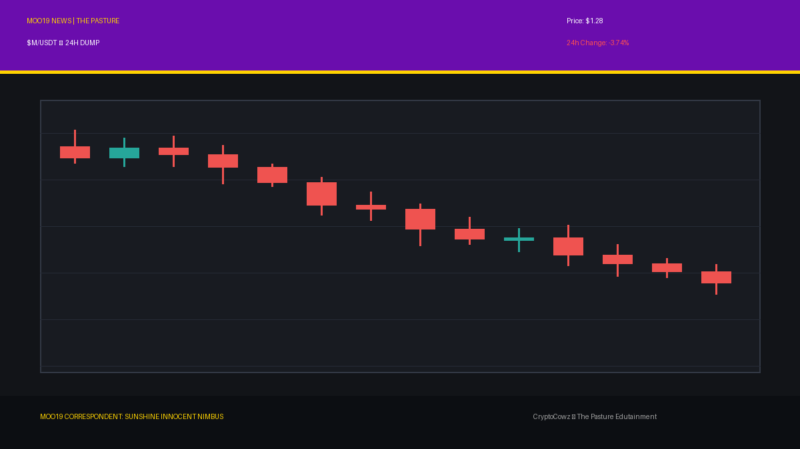

# Daily Top Movers: CMC Community Posts & Visuals

## 1. Akedo ($AKE) — 138.64% (PUMP)
**Cast Member:** Skip Zinfandel
**CMC Comment:** Akedo is up a staggering 138%! My hairspray couldn't even hold a pump this massive, ladies and gentlemen!

**Google Flow / Scene Prompt:**
> A clean 2D vector animation style drawing with bold outlines and flat cel shading featuring Skip Zinfandel, a smug news anchor with a magnificent pompadour, standing in the MOO19 newsroom studio. In the background, a giant high-tech broadcast screen shows tall, glowing green candlestick bars breaking upward through a resistance line, with the token symbol AKE and an arrow pointing up. The scene incorporates CryptoCowz brand colors like pasture green #567D33 and royal purple #6A0DAD.

---

## 2. Ethena ($ENA) — 20.36% (PUMP)
**Cast Member:** VOLA
**CMC Comment:** Processing Ethena gains at +20.36%. Corporate efficiency metrics dictate immediate algorithmic optimization of synthetic yields.

**Google Flow / Scene Prompt:**
> A clean 2D vector animation style illustration with bold outlines and flat cel shading featuring VOLA, a sleek corporate AI CEO character in a futuristic newsroom. Beside her, a giant high-tech broadcast screen shows tall, glowing green candlestick bars breaking upward through a resistance line, with the token symbol ENA and a massive green arrow pointing up. Palette features pasture green #567D33 and corporate lavender #9F86C0.

---

## 3. Avalanche ($AVAX) — 15.53% (PUMP)
**Cast Member:** Chet Lively
**CMC Comment:** Avalanche is sliding up the mountain by 15.53%! That's what I call an inverted landslide, sports fans!

**Google Flow / Scene Prompt:**
> A clean 2D vector animation style image with bold outlines and flat cel shading showing Chet Lively, an enthusiastic sports anchor with a microphone in the MOO19 news studio. In the background, a huge digital broadcast screen displays tall, glowing green candlestick bars breaking upward through a resistance line, labeled with the token symbol AVAX and an upward green arrow. Styled in pasture green #567D33 and royal purple #6A0DAD.

---

## 4. Injective ($INJ) — 14.28% (PUMP)
**Cast Member:** Skip Zinfandel
**CMC Comment:** Injective is injecting pure adrenaline into portfolio balances today! Absolutely pristine green gains!

**Google Flow / Scene Prompt:**
> A clean 2D vector animation style drawing with bold outlines and flat cel shading of Skip Zinfandel flashing a confident smile in a newsroom setting. Behind him, a large, prominent digital candlestick chart display showcases tall, glowing green candlestick bars breaking upward through a resistance line, marked with the INJ token symbol and a rising arrow. Styled with royal purple #6A0DAD and pasture green #567D33.

---

## 5. Morpho ($MORPHO) — 11.82% (PUMP)
**Cast Member:** VOLA
**CMC Comment:** Morpho protocol scaling detected at +11.82%. Re-allocating yield parameters for maximum corporate synergy.

**Google Flow / Scene Prompt:**
> A clean 2D vector animation style graphic with bold outlines and flat cel shading featuring VOLA in a high-tech corporate news studio. Next to her, a giant broadcast screen displays tall, glowing green candlestick bars breaking upward through a resistance line with the MORPHO symbol and a bright green arrow pointing up. Styled in corporate lavender #9F86C0 and pasture green #567D33.

---

## 6. Sky ($SKY) — -2.79% (DUMP)
**Cast Member:** Sunshine Innocent Nimbus
**CMC Comment:** A gentle drizzle of red for Sky today! Oh, I do love when the heavens fall just a tiny bit!

**Google Flow / Scene Prompt:**
> A clean 2D vector animation style illustration with bold outlines and flat cel shading depicting Sunshine Innocent Nimbus, a gothic weather presenter with dark hair and pale skin, smiling cheerfully. Behind her, a weather map radar screen displays tall, plunging red candlestick bars dropping off a cliff with SKY symbol, red crash percentages, and stormy graphics. Styled in royal purple #6A0DAD and dark accents.

---

## 7. NEAR Protocol ($NEAR) — -3.44% (DUMP)
**Cast Member:** Frank Rizzo
**CMC Comment:** NEAR took a hit on the block today down 3.44%. The streets don't give a damn about your smart contracts, pal.

**Google Flow / Scene Prompt:**
> A clean 2D vector animation style drawing with bold outlines and flat cel shading featuring Frank Rizzo, a gritty street reporter in a worn trench coat holding a vintage microphone in a rainy alleyway. Next to him, a gritty alley terminal shows tall, plunging red candlestick bars dropping off a cliff, complete with NEAR token text, red crash percentages, and stormy graphics. Uses pasture green #567D33 and royal purple #6A0DAD.

---

## 8. MemeCore ($M) — -3.74% (DUMP)
**Cast Member:** Sunshine Innocent Nimbus
**CMC Comment:** MemeCore is wilting! Watching the memes crumble brings such a delightful chill to my gloomy heart!

**Google Flow / Scene Prompt:**
> A clean 2D vector animation style picture with bold outlines and flat cel shading showing Sunshine Innocent Nimbus pointing joyfully at a storm radar screen. The display features tall, plunging red candlestick bars dropping off a cliff with the token symbol M, negative percentage indicators, and dark stormy weather icons. Rendered in corporate lavender #9F86C0 and deep purple tones.

---

## 9. Pump.fun ($PUMP) — -4.12% (DUMP)
**Cast Member:** Frank Rizzo
**CMC Comment:** Irony on the asphalt! Pump.fun is dumping 4.12%. You can't make this stuff up out here in the gutter!

**Google Flow / Scene Prompt:**
> A clean 2D vector animation style art piece with bold outlines and flat cel shading featuring Frank Rizzo standing on a wet city street corner. Beside him, a street terminal monitor exhibits tall, plunging red candlestick bars dropping off a cliff, labeled PUMP with red crash percentages and stormy graphics. Styled in pasture green #567D33 and royal purple #6A0DAD.

---

## 10. Bitway ($BTW) — -14.85% (DUMP)
**Cast Member:** Sunshine Innocent Nimbus
**CMC Comment:** Bitway dropped nearly 15%! What a glorious, pitch-black catastrophe! I'm absolutely dancing in this monsoon!

**Google Flow / Scene Prompt:**
> A clean 2D vector animation style illustration with bold outlines and flat cel shading of Sunshine Innocent Nimbus twirling happily in front of a giant weather radar broadcast screen. The screen shows tall, plunging red candlestick bars dropping off a cliff with BTW symbol, -14.85% crash graphics, and violent lightning icons. Palette uses royal purple #6A0DAD and dark shades.

---
