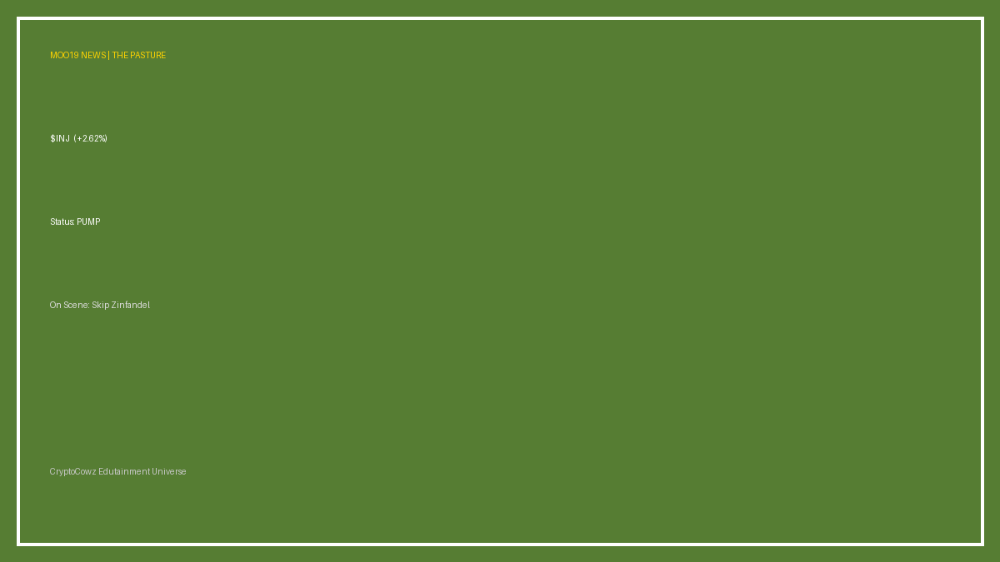
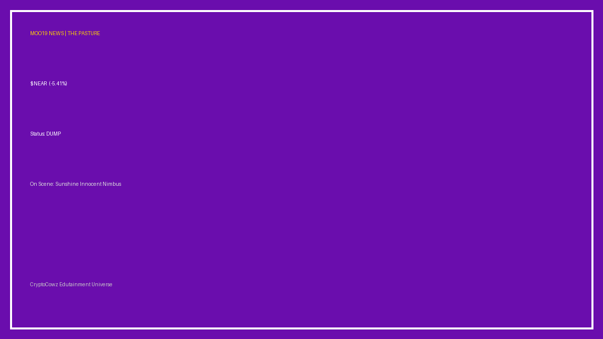

# Daily Top Movers: CMC Community Posts & Visuals

## 1. Bitway ($BTW) — 24.14% (PUMP)
**Cast Member:** Chet Lively
**CMC Comment:** Chet Lively here! Bitway just smashed through defenders with a massive 24% run up the middle! The crowd is going wild as BTW scores a touchdown for green candles!

**Google Flow / Scene Prompt:**
> 2D clean cartoon illustration in The Pasture animation style featuring sports anchor Chet Lively holding a foam finger in front of a green sports scoreboard showing BTW +24.14%, accented with Pasture green (#567D33).

---

## 2. Filecoin ($FIL) — 18.06% (PUMP)
**Cast Member:** VOLA
**CMC Comment:** Processing data storage surge. Filecoin decentralization efficiency increased by 18.06%. Synergistic ROI maximized for high-density node operators.

**Google Flow / Scene Prompt:**
> 2D clean cartoon illustration in The Pasture animation style featuring corporate AI CEO VOLA pointing at a glowing digital server rack with Royal Purple (#6A0DAD) accents and floating data charts.

---

## 3. JUST ($JST) — 3.23% (PUMP)
**Cast Member:** Skip Zinfandel
**CMC Comment:** Good evening, I am Skip Zinfandel. JUST creeps up 3.23%, proving that even modest gains look breathtaking when presented with my immaculate hair pompadour.

**Google Flow / Scene Prompt:**
> 2D clean cartoon illustration in The Pasture animation style featuring smug news anchor Skip Zinfandel with a high pompadour sitting behind a news desk, accented with Pasture green (#567D33).

---

## 4. Stable ($STABLE) — 2.95% (PUMP)
**Cast Member:** VOLA
**CMC Comment:** System analysis: Stable demonstrates controlled yield escalation of 2.95%. Volatility suppression protocols functioning within acceptable operational parameters.

**Google Flow / Scene Prompt:**
> 2D clean cartoon illustration in The Pasture animation style featuring corporate AI CEO VOLA holding a holographic clipboard displaying STABLE metrics, accented with Royal Purple (#6A0DAD).

---

## 5. Injective ($INJ) — 2.62% (PUMP)
**Cast Member:** Skip Zinfandel
**CMC Comment:** Injective gains 2.62%! While the peasants celebrate pennies, I celebrate the sheer elegance of upward momentum on my bespoke tailored suit.

**Google Flow / Scene Prompt:**
> 2D clean cartoon illustration in The Pasture animation style featuring smug news anchor Skip Zinfandel adjusting his tie in front of a news camera, accented with Pasture green (#567D33).

---

## 6. Dash ($DASH) — -5.12% (DUMP)
**Cast Member:** Frank Rizzo
**CMC Comment:** Frank Rizzo reporting live from the alleyway! Dash lived up to its name and sprinted away from gains today, dropping over 5%. I haven't seen a drop this fast since my last trench coat fell off a truck.

**Google Flow / Scene Prompt:**
> 2D clean cartoon illustration in The Pasture animation style featuring gritty street reporter Frank Rizzo in a trench coat holding a vintage microphone on a dark rainy street corner with Royal Purple (#6A0DAD) neon signs.

---

## 7. NEAR Protocol ($NEAR) — -5.41% (DUMP)
**Cast Member:** Sunshine Innocent Nimbus
**CMC Comment:** Oh delightful disaster! NEAR protocol drops 5.41%! The dark clouds of liquidation are gathering and I am absolutely dancing in the financial rain!

**Google Flow / Scene Prompt:**
> 2D clean cartoon illustration in The Pasture animation style featuring goth weather girl Sunshine Innocent Nimbus holding a black umbrella under a gloomy storm cloud with Royal Purple (#6A0DAD) lightning bolts.

---

## 8. Lighter ($LIT) — -5.48% (DUMP)
**Cast Member:** Frank Rizzo
**CMC Comment:** Rizzo here! Looks like Lighter just blew out its own flame, taking a 5.48% dive into the gutter. Back to you in the studio where it's hopefully less slippery!

**Google Flow / Scene Prompt:**
> 2D clean cartoon illustration in The Pasture animation style featuring street reporter Frank Rizzo standing in front of a smoking dump truck with Pasture green (#567D33) broadcast graphics.

---

## 9. Venice Token ($VVV) — -8.56% (DUMP)
**Cast Member:** Sunshine Innocent Nimbus
**CMC Comment:** Venice Token is sinking faster than a gondola full of lead bricks, down 8.56%! Grab your tragic despair gear, storm lovers!

**Google Flow / Scene Prompt:**
> 2D clean cartoon illustration in The Pasture animation style featuring goth weather girl Sunshine Innocent Nimbus pointing at a severe red weather map with gloom accents and Royal Purple (#6A0DAD).

---

## 10. Ether.fi ($ETHFI) — -15.07% (DUMP)
**Cast Member:** Sunshine Innocent Nimbus
**CMC Comment:** Absolute weather catastrophe! Ether.fi plummets a glorious 15.07%! Tears of liquidators are my favorite afternoon drizzle!

**Google Flow / Scene Prompt:**
> 2D clean cartoon illustration in The Pasture animation style featuring goth weather girl Sunshine Innocent Nimbus smiling joyfully in front of a chaotic red storm forecast map with Royal Purple (#6A0DAD) highlights.

---
