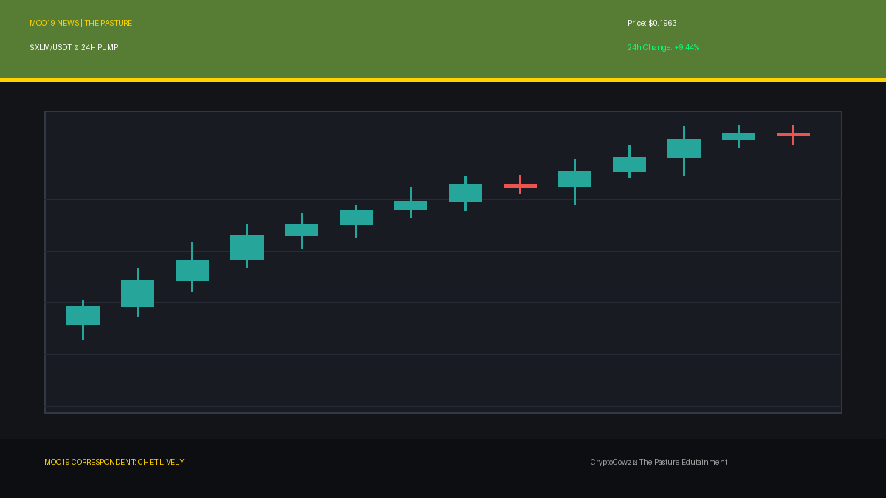
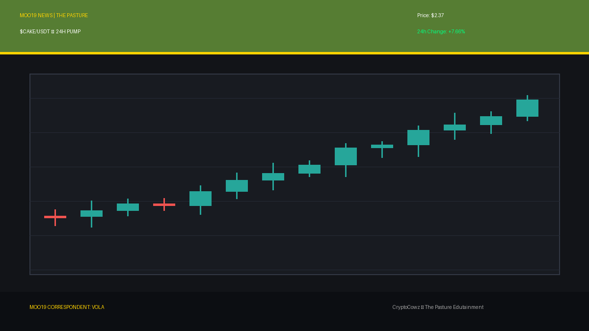
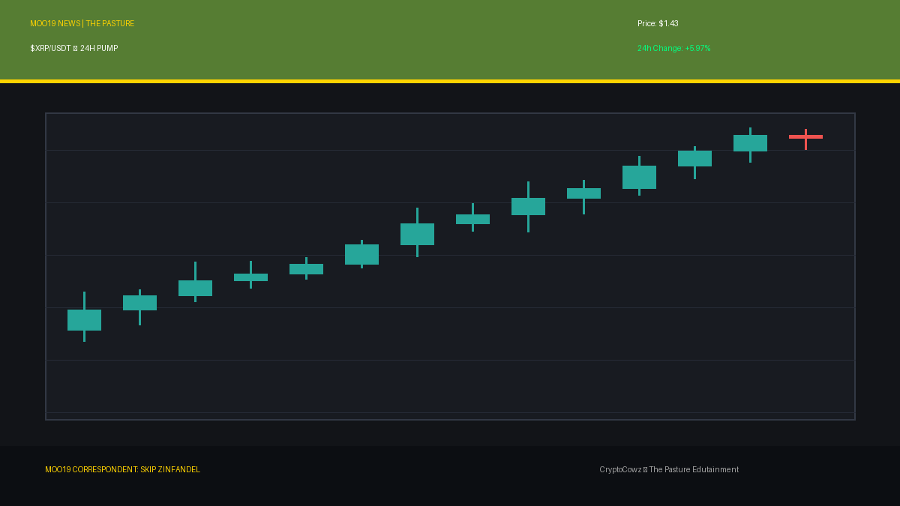
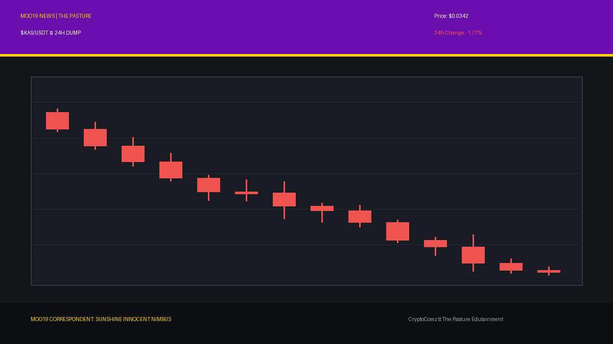
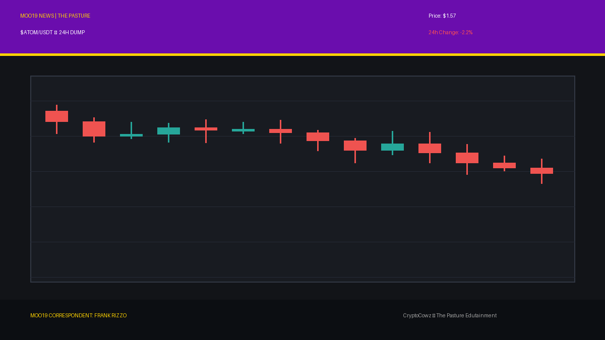
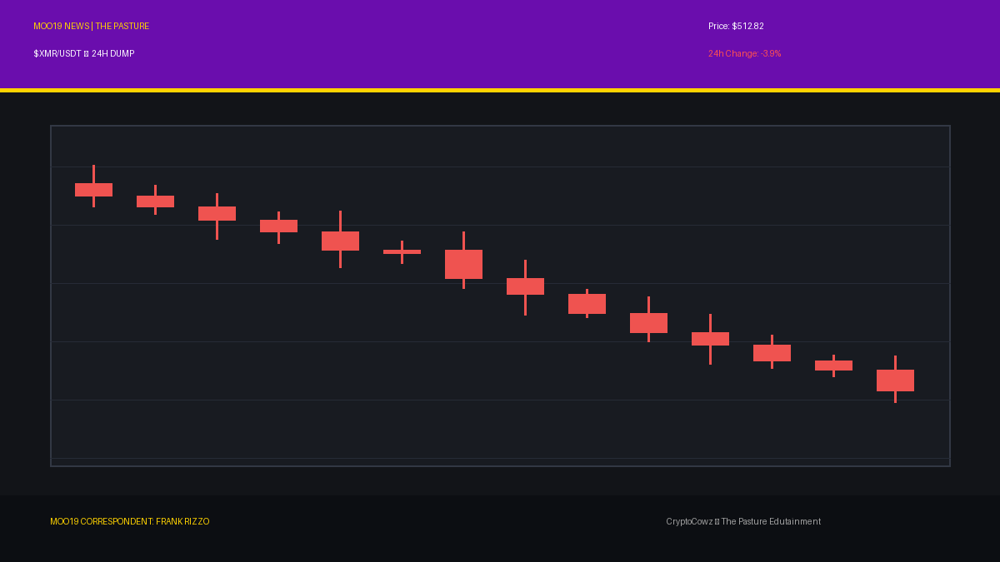
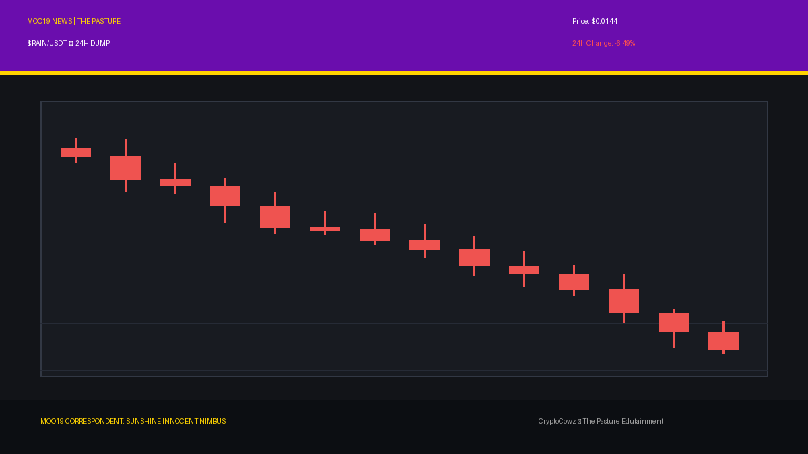

# Daily Top Movers: CMC Community Posts & Visuals

## 1. NEAR Protocol ($NEAR) — 9.53% (PUMP)
**Cast Member:** Skip Zinfandel
**CMC Comment:** NEAR is pumping +9.53%! My hair gel hasn't had this much hold since the 2021 bull run, folks! Sharding never looked so stylish.

**Google Flow / Scene Prompt:**
> 2D vector animation style with bold outlines, flat cel shading. Skip Zinfandel, a smug news anchor with a massive pompadour hairstyle, smiling in front of a giant high-tech broadcast screen showing tall, glowing green candlestick bars breaking upward through a resistance line, with the token symbol NEAR and a green arrow pointing up. Palette includes pasture green #567D33 and royal purple #6A0DAD.

---

## 2. Stellar ($XLM) — 9.44% (PUMP)
**Cast Member:** Chet Lively
**CMC Comment:** Stellar rockets up 9.44%! That's a textbook breakaway play, sports fans! XLM is sprinting past defenders straight into the endzone!

**Google Flow / Scene Prompt:**
> 2D vector animation style with bold outlines, flat cel shading. Chet Lively, an enthusiastic sports anchor with a headset, gesturing wildly in front of a giant high-tech broadcast screen displaying tall, glowing green candlestick bars breaking upward through a resistance line with the token symbol XLM and a green arrow pointing up. Palette features royal purple #6A0DAD and corporate lavender #9F86C0.

---

## 3. PancakeSwap ($CAKE) — 7.66% (PUMP)
**Cast Member:** VOLA
**CMC Comment:** CAKE yield protocol efficiency increased by +7.66%. Processing optimal syrup distribution metrics. Eat the gains, human units.

**Google Flow / Scene Prompt:**
> 2D vector animation style with bold outlines, flat cel shading. VOLA, a corporate AI CEO with a sleek glowing robotic face, standing beside a giant high-tech broadcast screen displaying tall, glowing green candlestick bars breaking upward through a resistance line with the token symbol CAKE and a green upward arrow. Palette includes pasture green #567D33 and corporate lavender #9F86C0.

---

## 4. XRP ($XRP) — 5.97% (PUMP)
**Cast Member:** Skip Zinfandel
**CMC Comment:** XRP up nearly 6%! The lawyers are popping champagne and my pompadour is standing tall! Legal clarity tastes like fine victory, viewers.

**Google Flow / Scene Prompt:**
> 2D vector animation style with bold outlines, flat cel shading. Skip Zinfandel, a smug anchor with a pompadour, pointing to a giant high-tech broadcast screen showing tall, glowing green candlestick bars breaking upward through a resistance line with the token symbol XRP and a green arrow pointing up. Palette features pasture green #567D33 and royal purple #6A0DAD.

---

## 5. Lighter ($LIT) — 4.17% (PUMP)
**Cast Member:** Chet Lively
**CMC Comment:** LIT living up to its name with a solid +4.17% gain! A clutch performance in the fourth quarter for the Lighter squad!

**Google Flow / Scene Prompt:**
> 2D vector animation style with bold outlines, flat cel shading. Chet Lively, a high-energy sports anchor, holding a foam finger in front of a giant high-tech broadcast screen displaying tall, glowing green candlestick bars breaking upward through a resistance line with the token symbol LIT and a green arrow pointing up. Palette features royal purple #6A0DAD and corporate lavender #9F86C0.

---

## 6. Kaspa ($KAS) — -1.77% (DUMP)
**Cast Member:** Sunshine Innocent Nimbus
**CMC Comment:** A delicate -1.77% drizzle on Kaspa today! Isn't the slow descent into dark red so beautiful, dark, and romantic?

**Google Flow / Scene Prompt:**
> 2D vector animation style with bold outlines, flat cel shading. Sunshine Innocent Nimbus, a goth weather girl with dark lipstick and umbrella, standing in front of a weather map radar screen showing tall, plunging red candlestick bars dropping off a cliff, with red crash percentages and stormy graphics with token symbol KAS. Palette includes royal purple #6A0DAD and corporate lavender #9F86C0.

---

## 7. Cosmos Hub ($ATOM) — -2.2% (DUMP)
**Cast Member:** Frank Rizzo
**CMC Comment:** Cosmos is down -2.2%. Out here in the streets, gravity always wins, pal. The hub is leaking grease on the pavement.

**Google Flow / Scene Prompt:**
> 2D vector animation style with bold outlines, flat cel shading. Frank Rizzo, a gritty street reporter in a worn trench coat holding a vintage microphone, standing in a dimly lit alley terminal showing tall, plunging red candlestick bars dropping off a cliff, with red crash percentages and token symbol ATOM. Palette features pasture green #567D33 and corporate lavender #9F86C0.

---

## 8. MemeCore ($M) — -3.51% (DUMP)
**Cast Member:** Sunshine Innocent Nimbus
**CMC Comment:** MemeCore drops -3.51%! Watch the memes wilt like poisoned roses in a lightning storm. Perfection!

**Google Flow / Scene Prompt:**
> 2D vector animation style with bold outlines, flat cel shading. Sunshine Innocent Nimbus, a goth weather girl, pointing happily at a weather map radar display showing tall, plunging red candlestick bars dropping off a cliff, with red crash percentages and stormy graphics featuring token symbol M. Palette includes royal purple #6A0DAD and pasture green #567D33.

---

## 9. Monero ($XMR) — -3.9% (DUMP)
**Cast Member:** Frank Rizzo
**CMC Comment:** Monero slumps -3.9%. Even the privacy guys can't hide from this beatdown in the dark alleys of the blockchain, boss.

**Google Flow / Scene Prompt:**
> 2D vector animation style with bold outlines, flat cel shading. Frank Rizzo, a gritty street reporter in a trench coat, standing in front of an alley terminal displaying tall, plunging red candlestick bars dropping off a cliff, with red crash percentages and token symbol XMR. Palette includes corporate lavender #9F86C0 and pasture green #567D33.

---

## 10. Rain ($RAIN) — -6.49% (DUMP)
**Cast Member:** Sunshine Innocent Nimbus
**CMC Comment:** Rain living up to its name with a lovely -6.49% torrential downpour! Put on your black raincoats, the despair is exquisite!

**Google Flow / Scene Prompt:**
> 2D vector animation style with bold outlines, flat cel shading. Sunshine Innocent Nimbus, a goth weather girl, holding a black lace umbrella in front of a weather map radar showing tall, plunging red candlestick bars dropping off a cliff, with red crash percentages and stormy graphics featuring token symbol RAIN. Palette features royal purple #6A0DAD and corporate lavender #9F86C0.

---
