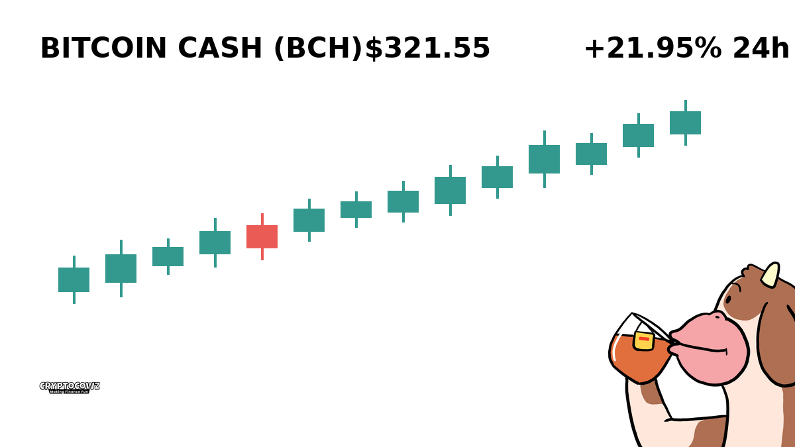
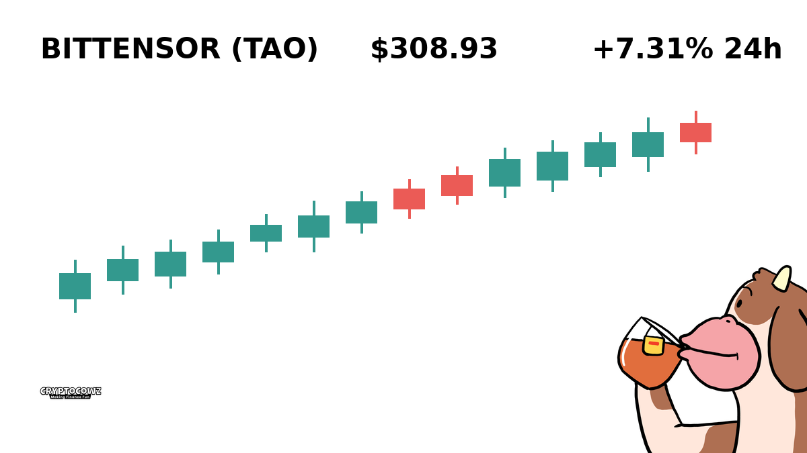
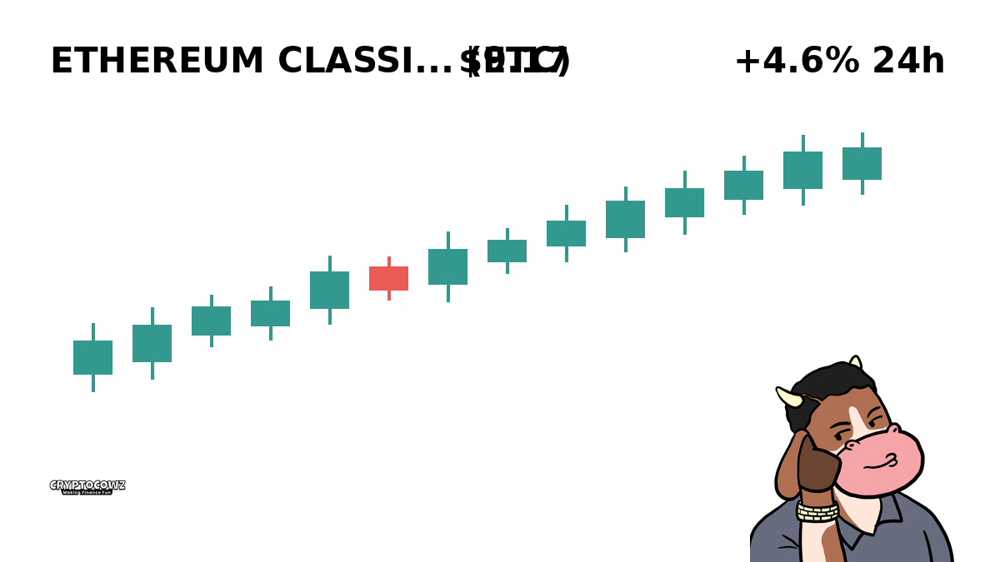
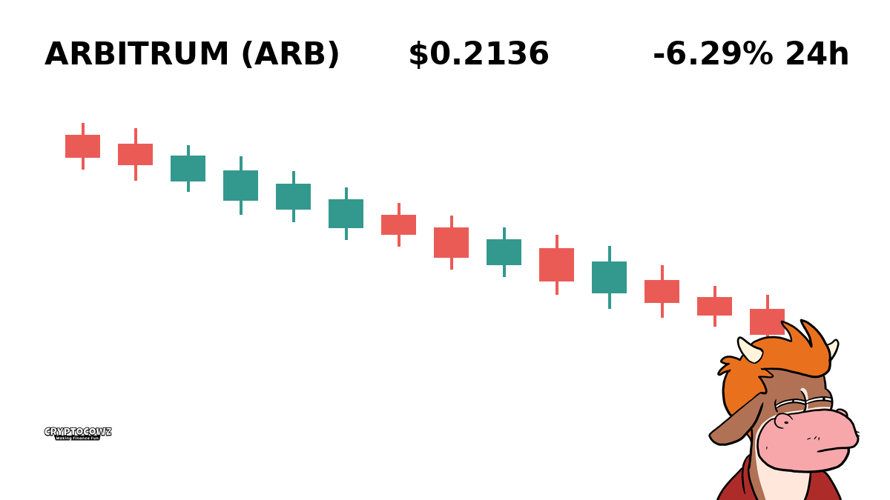
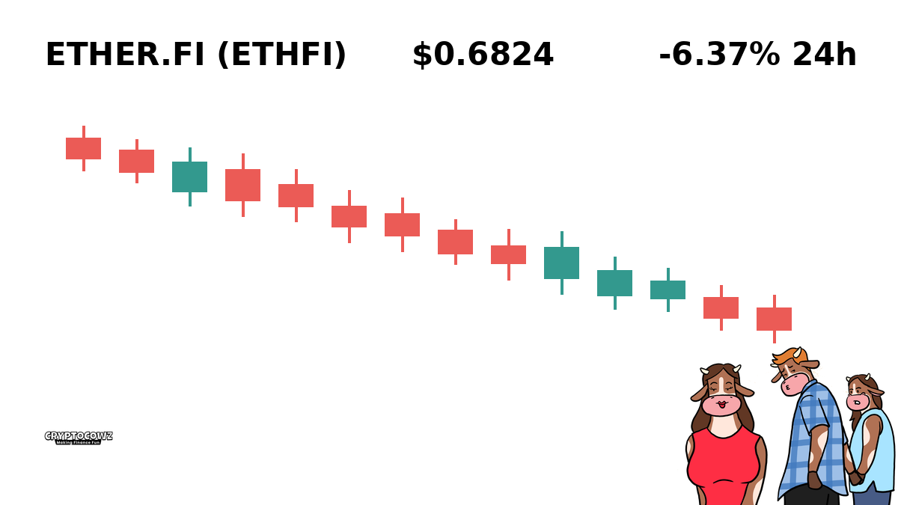
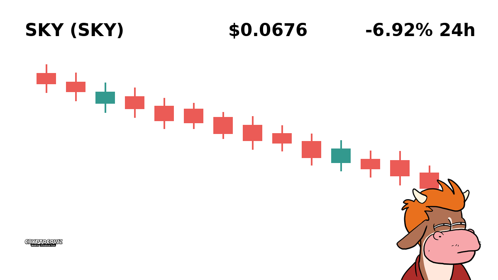
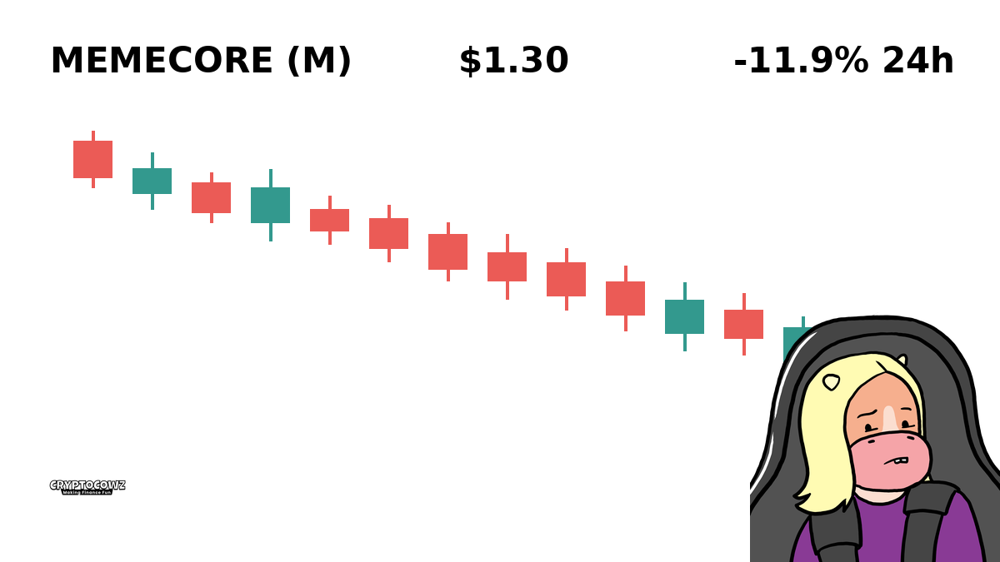

# Daily Top Movers: CMC Community Visuals & Posts

## 1. Bitcoin Cash ($BCH) — +21.95% (PUMP)
**Cast Member:** Skip Zinfandel
**CMC Comment:** Satoshi's real vision just paid for my second jet ski, complete with extra cup holders for core maxi tears.

---

## 2. NEAR Protocol ($NEAR) — +8.5% (PUMP)
**Cast Member:** Professor Hartmut
**CMC Comment:** The algorithmic alignment of user-friendly sharding is finally yielding retail exuberance, or perhaps just another irrational spike.

---

## 3. Quant ($QNT) — +8.04% (PUMP)
**Cast Member:** Frank Rizzo
**CMC Comment:** Interoperability sounds real fancy, but all I know is my leverage position isn't blowing up today.

---

## 4. Bittensor ($TAO) — +7.31% (PUMP)
**Cast Member:** Sunshine Innocent Nimbus
**CMC Comment:** The AI cows are singing in perfect harmony, bringing decentralized intelligence and sweet green candles to the pasture!

---

## 5. Ethereum Classic ($ETC) — +4.6% (PUMP)
**Cast Member:** Skip Zinfandel
**CMC Comment:** Code is law, and the law clearly states I am legally required to pop champagne on every four percent pump.

---

## 6. Arbitrum ($ARB) — -6.29% (DUMP)
**Cast Member:** Frank Rizzo
**CMC Comment:** Layer 2 transaction speed doesn't help when your portfolio value drops straight to zero in record time.

---

## 7. Ether.fi ($ETHFI) — -6.37% (DUMP)
**Cast Member:** Professor Hartmut
**CMC Comment:** Liquid restaking appears to have restaked itself directly into liquid insolvency for late adopters.

---

## 8. Sky ($SKY) — -6.92% (DUMP)
**Cast Member:** Sunshine Innocent Nimbus
**CMC Comment:** The sky isn't falling, it's just offering us a discount on cloud-based hopes and peaceful dreams!

---

## 9. Akedo ($AKE) — -11.09% (DUMP)
**Cast Member:** Frank Rizzo
**CMC Comment:** Down double digits again, time to tell my landlord I am in it strictly for the revolutionary gaming utility.

---

## 10. MemeCore ($M) — -11.9% (DUMP)
**Cast Member:** Skip Zinfandel
**CMC Comment:** Turns out buying a coin named after a single letter was slightly less sophisticated than my financial advisor advised.

---
