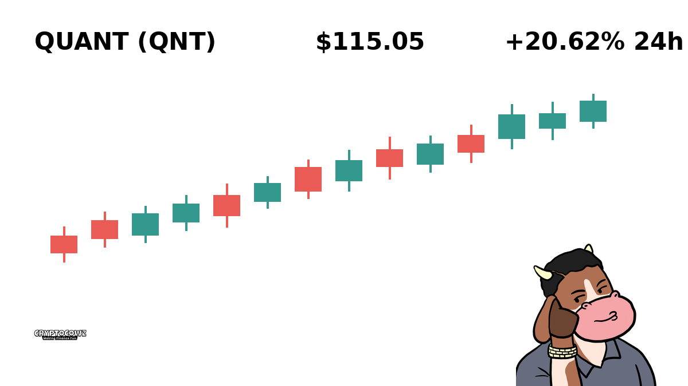
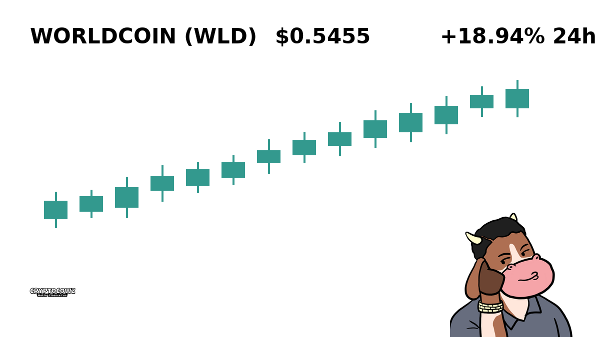
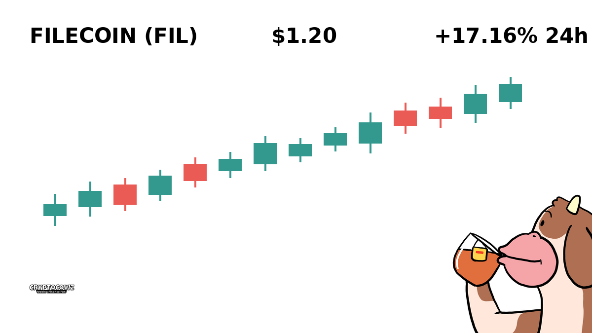
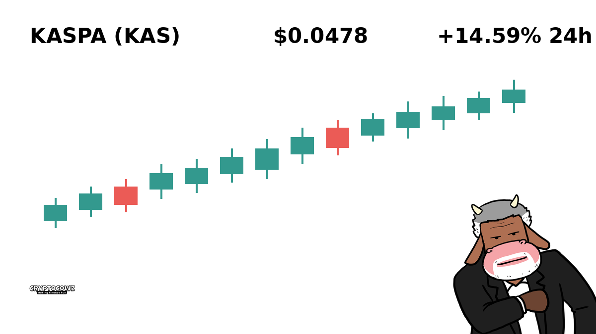
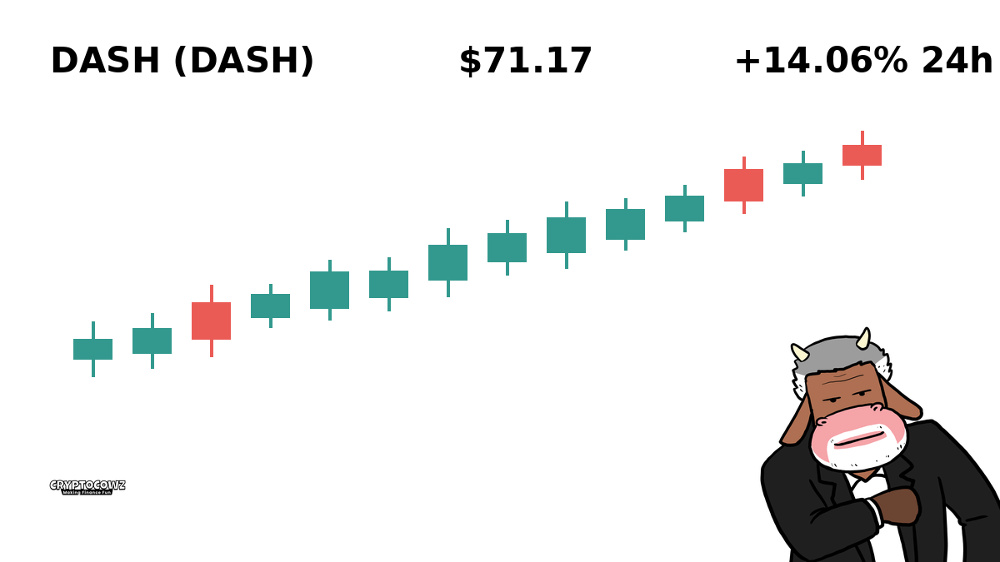
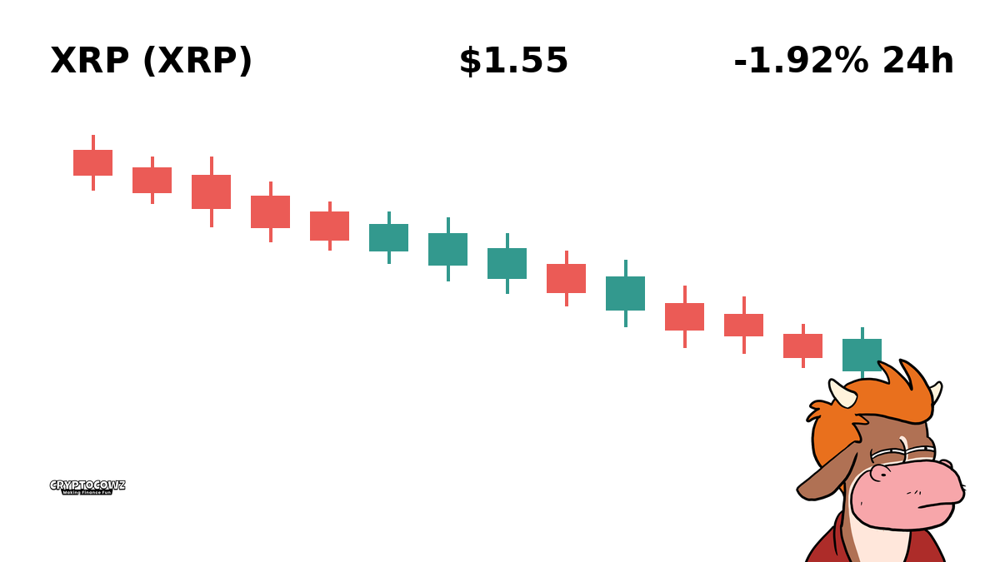
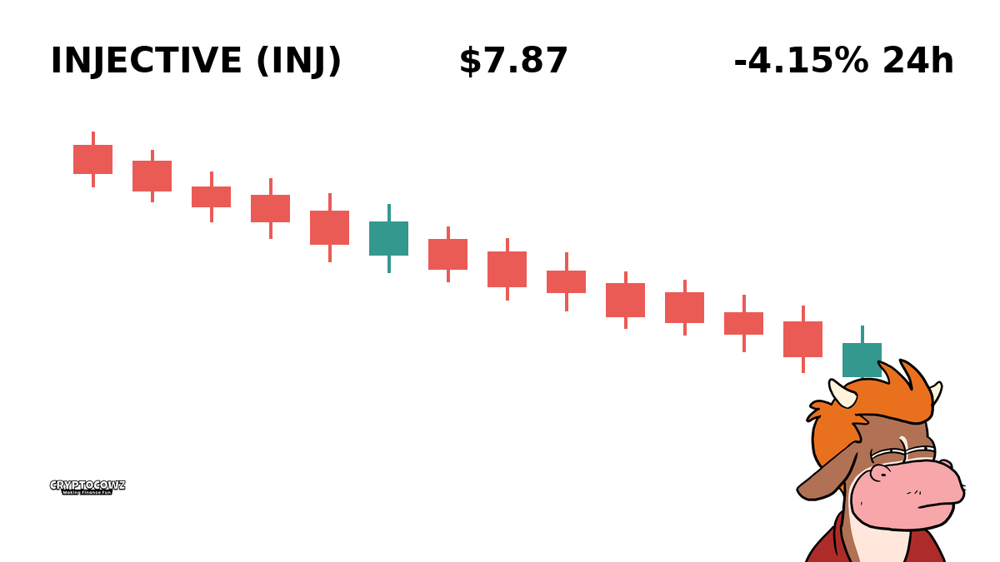
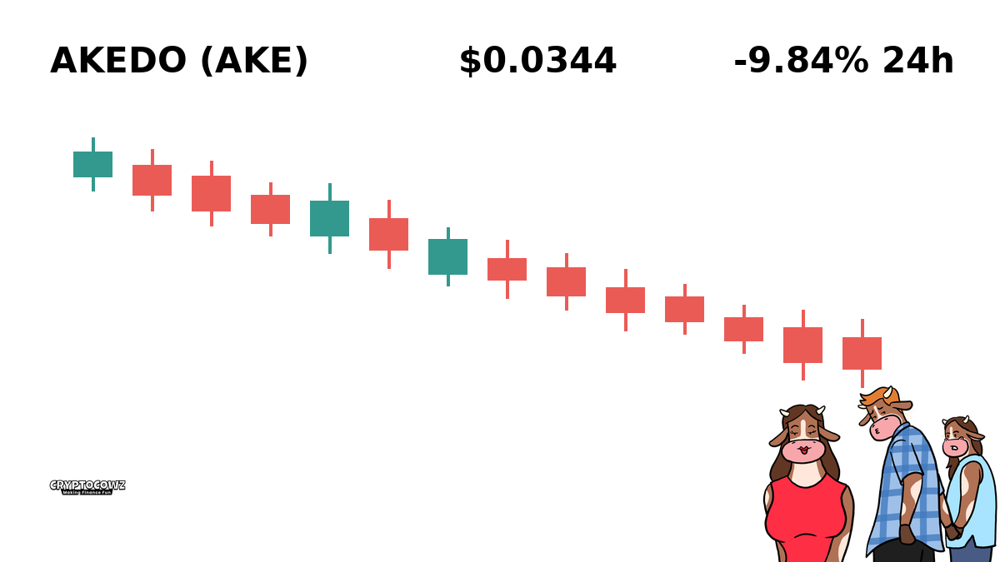

# Daily Top Movers: CMC Community Visuals & Posts

## 1. Quant ($QNT) — +20.62% (PUMP)
**Cast Member:** Skip Zinfandel
**CMC Comment:** Up 20% because enterprise interoperability sounds expensive enough to be valuable! Time to leverage my retirement fund and buy a third yacht.

---

## 2. Worldcoin ($WLD) — +18.94% (PUMP)
**Cast Member:** Sunshine Innocent Nimbus
**CMC Comment:** Selling my iris data for an 18% gain feels so spiritually aligning! Who needs personal privacy when the universe gifts you green candles?

---

## 3. Filecoin ($FIL) — +17.16% (PUMP)
**Cast Member:** Professor Hartmut
**CMC Comment:** Paying decentralized hard drive hoarders double digits to store JPEGs is the pinnacle of monetary progress. The charts clearly indicate pure, unadulterated euphoria.

---

## 4. Kaspa ($KAS) — +14.59% (PUMP)
**Cast Member:** Frank Rizzo
**CMC Comment:** Look at this green spike! I don't know what a BlockDAG is and I don't care, as long as it buys me a golden riding mower by Tuesday!

---

## 5. Dash ($DASH) — +14.06% (PUMP)
**Cast Member:** Skip Zinfandel
**CMC Comment:** Digital cash is booming again, baby! Dusting off my 2017 silk suits because nostalgia is the ultimate fundamental analysis.

---

## 6. XRP ($XRP) — -1.92% (DUMP)
**Cast Member:** Frank Rizzo
**CMC Comment:** Down almost two percent? I'm callin' my lawyer, the SEC, and my aunt! Someone get my money back right now!

---

## 7. Injective ($INJ) — -4.15% (DUMP)
**Cast Member:** Professor Hartmut
**CMC Comment:** A minor correction in layer-one derivatives was statistically bound to occur. My algorithmic analysis predicts severe weeping among over-leveraged retail holders.

---

## 8. NEAR Protocol ($NEAR) — -5.71% (DUMP)
**Cast Member:** Sunshine Innocent Nimbus
**CMC Comment:** NEAR is teaching us a gentle cosmic lesson in shedding earthly wealth. Embrace the loss as universe-mandated spiritual growth!

---

## 9. Akedo ($AKE) — -9.84% (DUMP)
**Cast Member:** Skip Zinfandel
**CMC Comment:** Down nearly 10%? I told my accountant Akedo was a high-risk tax write-off anyway, so technically I am still winning.

---

## 10. Bitway ($BTW) — -14.81% (DUMP)
**Cast Member:** Frank Rizzo
**CMC Comment:** Bitway is crashing and taking my jet ski down payment with it! Who do I gotta yell at to get a refund on a 15% drop?!

---
