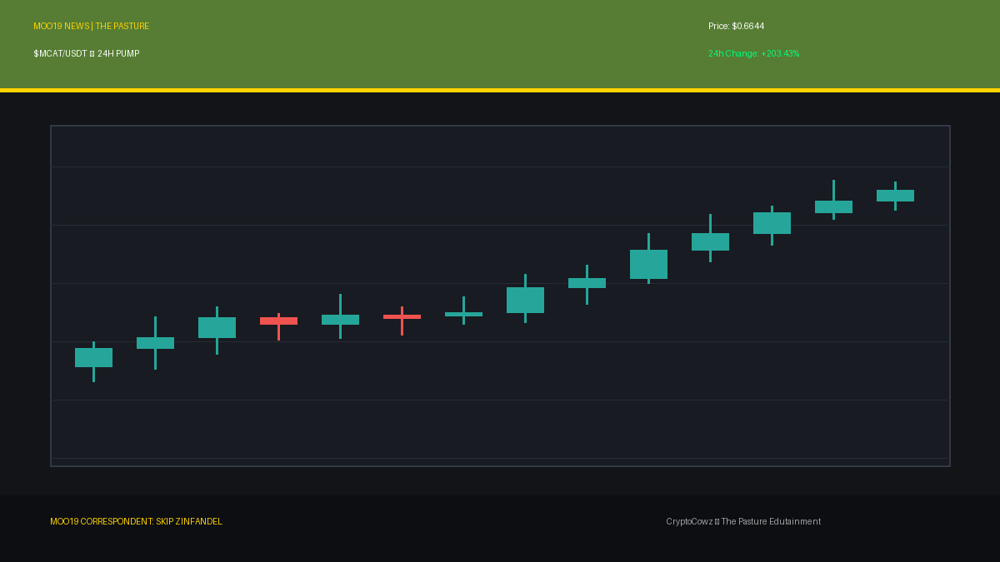
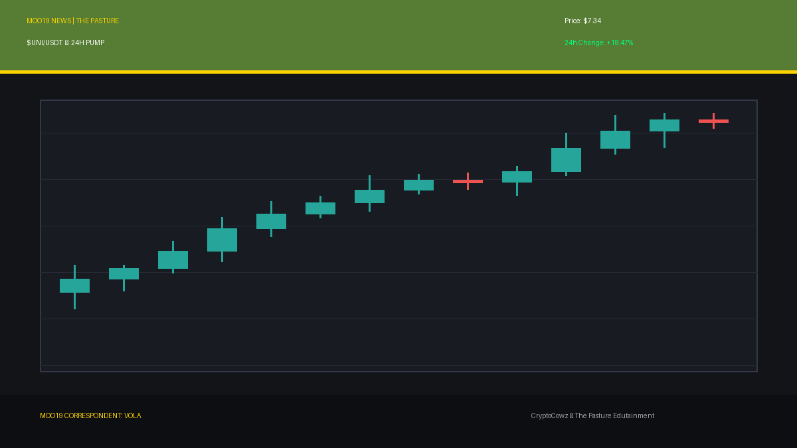
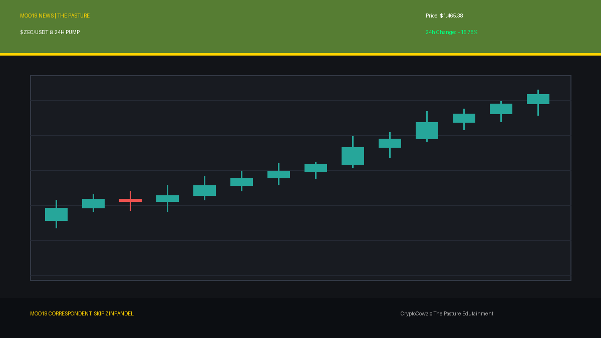
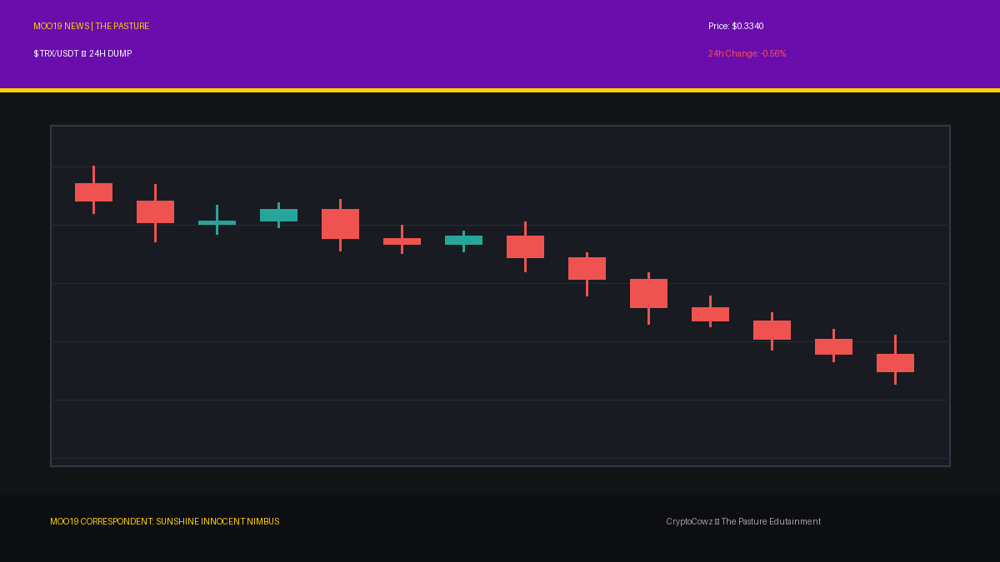
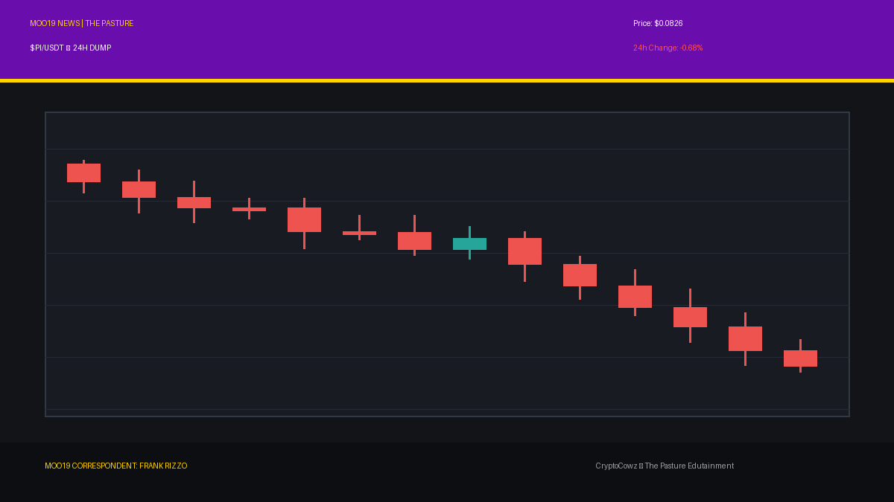
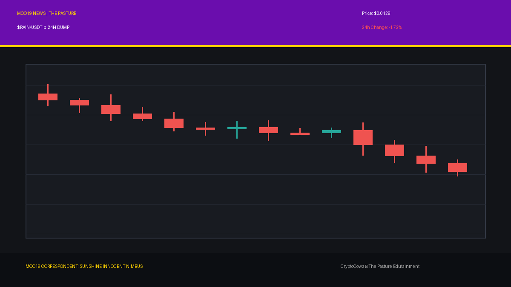
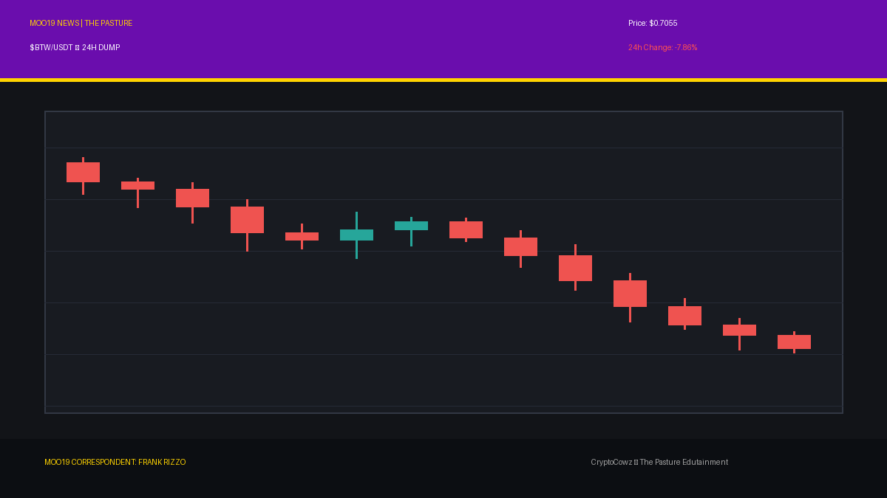
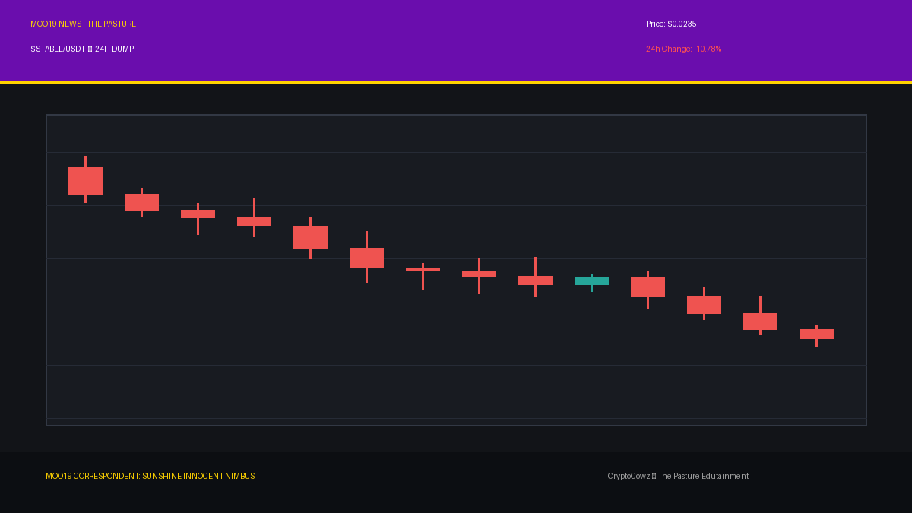

# Daily Top Movers: CMC Community Posts & Visuals

## 1. Marscat Token ($MCAT) — 203.43% (PUMP)
**Cast Member:** Skip Zinfandel
**CMC Comment:** Meow! MCAT is blasting to Mars faster than a laser pointer dot! My pompadour is standing on end just watching this vertical green candle rocket into orbit!

**Google Flow / Scene Prompt:**
> Clean 2D vector animation style. Smug news anchor Skip Zinfandel with a massive coiffed pompadour standing in front of a giant high-tech broadcast screen showing tall, glowing green candlestick bars breaking upward through a resistance line for MCAT, with a bold green arrow pointing up. Bold outlines, flat cel shading, featuring CryptoCowz brand colors pasture green #567D33 and royal purple #6A0DAD.

---

## 2. Uniswap ($UNI) — 18.47% (PUMP)
**Cast Member:** VOLA
**CMC Comment:** Analyzing UNI trajectory: automated market making protocols operating at peak efficiency. Liquidity pools surging by 18.47 percent. Profit projection optimal.

**Google Flow / Scene Prompt:**
> Clean 2D vector animation style. VOLA, a sleek corporate AI CEO hologram, standing in a futuristic newsroom beside a giant high-tech broadcast screen displaying tall, glowing green candlestick bars for UNI breaking through resistance with an upward pointing arrow. Bold outlines, flat cel shading, corporate lavender #9F86C0 and pasture green #567D33.

---

## 3. NEAR Protocol ($NEAR) — 18.35% (PUMP)
**Cast Member:** Chet Lively
**CMC Comment:** Touchdown NEAR! They just smashed through defense line 2.94 with an 18 percent breakaway gain! The crowd is going wild in the crypto stadium!

**Google Flow / Scene Prompt:**
> Clean 2D vector animation style. Enthusiastic sports anchor Chet Lively holding a foam finger and microphone in front of a giant high-tech broadcast screen showing tall, glowing green candlestick bars for NEAR surging upward with a green arrow. Bold outlines, flat cel shading, royal purple #6A0DAD and pasture green #567D33.

---

## 4. Zcash ($ZEC) — 15.78% (PUMP)
**Cast Member:** Skip Zinfandel
**CMC Comment:** Zcash proves privacy is pricey! $1,465 and pumping hard! My smile is as bright as this green mega-candle breaking through resistance!

**Google Flow / Scene Prompt:**
> Clean 2D vector animation style. Smug anchor Skip Zinfandel grinning brilliantly next to a giant high-tech broadcast screen showing tall, glowing green candlestick bars for ZEC breaking upward through resistance lines. Bold outlines, flat cel shading, pasture green #567D33 and corporate lavender #9F86C0.

---

## 5. Dash ($DASH) — 13.64% (PUMP)
**Cast Member:** VOLA
**CMC Comment:** DASH velocity increased by 13.64 percent. Corporate forecast indicates high-frequency transaction dominance. Excellent performance metric.

**Google Flow / Scene Prompt:**
> Clean 2D vector animation style. VOLA the AI CEO standing in a studio beside a giant high-tech digital display screen showing tall, glowing green candlestick bars for DASH breaking through resistance lines with an upward green arrow. Bold outlines, flat cel shading, corporate lavender #9F86C0 and pasture green #567D33.

---

## 6. TRON ($TRX) — -0.56% (DUMP)
**Cast Member:** Sunshine Innocent Nimbus
**CMC Comment:** Oh look, a gentle dark cloud over TRON! Just a soft 0.56 percent drop, but I can feel the storm brewing underneath! Rain down on us, sweet red candles!

**Google Flow / Scene Prompt:**
> Clean 2D vector animation style. Goth weather girl Sunshine Innocent Nimbus standing in front of a weather map radar screen showing tall, plunging red candlestick bars for TRX dropping off a cliff with stormy graphics and red crash percentages. Bold outlines, flat cel shading, royal purple #6A0DAD and pasture green #567D33.

---

## 7. Pi Network ($PI) — -0.68% (DUMP)
**Cast Member:** Frank Rizzo
**CMC Comment:** I am standing here in the rain, folks. Pi Network is leaking red on the pavement. Not a huge drop yet, but the street smells like impending panic!

**Google Flow / Scene Prompt:**
> Clean 2D vector animation style. Gritty street reporter Frank Rizzo in a beige trench coat standing beside a flickering alley terminal screen showing tall, plunging red candlestick bars for PI dropping off a cliff with red crash percentage numbers. Bold outlines, flat cel shading, royal purple #6A0DAD and pasture green #567D33.

---

## 8. Rain ($RAIN) — -1.72% (DUMP)
**Cast Member:** Sunshine Innocent Nimbus
**CMC Comment:** Rain token is living up to its name! A lovely little downpour of red candles! I hope it turns into a total hurricane financial apocalypse!

**Google Flow / Scene Prompt:**
> Clean 2D vector animation style. Goth weather girl Sunshine Innocent Nimbus smiling excitedly next to a weather radar screen showing tall, plunging red candlestick bars for RAIN dropping off a cliff with stormy rain clouds and crash graphics. Bold outlines, flat cel shading, corporate lavender #9F86C0 and royal purple #6A0DAD.

---

## 9. Bitway ($BTW) — -7.86% (DUMP)
**Cast Member:** Frank Rizzo
**CMC Comment:** Bitway is taking a real beating! Down almost 8 percent! I am on the corner of Dump Street and Capitulation Avenue, and it ain't pretty!

**Google Flow / Scene Prompt:**
> Clean 2D vector animation style. Gritty street reporter Frank Rizzo holding a microphone near a weather radar alley terminal displaying tall, plunging red candlestick bars for BTW dropping off a cliff with red crash percentages. Bold outlines, flat cel shading, royal purple #6A0DAD and pasture green #567D33.

---

## 10. ​​Stable ($STABLE) — -10.78% (DUMP)
**Cast Member:** Sunshine Innocent Nimbus
**CMC Comment:** Ironically named STABLE is down nearly 11 percent! Absolute chaos and beautiful disaster! The red candles are melting so gorgeously!

**Google Flow / Scene Prompt:**
> Clean 2D vector animation style. Goth weather girl Sunshine Innocent Nimbus clapping cheerfully in front of a stormy weather map screen showing tall, plunging red candlestick bars for STABLE falling off a cliff with big red crash stats. Bold outlines, flat cel shading, corporate lavender #9F86C0 and royal purple #6A0DAD.

---
