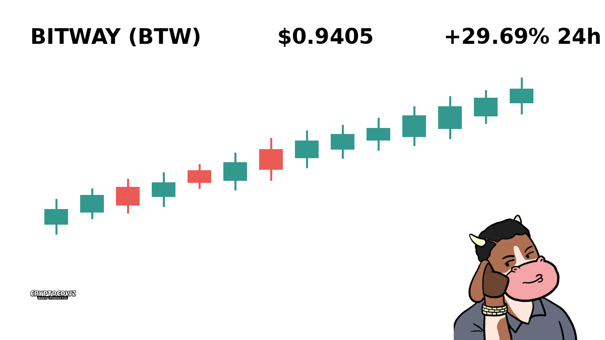
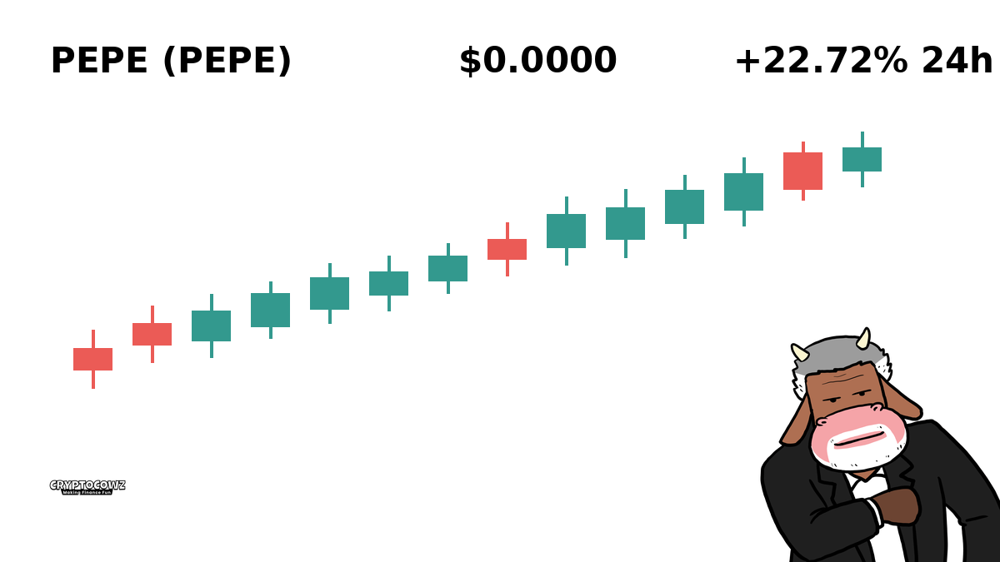
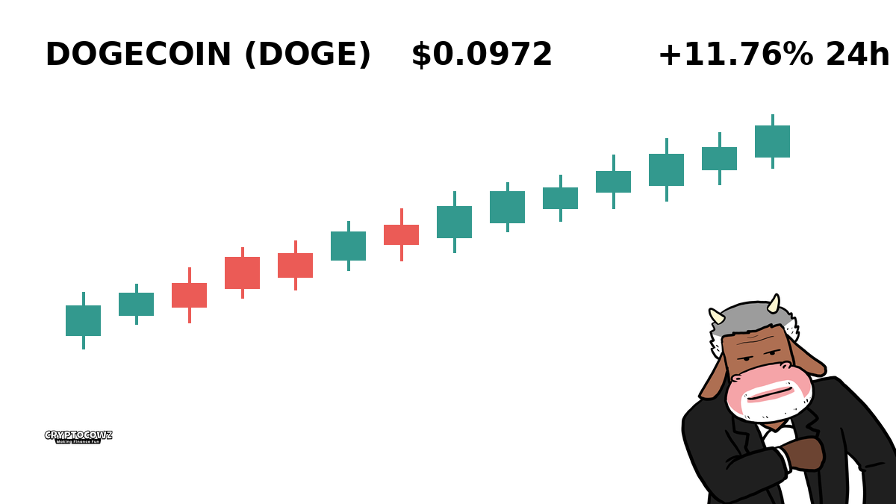
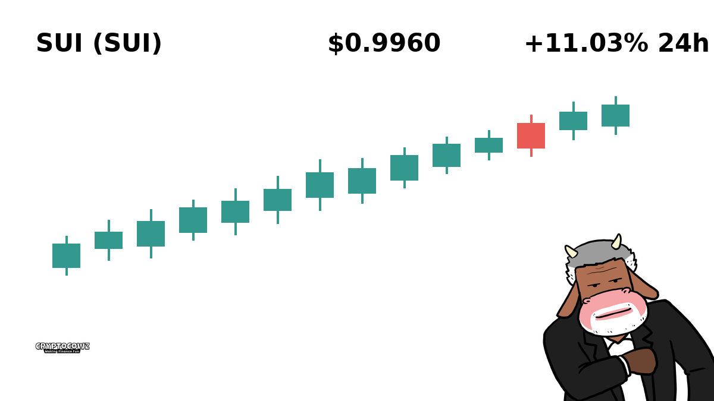
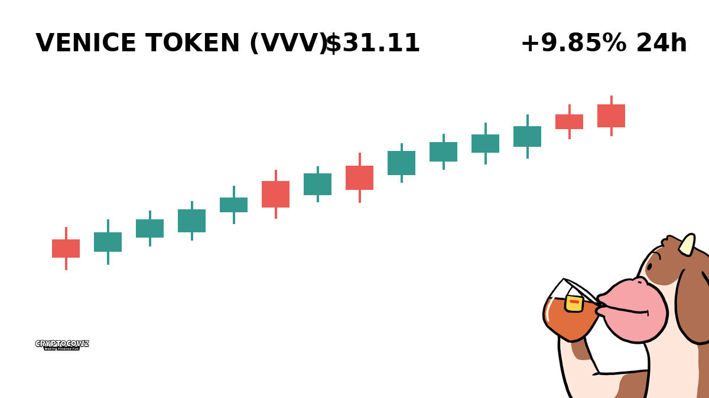
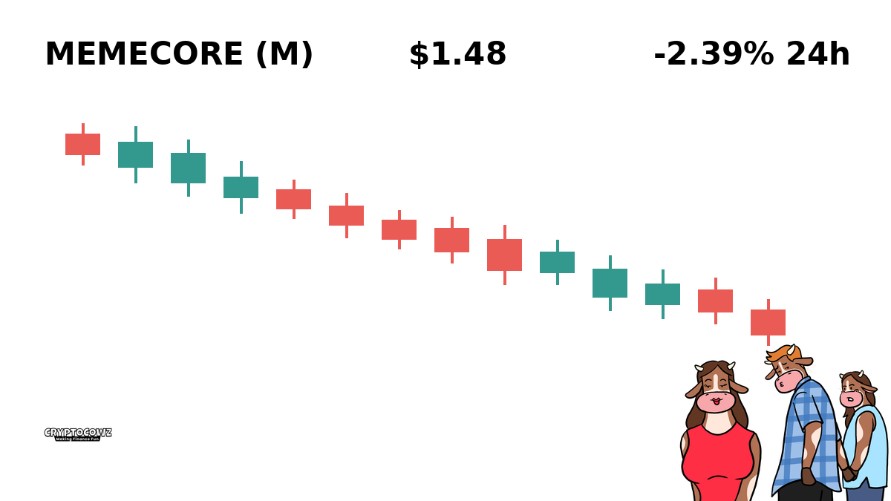
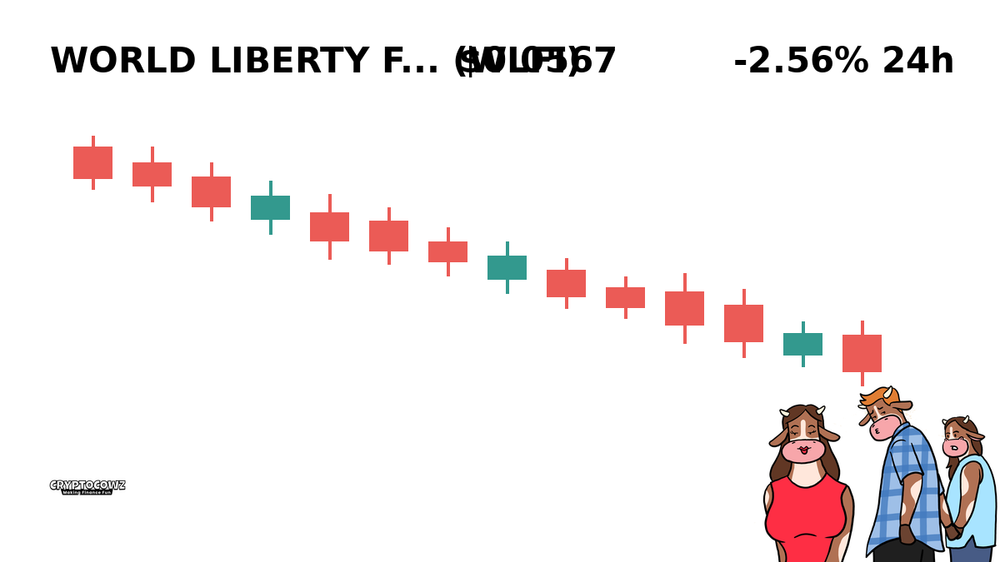
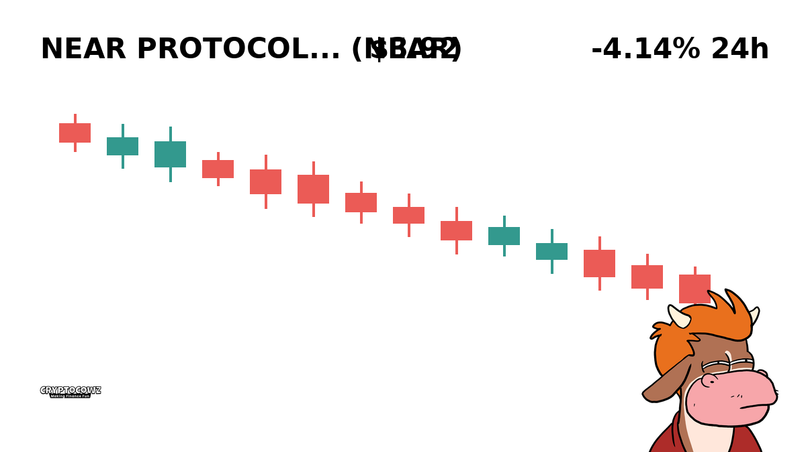
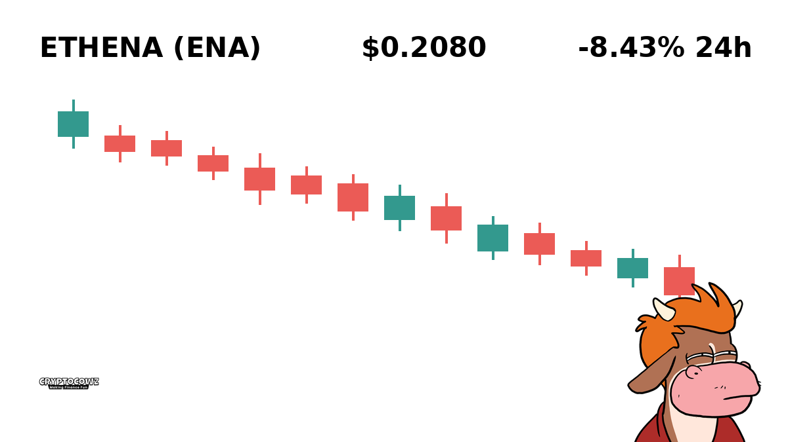
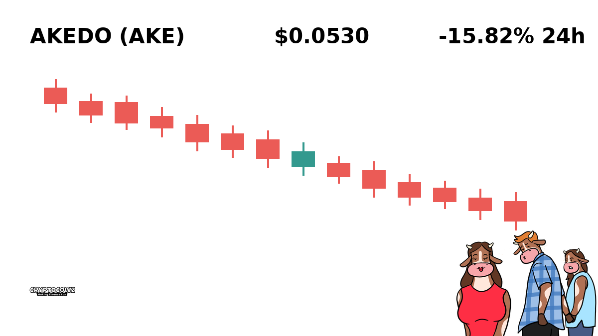

# Daily Top Movers: CMC Community Visuals & Posts

## 1. Bitway ($BTW) — +29.69% (PUMP)
**Cast Member:** Skip Zinfandel
**CMC Comment:** Bitway is pumping so hard I just remortgaged my third yacht to double down. If you are not all-in right now, do you even care about generational wealth?

---

## 2. Pepe ($PEPE) — +22.72% (PUMP)
**Cast Member:** Sunshine Innocent Nimbus
**CMC Comment:** The holy green frog spirit has blessed my sacred wallet with cosmic abundance today! I can finally afford organic grass-fed stardust for my moon rituals.

---

## 3. Dogecoin ($DOGE) — +11.76% (PUMP)
**Cast Member:** Frank Rizzo
**CMC Comment:** Listen up, ya bums! The dog is barking again and my cousin Vinny just put his entire retirement fund into it. To the moon or the soup kitchen!

---

## 4. Sui ($SUI) — +11.03% (PUMP)
**Cast Member:** Professor Hartmut
**CMC Comment:** Statistically speaking, this sudden upward momentum correlates directly with retail euphoria overtaking basic mathematical logic. Naturally, I am allocating more capital.

---

## 5. Venice Token ($VVV) — +9.85% (PUMP)
**Cast Member:** Skip Zinfandel
**CMC Comment:** Venice Token is floating straight to the top of the luxury canal! I am already picking out the custom leather interior for my new amphibious supercar.

---

## 6. MemeCore ($M) — -2.39% (DUMP)
**Cast Member:** Frank Rizzo
**CMC Comment:** MemeCore is sliding faster than a wet bar of soap on a slick tile floor. You want me to hold the bag? Get outta here!

---

## 7. World Liberty Financial ($WLFI) — -2.56% (DUMP)
**Cast Member:** Professor Hartmut
**CMC Comment:** A quantifiable decline in market cap, yet a massive spike in psychological trauma for investors who failed to hedge properly. A fascinating study in human error.

---

## 8. NEAR Protocol ($NEAR) — -4.14% (DUMP)
**Cast Member:** Sunshine Innocent Nimbus
**CMC Comment:** NEAR is feeling a bit far from harmony right now, but the universe is simply cleansing our chakras of quick gains. Just breathe through the red candles, star-children!

---

## 9. Ethena ($ENA) — -8.43% (DUMP)
**Cast Member:** Frank Rizzo
**CMC Comment:** Ethena is taking a absolute nose dive and my brother-in-law is crying in the garage. Someone pass me a cannoli and unplug the router!

---

## 10. Akedo ($AKE) — -15.82% (DUMP)
**Cast Member:** Skip Zinfandel
**CMC Comment:** Down nearly sixteen percent? That is not a disaster, that is just an exclusive opportunity for the lower class to buy out my remaining bags!

---
