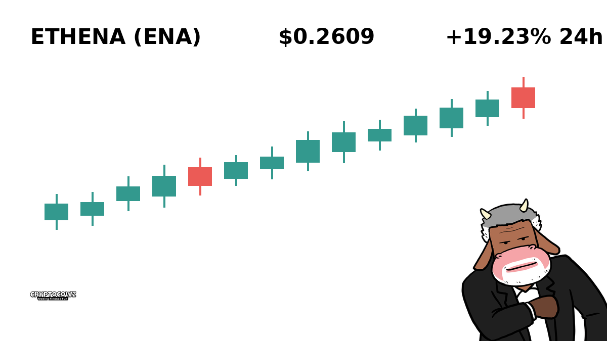
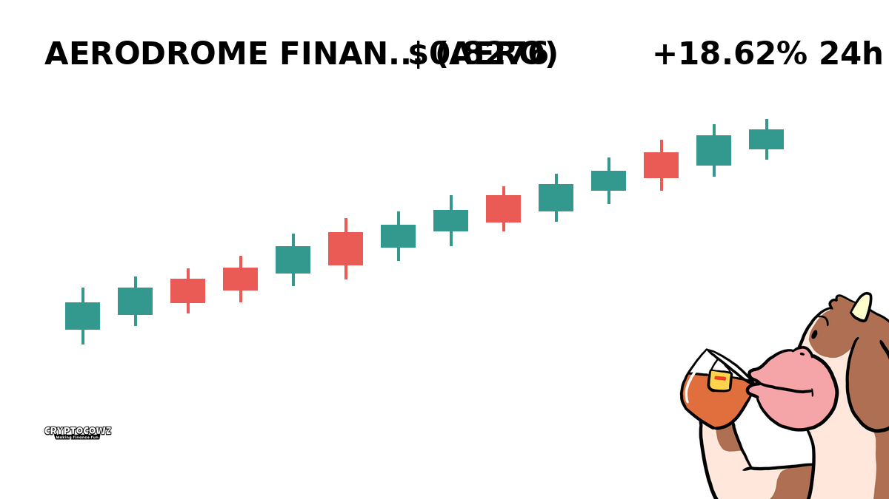
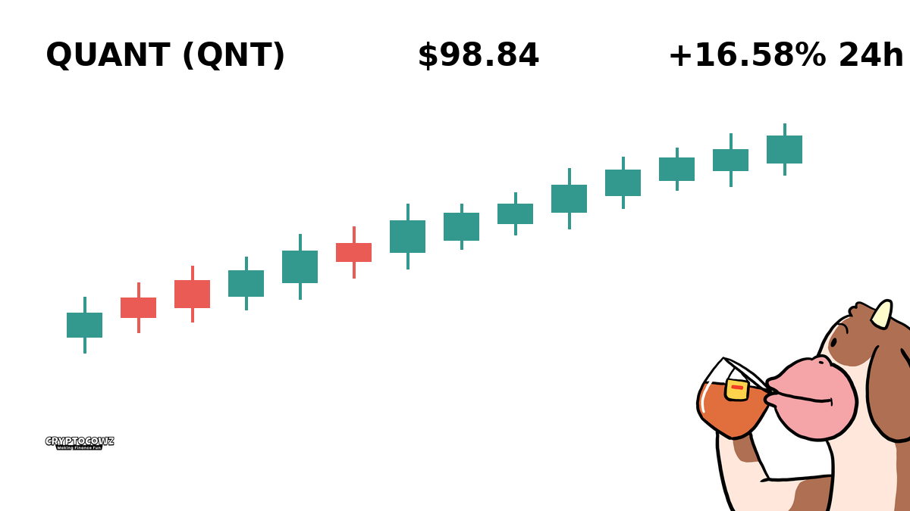
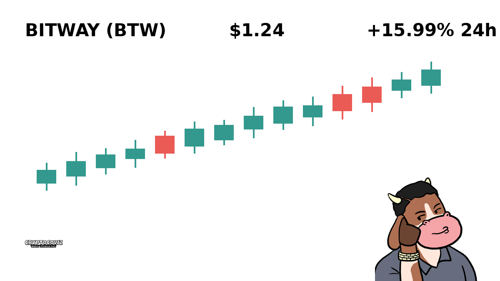
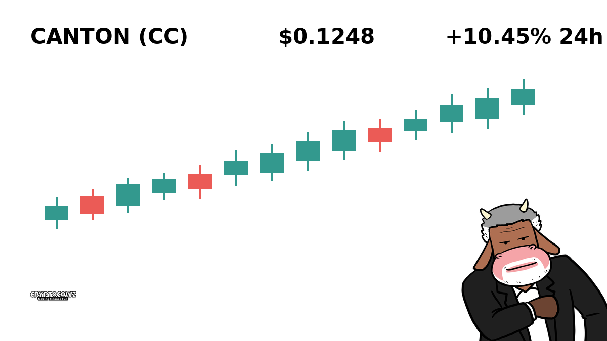
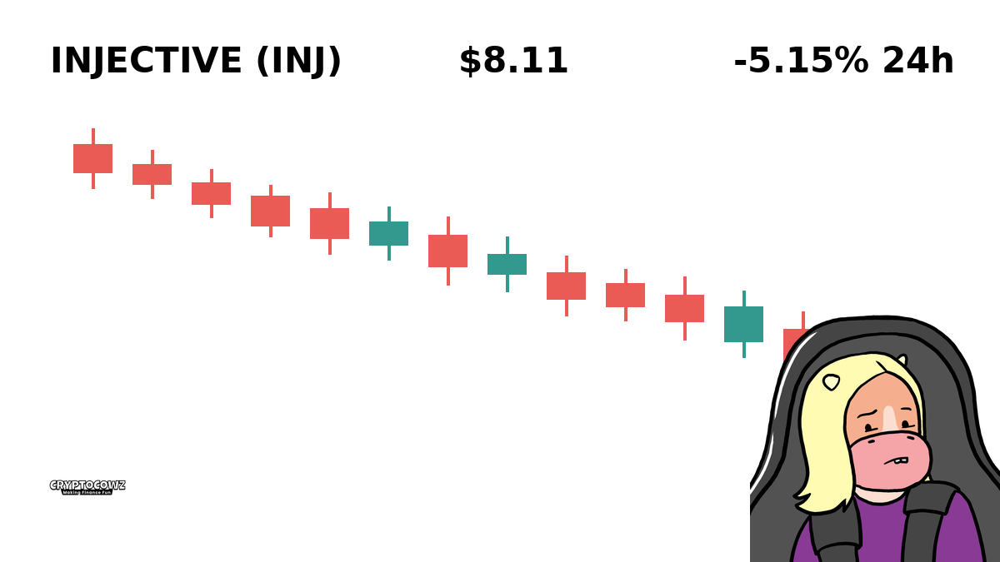
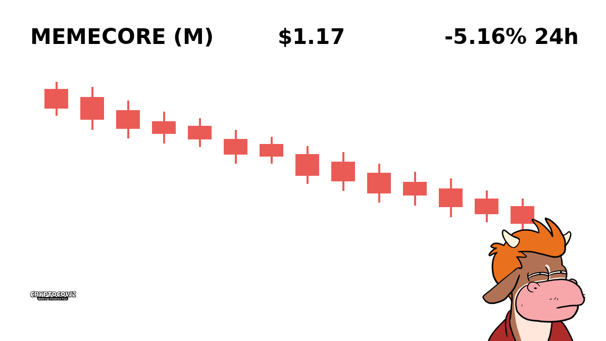
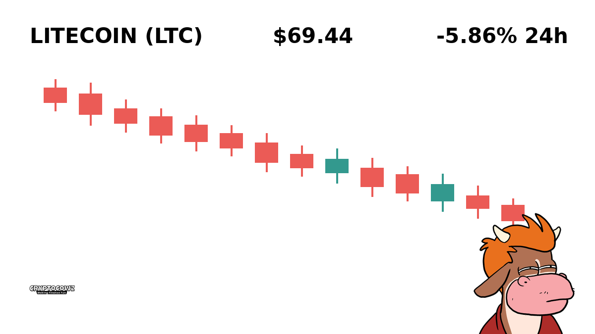
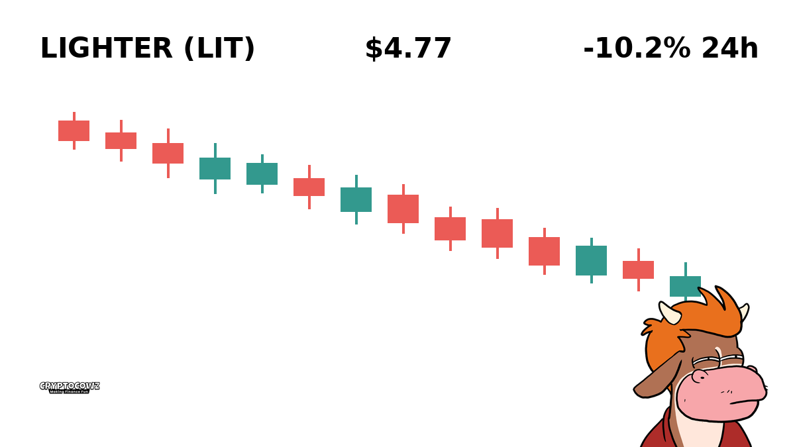

# Daily Top Movers: CMC Community Visuals & Posts

## 1. Ethena ($ENA) — +19.23% (PUMP)
**Cast Member:** Skip Zinfandel
**CMC Comment:** Just refinanced my barn to ape into synthetic yield because line only goes up. Generational wealth is officially secured, boys!

---

## 2. Aerodrome Finance ($AERO) — +18.62% (PUMP)
**Cast Member:** Frank Rizzo
**CMC Comment:** I don't know what an aerodrome is, but I'm throwing my mother-in-law's pension into it immediately. Keep flying, baby!

---

## 3. Quant ($QNT) — +16.58% (PUMP)
**Cast Member:** Professor Hartmut
**CMC Comment:** Interoperability theory dictates that a sixteen percent pump completely validates my three-hundred page whitepaper on farmyard liquidity.

---

## 4. Bitway ($BTW) — +15.99% (PUMP)
**Cast Member:** Sunshine Innocent Nimbus
**CMC Comment:** The cosmos is sending golden vibrations straight into our digital wallets today! Hug your local validator!

---

## 5. Canton ($CC) — +10.45% (PUMP)
**Cast Member:** Skip Zinfandel
**CMC Comment:** Selling my wife's prized heifers to double down on Canton before the normies wake up. To the moon!

---

## 6. Injective ($INJ) — -5.15% (DUMP)
**Cast Member:** Frank Rizzo
**CMC Comment:** Down five percent? Great, now I gotta explain to the family why we are eating expired hay for dinner again.

---

## 7. MemeCore ($M) — -5.16% (DUMP)
**Cast Member:** Sunshine Innocent Nimbus
**CMC Comment:** My aura is feeling heavily damaged by this red candle, but perhaps the red is just market love in disguise?

---

## 8. Litecoin ($LTC) — -5.86% (DUMP)
**Cast Member:** Skip Zinfandel
**CMC Comment:** Digital silver is behaving like digital lead again. Guess I'll just hold these vintage 2017 bags until retirement.

---

## 9. Lighter ($LIT) — -10.2% (DUMP)
**Cast Member:** Professor Hartmut
**CMC Comment:** A ten percent devaluation clearly demonstrates the psychological fragility of retail investors facing structural entropy.

---

## 10. Akedo ($AKE) — -13.73% (DUMP)
**Cast Member:** Frank Rizzo
**CMC Comment:** Somebody call the sheriff because my portfolio just got utterly mugged in broad daylight!

---
