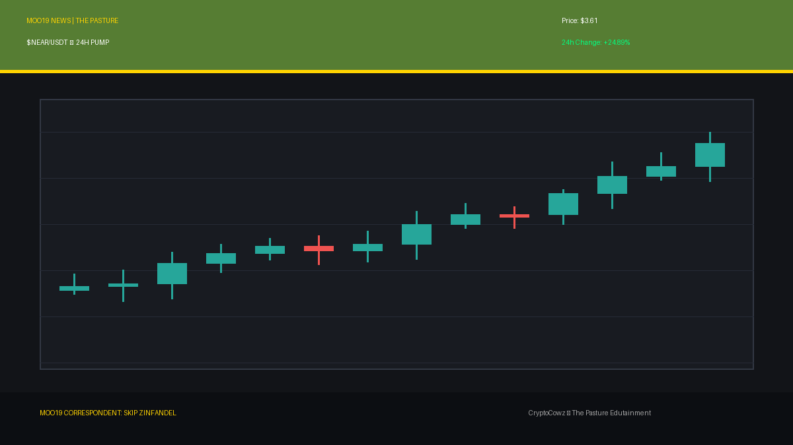
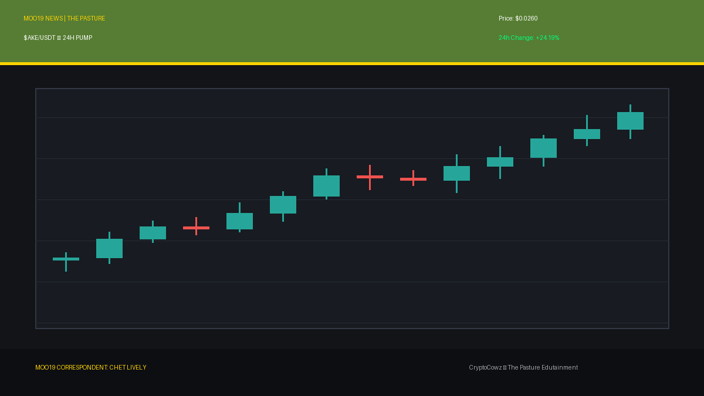
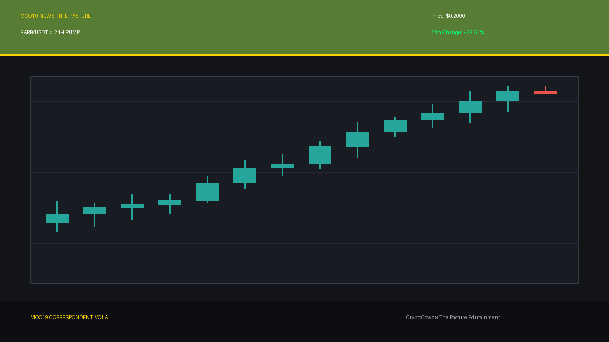
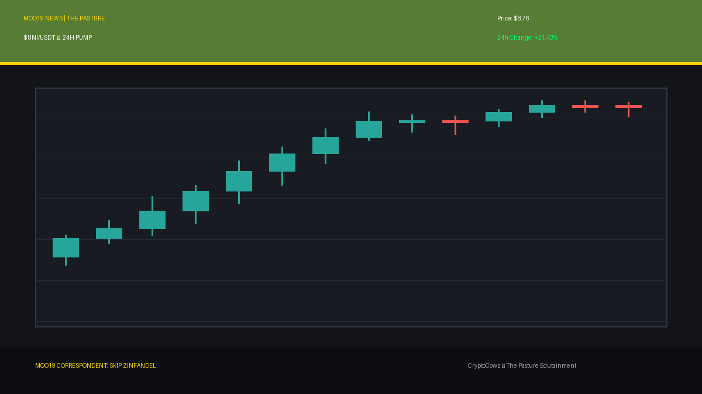
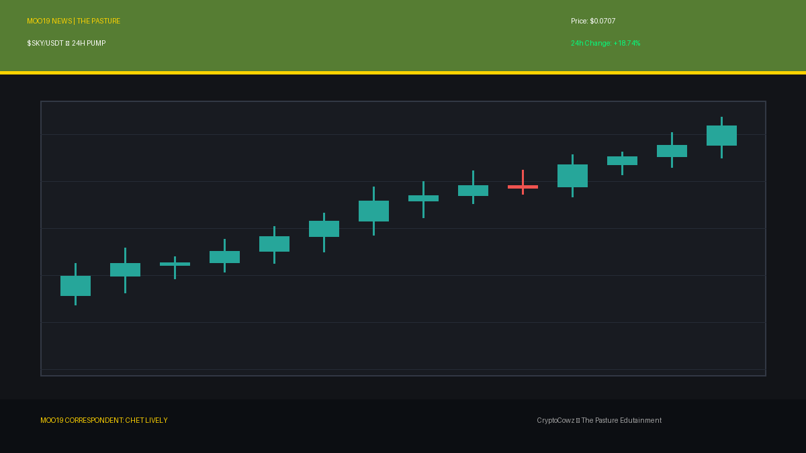
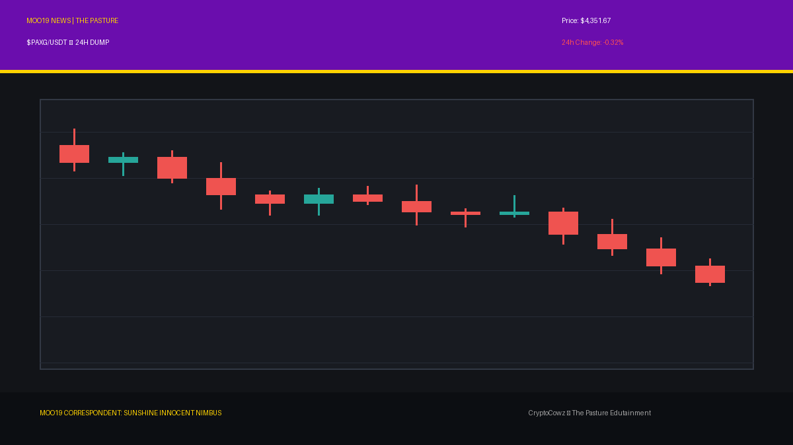
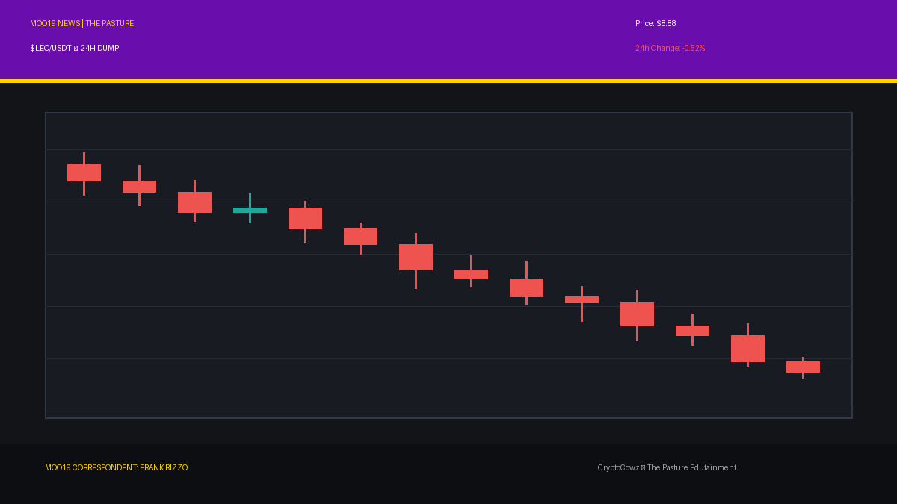
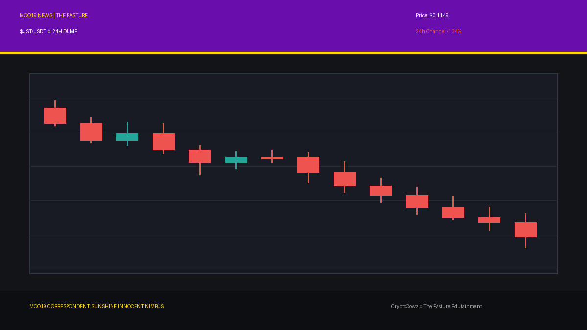
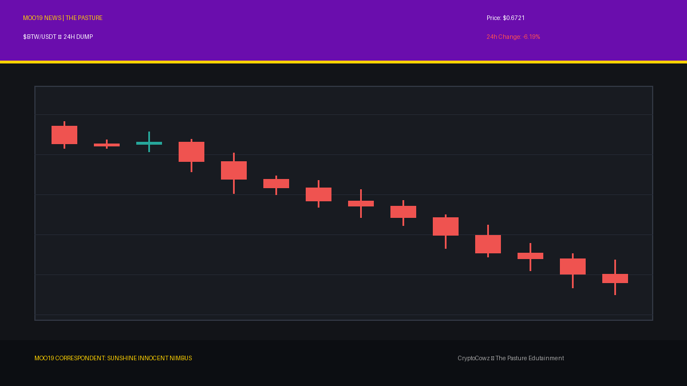

# Daily Top Movers: CMC Community Posts & Visuals

## 1. NEAR Protocol ($NEAR) — 24.89% (PUMP)
**Cast Member:** Skip Zinfandel
**CMC Comment:** Hold onto your toupees, folks! NEAR is pumping so hard my hair gel can barely handle the aerodynamic drag! +24% in a day!

**Google Flow / Scene Prompt:**
> Clean 2D vector animation style with bold outlines, flat cel shading, and CryptoCowz brand color pasture green #567D33. Skip Zinfandel, a smug news anchor with a massive pompadour hairstyle and a crisp suit, holding a microphone in the MOO19 newsroom. Behind him is a giant high-tech broadcast screen showing tall, glowing green candlestick bars breaking upward through a resistance line, with the symbol NEAR and a massive green arrow pointing up.

---

## 2. Akedo ($AKE) — 24.19% (PUMP)
**Cast Member:** Chet Lively
**CMC Comment:** BOOM! Akedo comes out of the dugout with a massive +24% grand slam! That's what I call high-octane crypto athleticism!

**Google Flow / Scene Prompt:**
> Clean 2D vector animation style with bold outlines, flat cel shading, and CryptoCowz brand color royal purple #6A0DAD. Chet Lively, an overly enthusiastic sports anchor in a bright blazer with a foam finger, shouting into a desk mic. In the background, a giant high-tech stadium broadcast screen displays tall, glowing green candlestick bars breaking upward through a resistance line, with the symbol AKE and a green arrow pointing up.

---

## 3. Arbitrum ($ARB) — 22.51% (PUMP)
**Cast Member:** VOLA
**CMC Comment:** ALGORITHM UPDATE: Arbitrum liquidity metrics have expanded by +22.51%. Corporate efficiency optimized. Human emotion deemed irrelevant.

**Google Flow / Scene Prompt:**
> Clean 2D vector animation style with bold outlines, flat cel shading, and CryptoCowz brand color corporate lavender #9F86C0. VOLA, a sleek corporate AI CEO persona represented as a glowing holographic silhouette at a glass boardroom podium. A giant high-tech corporate broadcast screen behind displays tall, glowing green candlestick bars breaking upward through a resistance line, marked with the symbol ARB and an upward green arrow.

---

## 4. Uniswap ($UNI) — 21.43% (PUMP)
**Cast Member:** Skip Zinfandel
**CMC Comment:** Uniswap swapping its way to the top of the charts! +21% and looking as handsome as my studio lighting setup!

**Google Flow / Scene Prompt:**
> Clean 2D vector animation style with bold outlines, flat cel shading, and CryptoCowz brand color pasture green #567D33. Skip Zinfandel, a smug news anchor pointing a polished finger at the camera with a flashing smile in a broadcast studio. A giant high-tech broadcast screen in the studio displays tall, glowing green candlestick bars breaking upward through a resistance line, featuring the UNI symbol and a bright green arrow pointing up.

---

## 5. Sky ($SKY) — 18.74% (PUMP)
**Cast Member:** Chet Lively
**CMC Comment:** Sky is reaching for the stratosphere! Up nearly 19% on the scoreboard! Keep your eyes on the replay, folks!

**Google Flow / Scene Prompt:**
> Clean 2D vector animation style with bold outlines, flat cel shading, and CryptoCowz brand color royal purple #6A0DAD. Chet Lively, an energetic sports news anchor leaning over his desk with excitement. Behind him, a giant high-tech broadcast screen features tall, glowing green candlestick bars breaking upward through a resistance line, accompanied by the token symbol SKY and an arrow pointing up.

---

## 6. PAX Gold ($PAXG) — -0.32% (DUMP)
**Cast Member:** Sunshine Innocent Nimbus
**CMC Comment:** Even precious shiny gold is feeling the sweet kiss of darkness today... a soft, tragic bleed into the abyss. Gorgeous.

**Google Flow / Scene Prompt:**
> Clean 2D vector animation style with bold outlines, flat cel shading, and CryptoCowz brand color corporate lavender #9F86C0. Sunshine Innocent Nimbus, a pale goth weather presenter wearing black lace and dark lipstick, standing cheerfully in front of a weather map radar display. The radar screen displays tall, plunging red candlestick bars dropping off a cliff, with red crash percentages (-0.32%) and stormy rain graphics overlaid with the token symbol PAXG.

---

## 7. LEO Token ($LEO) — -0.52% (DUMP)
**Cast Member:** Frank Rizzo
**CMC Comment:** Reporting live from the rain-soaked pavement. LEO took a light hit on the streets today. Nothing a cold coffee can't fix.

**Google Flow / Scene Prompt:**
> Clean 2D vector animation style with bold outlines, flat cel shading, and CryptoCowz brand color pasture green #567D33. Frank Rizzo, a gritty street reporter wearing a wrinkled trench coat, holding a vintage microphone in a dark alley. On a flickering wall terminal display in the alley, tall, plunging red candlestick bars drop off a cliff, showing red crash percentages (-0.52%) and stormy graphics alongside the LEO symbol.

---

## 8. JUST ($JST) — -1.34% (DUMP)
**Cast Member:** Sunshine Innocent Nimbus
**CMC Comment:** JUST is dripping downward like beautiful cold rain on a foggy window. Embrace the gloom, my dear bagholders.

**Google Flow / Scene Prompt:**
> Clean 2D vector animation style with bold outlines, flat cel shading, and CryptoCowz brand color royal purple #6A0DAD. Sunshine Innocent Nimbus, a goth weather girl with dark braided hair and a sinister smile, gesturing to a weather map radar screen. The screen shows tall, plunging red candlestick bars dropping off a cliff with stormy storm cloud graphics and red percentages showing -1.34% alongside the symbol JST.

---

## 9. Dash ($DASH) — -1.6% (DUMP)
**Cast Member:** Frank Rizzo
**CMC Comment:** Dash ain't dashing anywhere fast right now. The charts are cold and the asphalt is slippery. Back to you in the studio.

**Google Flow / Scene Prompt:**
> Clean 2D vector animation style with bold outlines, flat cel shading, and CryptoCowz brand color corporate lavender #9F86C0. Frank Rizzo, a tired street reporter in a trench coat standing under a flickering street lamp. A nearby gritty alley terminal screen displays tall, plunging red candlestick bars dropping off a cliff with red crash percentage metrics (-1.60%) and stormy graphics for DASH.

---

## 10. Bitway ($BTW) — -6.19% (DUMP)
**Cast Member:** Sunshine Innocent Nimbus
**CMC Comment:** Down over six percent! Oh, the sheer melancholy of Bitway slipping down the storm drain! I love this forecast!

**Google Flow / Scene Prompt:**
> Clean 2D vector animation style with bold outlines, flat cel shading, and CryptoCowz brand color pasture green #567D33. Sunshine Innocent Nimbus, a goth weather presenter holding a black umbrella indoors, smiling delightedly in front of a weather map radar display. The broadcast display features tall, plunging red candlestick bars dropping off a cliff with dark thunderbolt graphics, red crash percentages (-6.19%), and the symbol BTW.

---
