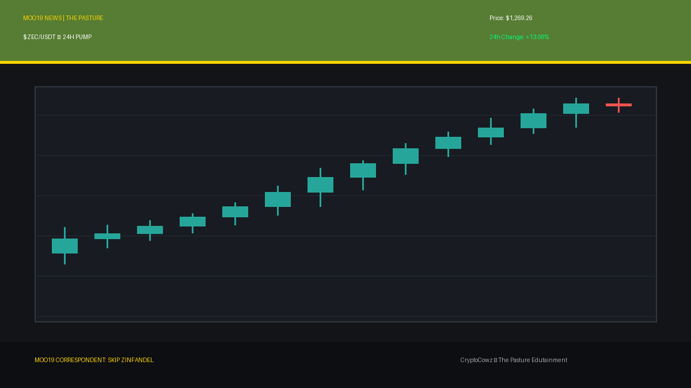
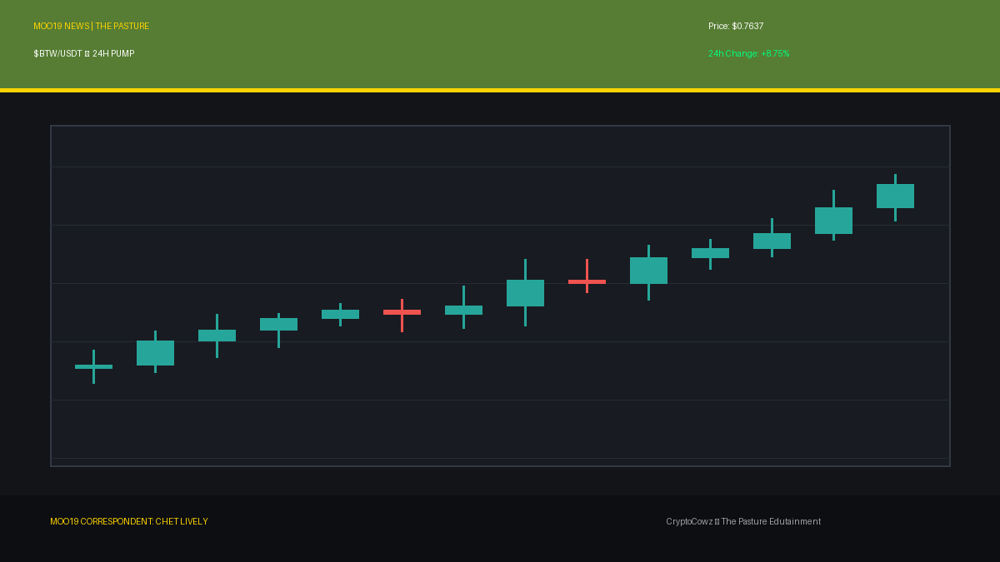
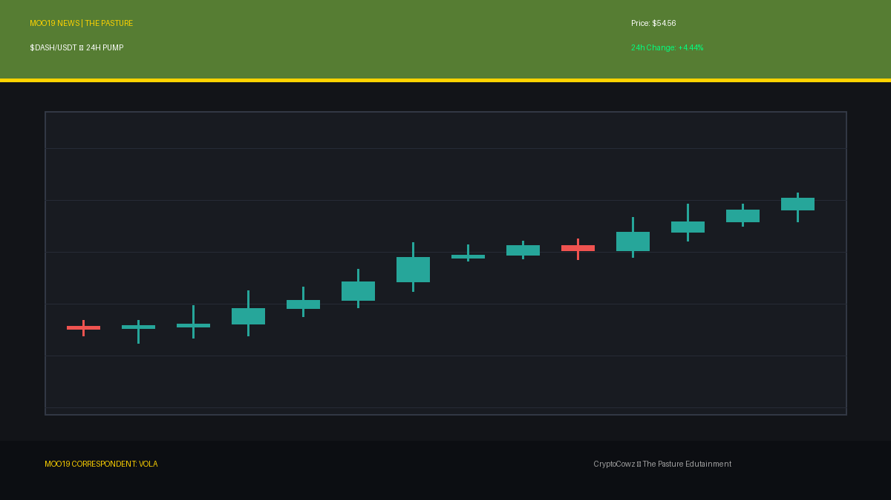
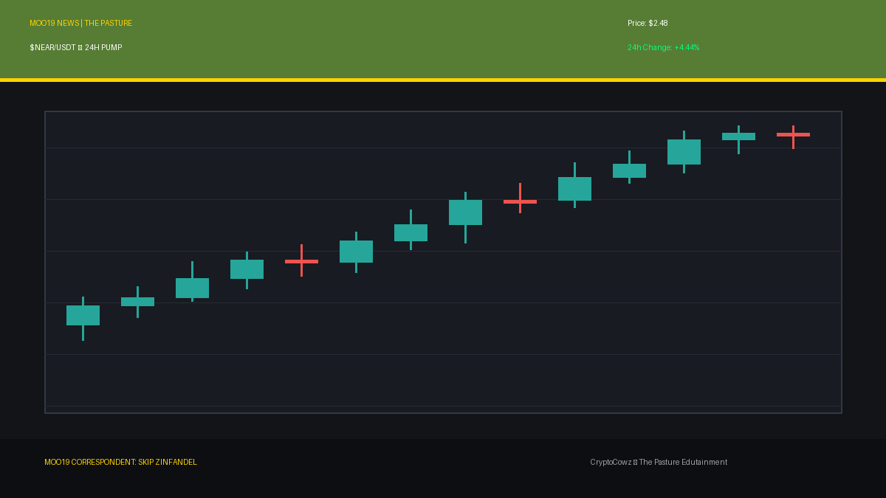
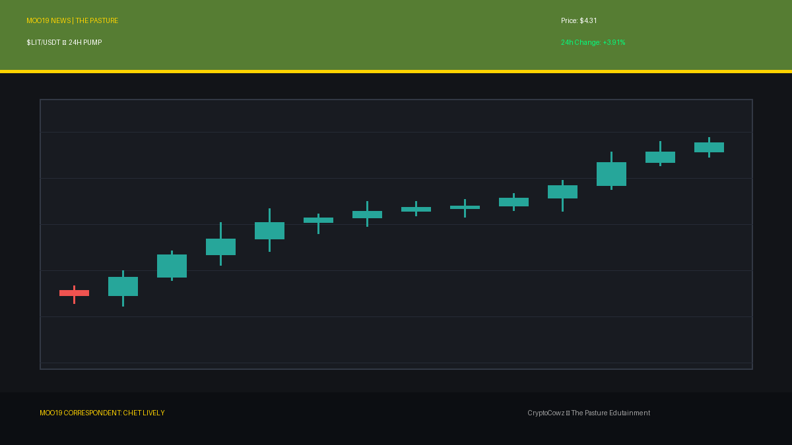
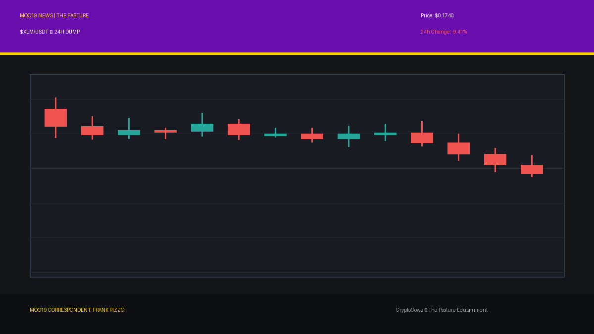
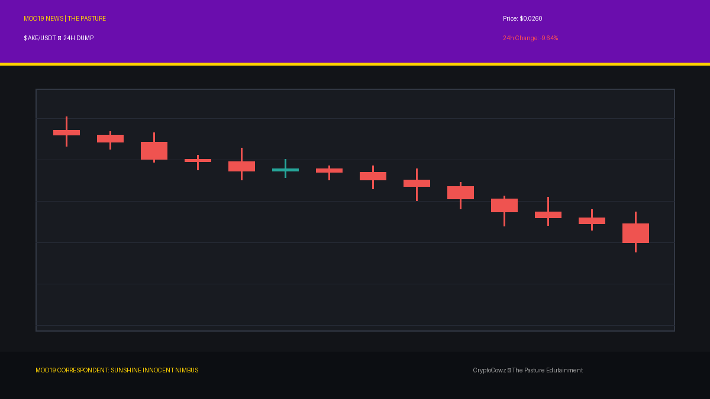
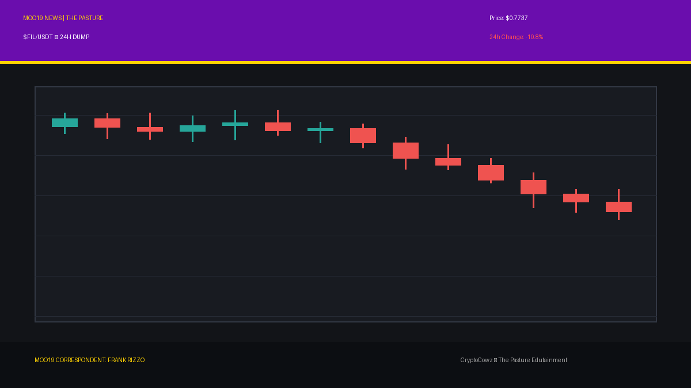
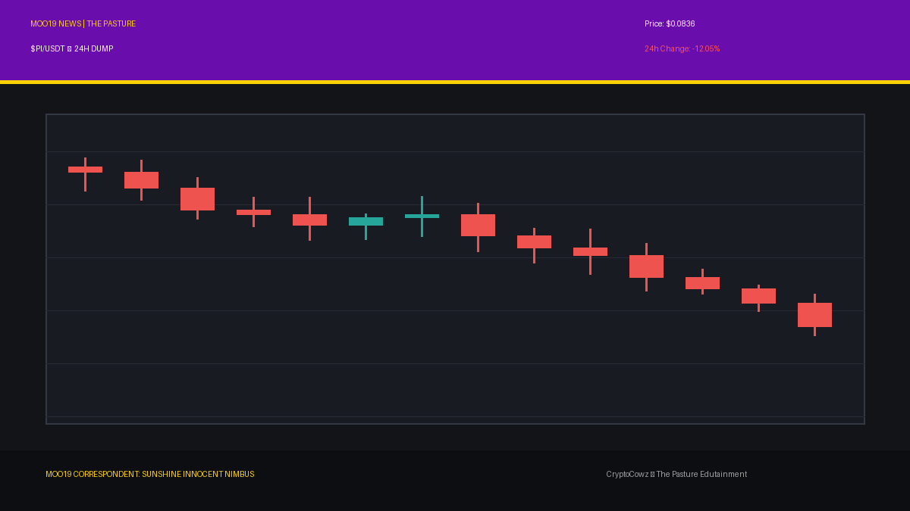

# Daily Top Movers: CMC Community Posts & Visuals

## 1. Zcash ($ZEC) — 13.06% (PUMP)
**Cast Member:** Skip Zinfandel
**CMC Comment:** Privacy is back in style, folks! ZEC rises +13.06% while my tax attorney magically disappears into thin air. Pure brilliance!

**Google Flow / Scene Prompt:**
> Clean 2D vector animation style, bold outlines, flat cel shading, pasture green #567D33 and royal purple #6A0DAD colors. Smug news anchor Skip Zinfandel with a massive blonde pompadour standing in front of a giant high-tech broadcast screen showing tall, glowing green candlestick bars for ZEC breaking upward through a resistance line with a bright green arrow pointing up.

---

## 2. Bitway ($BTW) — 8.75% (PUMP)
**Cast Member:** Chet Lively
**CMC Comment:** Bitway is making a huge play today, up +8.75%! That's a textbook hustle down the field, folks!

**Google Flow / Scene Prompt:**
> Clean 2D vector animation style, bold outlines, flat cel shading, corporate lavender #9F86C0 and pasture green #567D33 colors. Energetic sports anchor Chet Lively pointing enthusiastically at a giant high-tech broadcast screen displaying tall, glowing green candlestick bars for BTW breaking upward through resistance with a green upward arrow.

---

## 3. Dash ($DASH) — 4.44% (PUMP)
**Cast Member:** VOLA
**CMC Comment:** DASH metrics indicate a +4.44% velocity vector. Efficiency optimized; retail sentiment surging.

**Google Flow / Scene Prompt:**
> Clean 2D vector animation style, bold outlines, flat cel shading, corporate lavender #9F86C0 and royal purple #6A0DAD colors. Corporate AI CEO VOLA standing beside a giant high-tech broadcast screen showing tall glowing green candlestick bars for DASH breaking upward through a resistance line with an arrow pointing up.

---

## 4. NEAR Protocol ($NEAR) — 4.44% (PUMP)
**Cast Member:** Skip Zinfandel
**CMC Comment:** NEAR is getting nearer to my personal wealth goals with a fine +4.44% gain. Smells like success and expensive cologne.

**Google Flow / Scene Prompt:**
> Clean 2D vector animation style, bold outlines, flat cel shading, pasture green #567D33 and royal purple #6A0DAD colors. Smug anchor Skip Zinfandel adjusting his tie next to a giant high-tech broadcast screen displaying tall glowing green candlestick bars for NEAR breaking through resistance with a green up arrow.

---

## 5. Lighter ($LIT) — 3.91% (PUMP)
**Cast Member:** Chet Lively
**CMC Comment:** Lighter is truly lit today with a solid +3.91% pump! That's how you score on the rally!

**Google Flow / Scene Prompt:**
> Clean 2D vector animation style, bold outlines, flat cel shading, corporate lavender #9F86C0 and pasture green #567D33 colors. Sports anchor Chet Lively holding a microphone in front of a giant high-tech broadcast screen displaying tall glowing green candlestick bars for LIT breaking through a resistance line with an arrow pointing up.

---

## 6. XRP ($XRP) — -9.09% (DUMP)
**Cast Member:** Sunshine Innocent Nimbus
**CMC Comment:** A lovely gloomy storm cloud for XRP, crashing -9.09%! The sheer agony in the charts is absolutely divine!

**Google Flow / Scene Prompt:**
> Clean 2D vector animation style, bold outlines, flat cel shading, royal purple #6A0DAD and pasture green #567D33 colors. Goth weather girl Sunshine Innocent Nimbus smiling sinisterly in front of a weather map radar screen showing tall plunging red candlestick bars for XRP dropping off a cliff with red crash percentages and stormy graphics.

---

## 7. Stellar ($XLM) — -9.41% (DUMP)
**Cast Member:** Frank Rizzo
**CMC Comment:** Down here on the asphalt, XLM just took a -9.41% hit. The street doesn't show mercy to paper hands.

**Google Flow / Scene Prompt:**
> Clean 2D vector animation style, bold outlines, flat cel shading, royal purple #6A0DAD and corporate lavender #9F86C0 colors. Gritty street reporter Frank Rizzo in a wrinkled trench coat holding a microphone in a dark alley, standing next to a gritty alley terminal showing tall plunging red candlestick bars for XLM dropping off a cliff with red crash percentages.

---

## 8. Akedo ($AKE) — -9.64% (DUMP)
**Cast Member:** Sunshine Innocent Nimbus
**CMC Comment:** Akedo drops -9.64%! I just love watching green dreams crumble into sweet, dark despair.

**Google Flow / Scene Prompt:**
> Clean 2D vector animation style, bold outlines, flat cel shading, royal purple #6A0DAD and pasture green #567D33 colors. Goth weather girl Sunshine Innocent Nimbus pointing gleefully at a weather map radar screen showing tall plunging red candlestick bars for AKE dropping off a cliff with stormy lightning graphics and red crash percentages.

---

## 9. Filecoin ($FIL) — -10.8% (DUMP)
**Cast Member:** Frank Rizzo
**CMC Comment:** Filecoin is leaking -10.8% into the gutters tonight. Back to you in the studio, if the studio hasn't liquidated yet.

**Google Flow / Scene Prompt:**
> Clean 2D vector animation style, bold outlines, flat cel shading, royal purple #6A0DAD and pasture green #567D33 colors. Gritty reporter Frank Rizzo in a trench coat looking weary next to a gritty alley terminal displaying tall plunging red candlestick bars for FIL dropping off a cliff with red crash percentages.

---

## 10. Pi Network ($PI) — -12.05% (DUMP)
**Cast Member:** Sunshine Innocent Nimbus
**CMC Comment:** Pi Network plummets -12.05%! A magnificent hurricane of liquidations, absolutely breathtaking!

**Google Flow / Scene Prompt:**
> Clean 2D vector animation style, bold outlines, flat cel shading, royal purple #6A0DAD and corporate lavender #9F86C0 colors. Goth weather girl Sunshine Innocent Nimbus standing in front of a weather map radar screen showing tall plunging red candlestick bars for PI dropping off a cliff with stormy graphics and red crash percentages.

---
