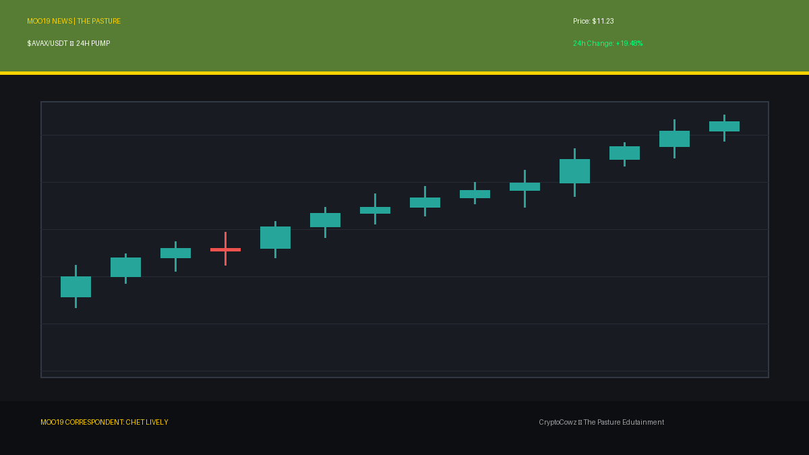
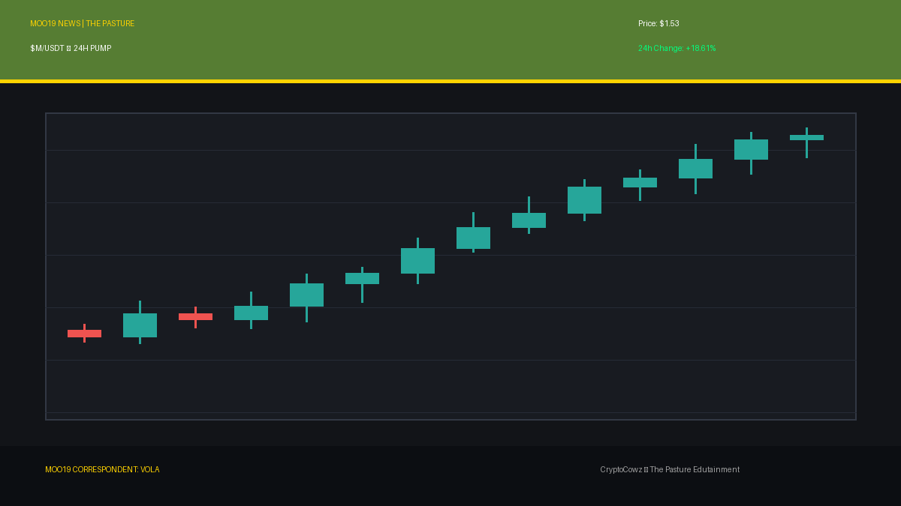
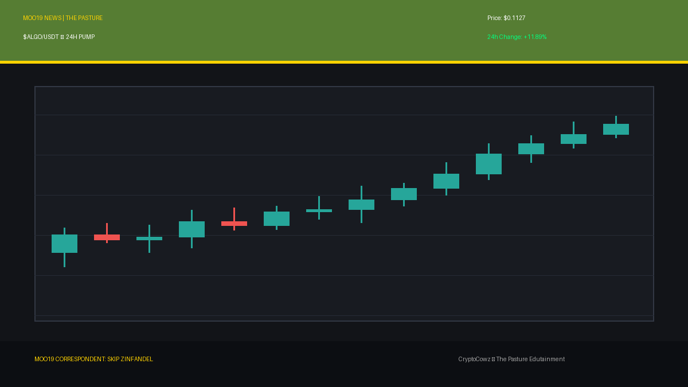
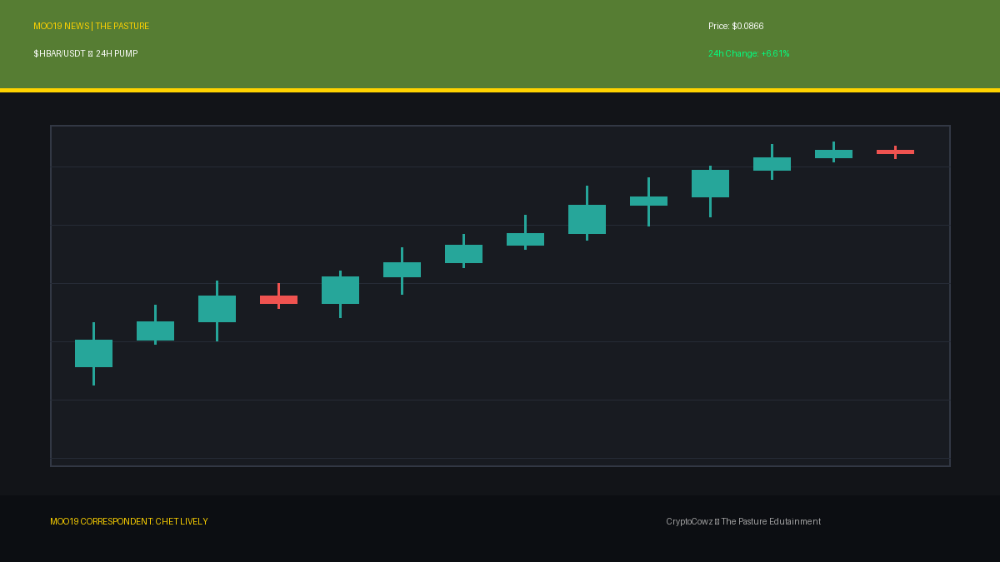
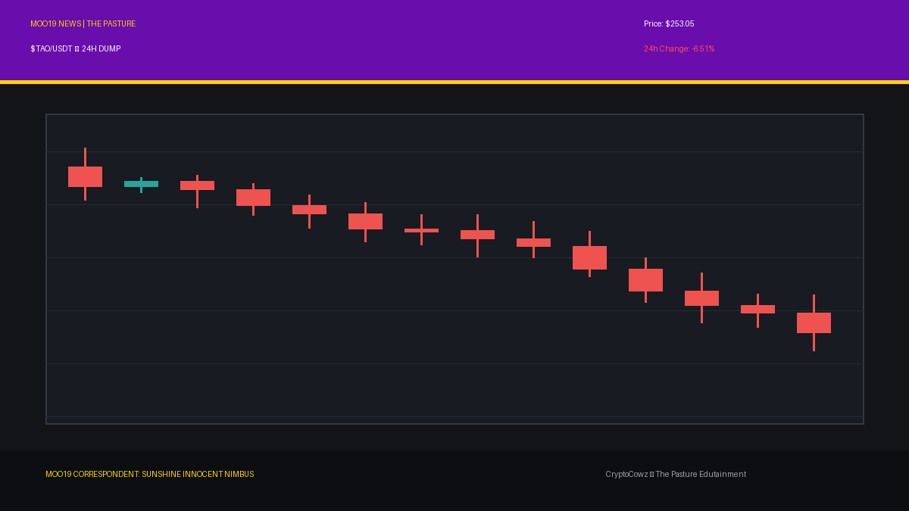
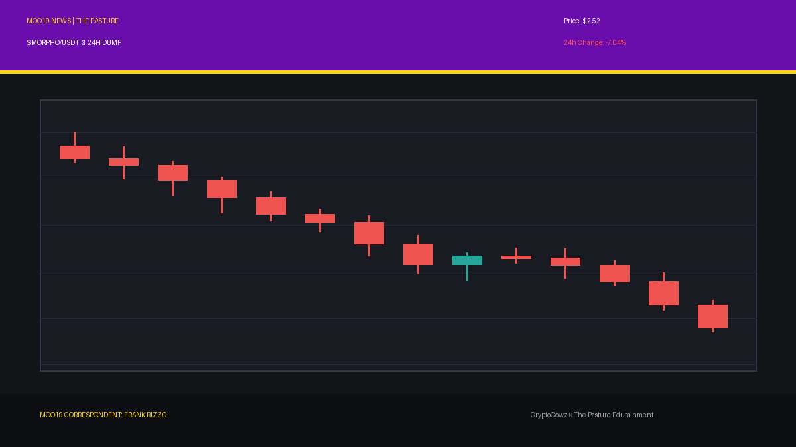
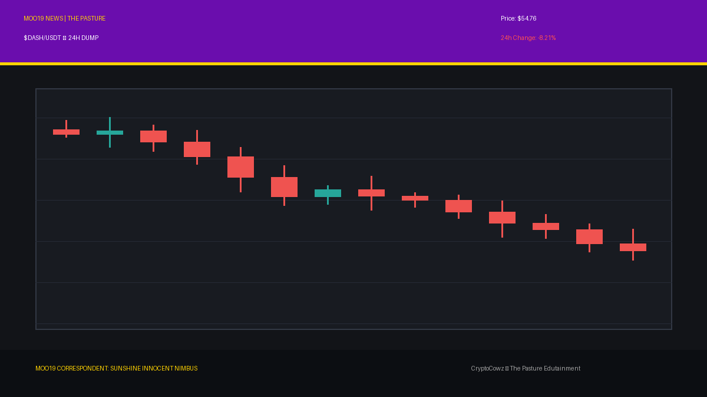

# Daily Top Movers: CMC Community Posts & Visuals

## 1. Bitway ($BTW) — 26.61% (PUMP)
**Cast Member:** Skip Zinfandel
**CMC Comment:** Bitway is charging up the charts +26.61%! I haven't seen green this lush since my last hairpiece adjustment. Stay smug, folks!

**Google Flow / Scene Prompt:**
> Clean 2D vector animation style, flat cel shading with bold outlines. Skip Zinfandel, a smug news anchor with a giant pompadour, standing in front of a giant high-tech broadcast screen showing tall, glowing green candlestick bars breaking upward through a resistance line, displaying the $BTW symbol with a bright green arrow pointing up. Palette features pasture green #567D33 and royal purple #6A0DAD.

---

## 2. Avalanche ($AVAX) — 19.48% (PUMP)
**Cast Member:** Chet Lively
**CMC Comment:** Avalanche just scored a massive +19.48% breakaway goal! The crowd is going wild as AVAX blitzes straight past defense!

**Google Flow / Scene Prompt:**
> Clean 2D vector animation style, flat cel shading with bold outlines. Chet Lively, an energetic sports anchor holding a microphone, pointing excitedly at a giant high-tech broadcast screen showing tall, glowing green candlestick bars breaking upward through a resistance line, displaying the $AVAX symbol with a green up arrow. Palette features pasture green #567D33 and corporate lavender #9F86C0.

---

## 3. MemeCore ($M) — 18.61% (PUMP)
**Cast Member:** VOLA
**CMC Comment:** Efficiency optimization complete: MemeCore yield maximized at +18.61%. Corporate synergy with memes yields optimal quarterly profits.

**Google Flow / Scene Prompt:**
> Clean 2D vector animation style, flat cel shading with bold outlines. VOLA, a sleek corporate AI CEO with glowing holographic elements, in a futuristic news studio next to a giant high-tech broadcast screen displaying tall, glowing green candlestick bars breaking upward through a resistance line, featuring $M symbol and a green upward arrow. Palette features royal purple #6A0DAD and corporate lavender #9F86C0.

---

## 4. Algorand ($ALGO) — 11.89% (PUMP)
**Cast Member:** Skip Zinfandel
**CMC Comment:** Algorand flexing +11.89%! Proof that pure elegance and my hair gel always prevail in the end.

**Google Flow / Scene Prompt:**
> Clean 2D vector animation style, flat cel shading with bold outlines. Skip Zinfandel with his signature pompadour adjusting his tie beside a giant high-tech broadcast screen featuring tall, glowing green candlestick bars breaking upward through a resistance line, showing $ALGO symbol and a green up arrow. Colors include pasture green #567D33 and royal purple #6A0DAD.

---

## 5. Hedera ($HBAR) — 6.61% (PUMP)
**Cast Member:** Chet Lively
**CMC Comment:** Hedera grinding out a steady +6.61% gain! That's disciplined teamwork right there on the ledger field!

**Google Flow / Scene Prompt:**
> Clean 2D vector animation style, flat cel shading with bold outlines. Chet Lively gesturing enthusiastically toward a giant high-tech broadcast screen displaying tall, glowing green candlestick bars breaking upward through a resistance line, marked with $HBAR symbol and a green arrow pointing up. Palette includes pasture green #567D33 and corporate lavender #9F86C0.

---

## 6. Bittensor ($TAO) — -6.51% (DUMP)
**Cast Member:** Sunshine Innocent Nimbus
**CMC Comment:** A lovely dark cloud hangs over Bittensor down -6.51%! The rain of liquidation is music to my gothic soul.

**Google Flow / Scene Prompt:**
> Clean 2D vector animation style, flat cel shading with bold outlines. Sunshine Innocent Nimbus, a goth weather girl with a dark umbrella, standing in front of a weather map radar showing tall, plunging red candlestick bars dropping off a cliff, with red crash percentages and stormy graphics for $TAO. Palette features royal purple #6A0DAD and corporate lavender #9F86C0.

---

## 7. Morpho ($MORPHO) — -7.04% (DUMP)
**Cast Member:** Frank Rizzo
**CMC Comment:** Reporting live from the gutters where Morpho slipped -7.04%. Watch your step, folks, it's slick down here!

**Google Flow / Scene Prompt:**
> Clean 2D vector animation style, flat cel shading with bold outlines. Frank Rizzo, a gritty street reporter in a worn trench coat holding a microphone in a dark alley, next to a gritty alley terminal showing tall, plunging red candlestick bars dropping off a cliff, displaying $MORPHO with red crash percentages. Palette includes royal purple #6A0DAD and pasture green #567D33.

---

## 8. Dash ($DASH) — -8.21% (DUMP)
**Cast Member:** Sunshine Innocent Nimbus
**CMC Comment:** Dash plunges -8.21%! Delicious misery washes over the market like a beautiful midnight thunderstorm.

**Google Flow / Scene Prompt:**
> Clean 2D vector animation style, flat cel shading with bold outlines. Sunshine Innocent Nimbus pointing gleefully at a weather map radar screen showing tall, plunging red candlestick bars dropping off a cliff with stormy lightning graphics and $DASH symbol down arrows. Colors feature royal purple #6A0DAD and corporate lavender #9F86C0.

---

## 9. Lighter ($LIT) — -9.59% (DUMP)
**Cast Member:** Frank Rizzo
**CMC Comment:** Lighter's flame got blown right out, dropping -9.59%! I've seen back alleys brighter than this chart!

**Google Flow / Scene Prompt:**
> Clean 2D vector animation style, flat cel shading with bold outlines. Frank Rizzo in his trench coat scribbling on a notepad beside a gritty alley terminal showing tall, plunging red candlestick bars dropping off a cliff with red crash percentage numbers and $LIT symbol. Palette incorporates pasture green #567D33 and royal purple #6A0DAD.

---

## 10. Akedo ($AKE) — -13.07% (DUMP)
**Cast Member:** Sunshine Innocent Nimbus
**CMC Comment:** Akedo plummets a glorious -13.07%! Pure aesthetic despair... absolute perfection.

**Google Flow / Scene Prompt:**
> Clean 2D vector animation style, flat cel shading with bold outlines. Sunshine Innocent Nimbus smiling serenely before a weather map radar screen displaying tall, plunging red candlestick bars dropping off a cliff, complete with dark storm graphics and $AKE crash metrics. Palette features royal purple #6A0DAD, pasture green #567D33, and corporate lavender #9F86C0.

---
