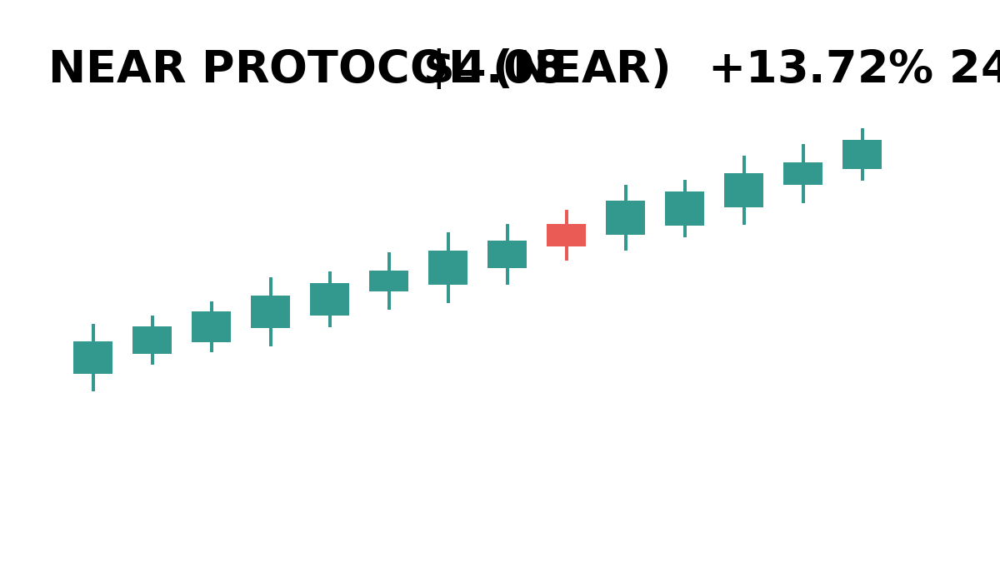
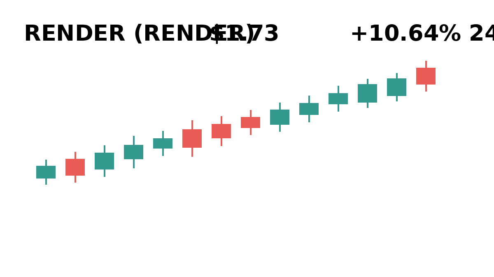
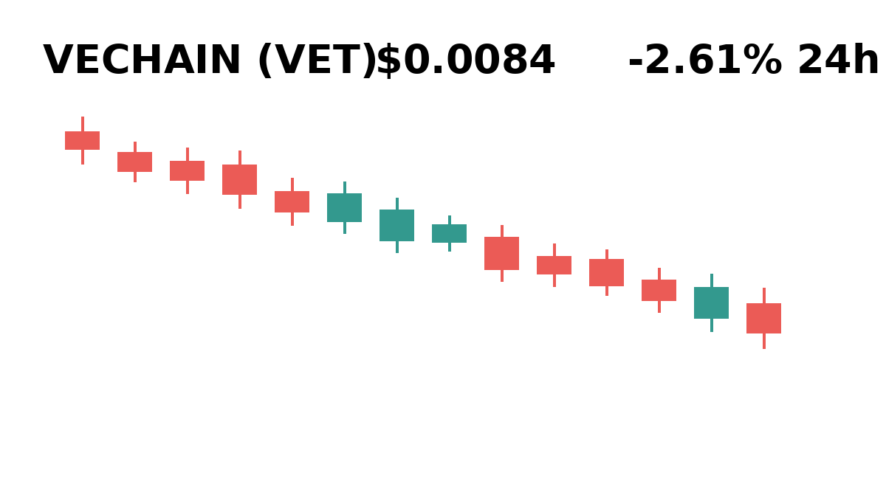
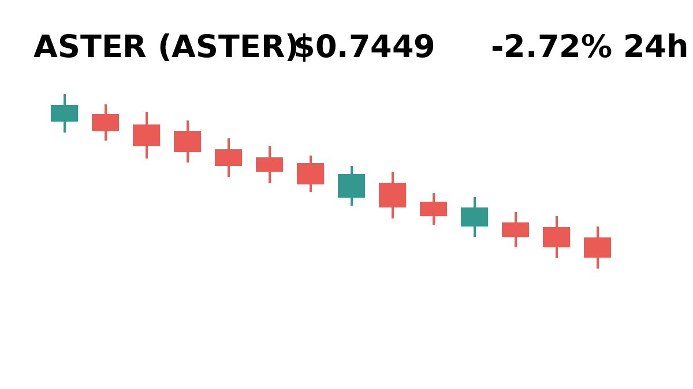
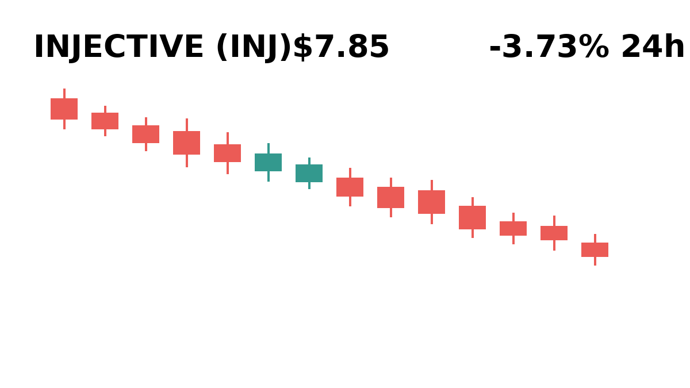
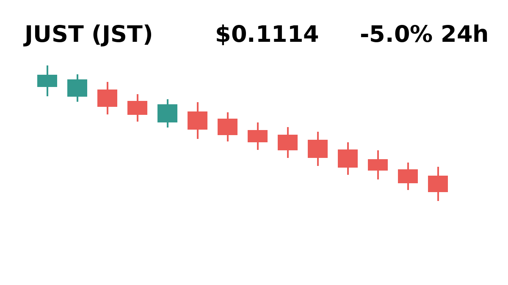

# Daily Top Movers: CMC Community Visuals & Posts

## 1. Bitway ($BTW) — +27.83% (PUMP)
**Cast Member:** Skip Zinfandel
**CMC Comment:** Bitway is up nearly thirty percent and my third yacht is already paid for in spirit! Generational wealth is just one green candle away, keep buying!

---

## 2. Avalanche ($AVAX) — +14.93% (PUMP)
**Cast Member:** Frank Rizzo
**CMC Comment:** Avalanche jumps fifteen percent, which means a bunch of toddlers in hoodies think they invented high finance again.

---

## 3. NEAR Protocol ($NEAR) — +13.72% (PUMP)
**Cast Member:** Sunshine Innocent Nimbus
**CMC Comment:** NEAR is floating super high into the sky, which is lovely because that is where all the pretty digital butterflies live!

---

## 4. Venice Token ($VVV) — +11.7% (PUMP)
**Cast Member:** Professor Hartmut
**CMC Comment:** The recent appreciation in Venice Token merely illustrates a brief window of irrational exuberance within localized liquidity pools.

---

## 5. Render ($RENDER) — +10.64% (PUMP)
**Cast Member:** Skip Zinfandel
**CMC Comment:** Render is printing pure heat right now, if you are not leveraged 100x on this chart you clearly hate winning!

---

## 6. VeChain ($VET) — -2.61% (DUMP)
**Cast Member:** Frank Rizzo
**CMC Comment:** VeChain slips again, proving that supply chain logistics are great until you realize you are the one holding the heavy freight.

---

## 7. Aster ($ASTER) — -2.72% (DUMP)
**Cast Member:** Sunshine Innocent Nimbus
**CMC Comment:** Oh no, Aster dropped a teeny bit, but red is just green's cozy bedtime clothes before it goes back to the moon!

---

## 8. Injective ($INJ) — -3.73% (DUMP)
**Cast Member:** Professor Hartmut
**CMC Comment:** Injective's negative trajectory demonstrates classic retail capitulation driven by macro-economic volatility and systemic leverage decay.

---

## 9. JUST ($JST) — -5.0% (DUMP)
**Cast Member:** Frank Rizzo
**CMC Comment:** JUST down five percent today, proving once again that buying tokens named like emotional pleas never ends well for your wallet.

---

## 10. Akedo ($AKE) — -8.2% (DUMP)
**Cast Member:** Skip Zinfandel
**CMC Comment:** Akedo is down eight percent which is just an elite fire-sale discount for absolute chad-level dip buyers!

---
