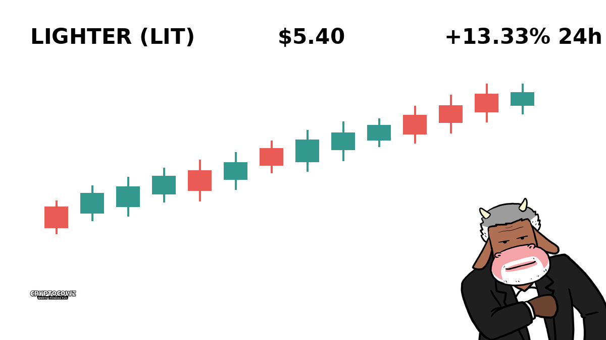
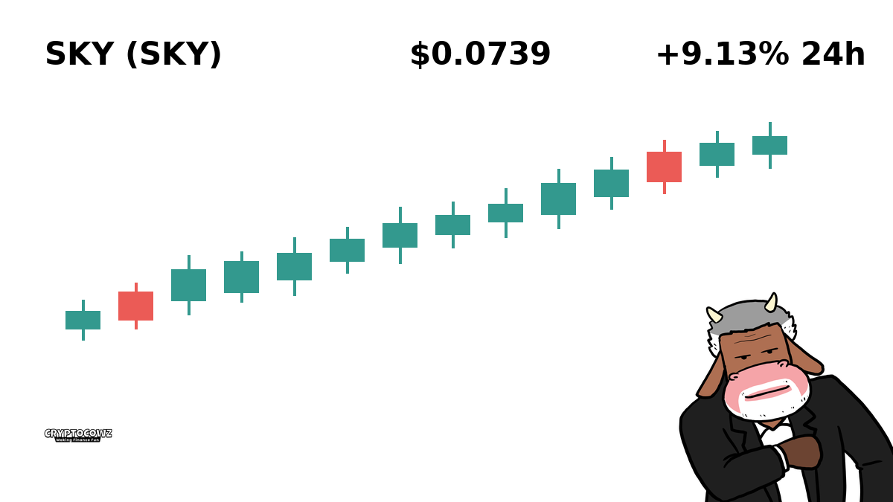
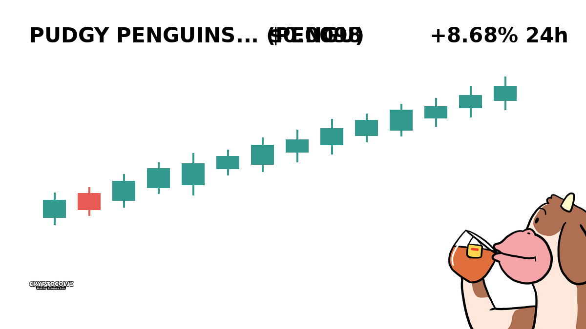
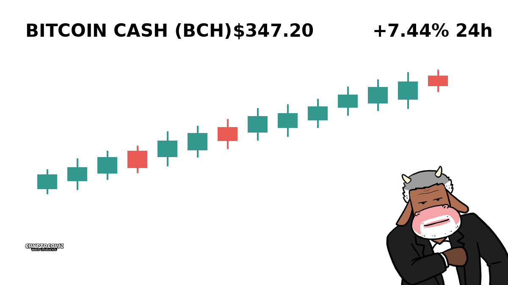
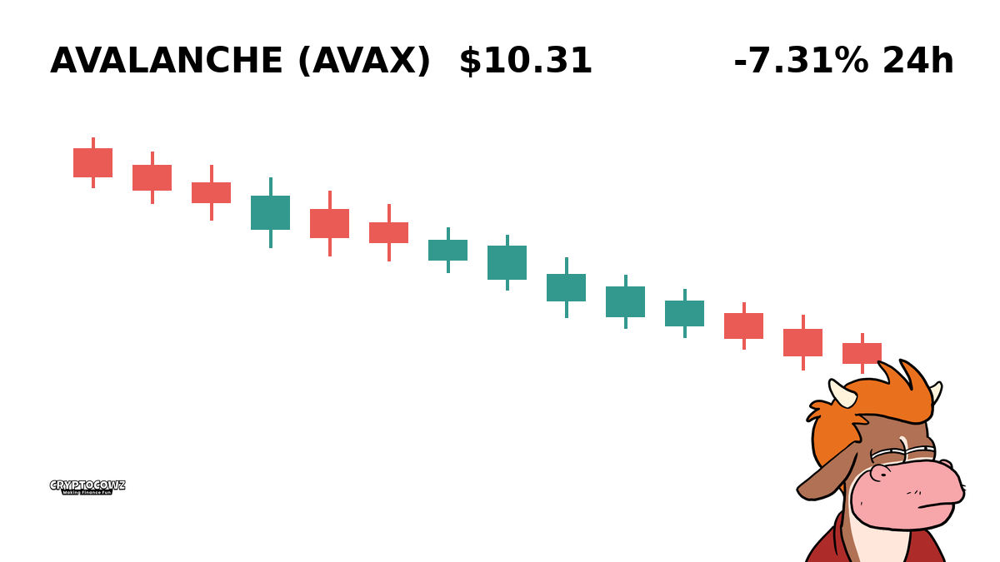
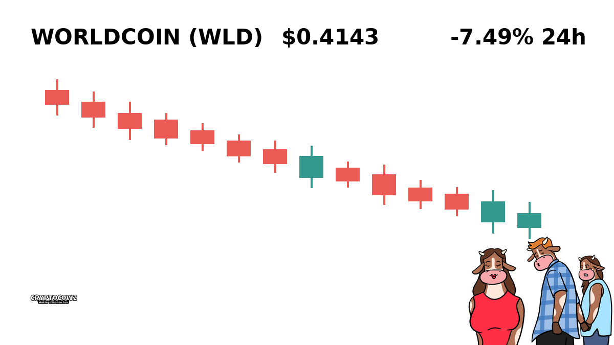
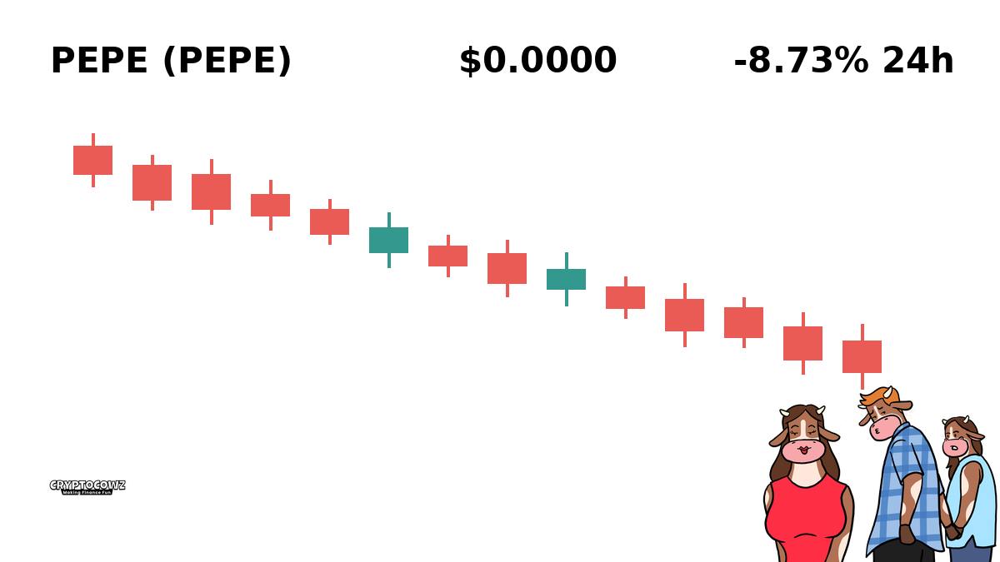
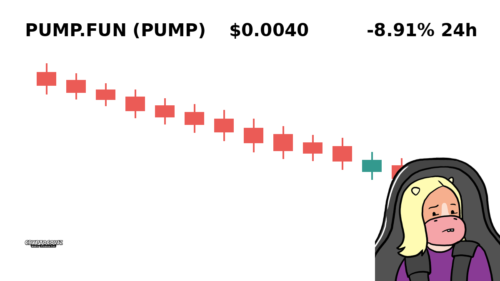

# Daily Top Movers: CMC Community Visuals & Posts

## 1. Lighter ($LIT) — +13.33% (PUMP)
**Cast Member:** Frank Rizzo
**CMC Comment:** Up 13% and I've already put a down payment on a second jet ski I don't know how to ride. Never selling, generational wealth is literally days away!

---

## 2. Bitway ($BTW) — +10.94% (PUMP)
**Cast Member:** Skip Zinfandel
**CMC Comment:** Bitway is pumping so hard my second mortgage is starting to look like a stroke of sheer financial genius. We are taking this rocket straight to the top, boys!

---

## 3. Sky ($SKY) — +9.13% (PUMP)
**Cast Member:** Professor Hartmut
**CMC Comment:** An unexpected 9% surge in SKY, clearly validating my algorithmic thesis that irrational exuberance always triumphs over basic arithmetic.

---

## 4. Pudgy Penguins ($PENGU) — +8.68% (PUMP)
**Cast Member:** Sunshine Innocent Nimbus
**CMC Comment:** Look at the cute little flightless birds going up! I bought ten thousand of them because penguins are nice and now we're all going to be rich forever!

---

## 5. Bitcoin Cash ($BCH) — +7.44% (PUMP)
**Cast Member:** Skip Zinfandel
**CMC Comment:** Bitcoin Cash back in green, proved all the haters wrong for the forty-seventh time this year! Time to order the top-shelf champagne!

---

## 6. Avalanche ($AVAX) — -7.31% (DUMP)
**Cast Member:** Frank Rizzo
**CMC Comment:** Down 7% on Avalanche and my wife's lawyer just called. It's fine, it's just a healthy consolidation down into a completely empty bank account.

---

## 7. Worldcoin ($WLD) — -7.49% (DUMP)
**Cast Member:** Professor Hartmut
**CMC Comment:** Scanning your eyeballs for a token that loses 7% of its value in a day seems like an inefficient trade off for human dignity.

---

## 8. Pepe ($PEPE) — -8.73% (DUMP)
**Cast Member:** Sunshine Innocent Nimbus
**CMC Comment:** The sad green frog is falling again, but I'm holding his hand all the way down to zero because true friendship isn't about profit.

---

## 9. Pump.fun ($PUMP) — -8.91% (DUMP)
**Cast Member:** Frank Rizzo
**CMC Comment:** Irony at its finest: Pump.fun dumps 9% and now my fun is completely ruined along with my credit score.

---

## 10. Akedo ($AKE) — -14.88% (DUMP)
**Cast Member:** Professor Hartmut
**CMC Comment:** A 14% drop in Akedo provides an empirical demonstration of gravitational collapse applied to speculative internet coupons.

---
