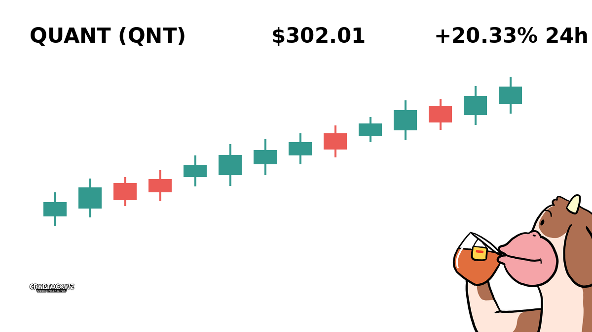
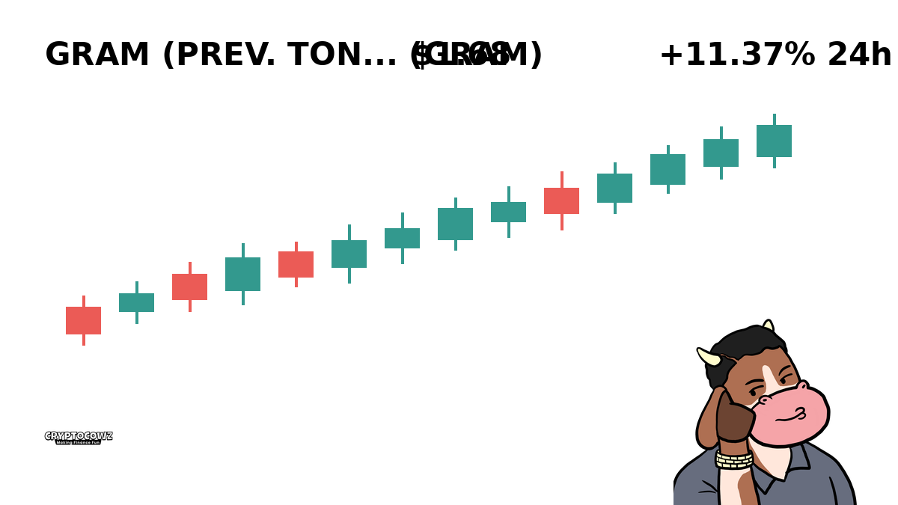
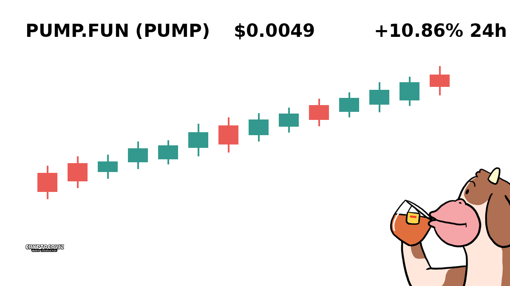
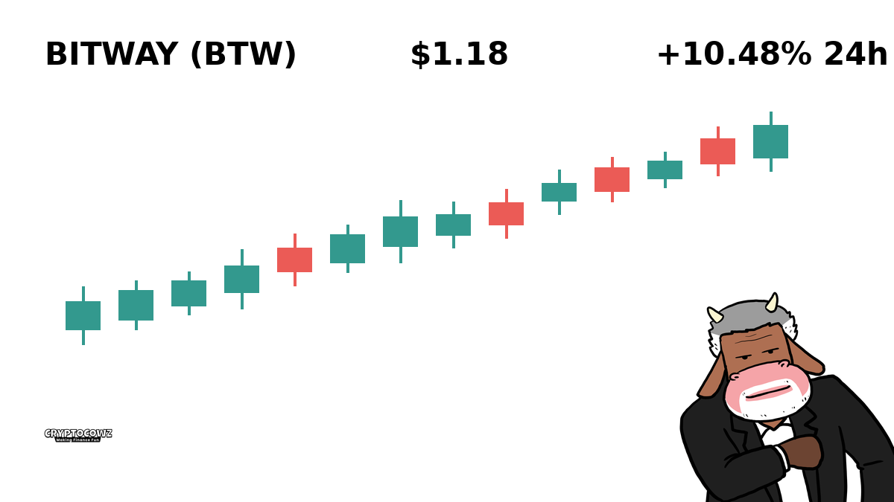
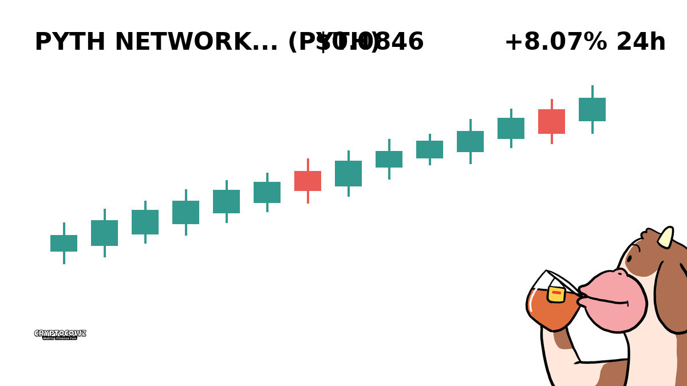
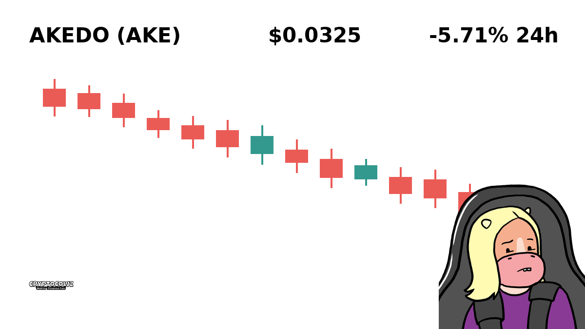
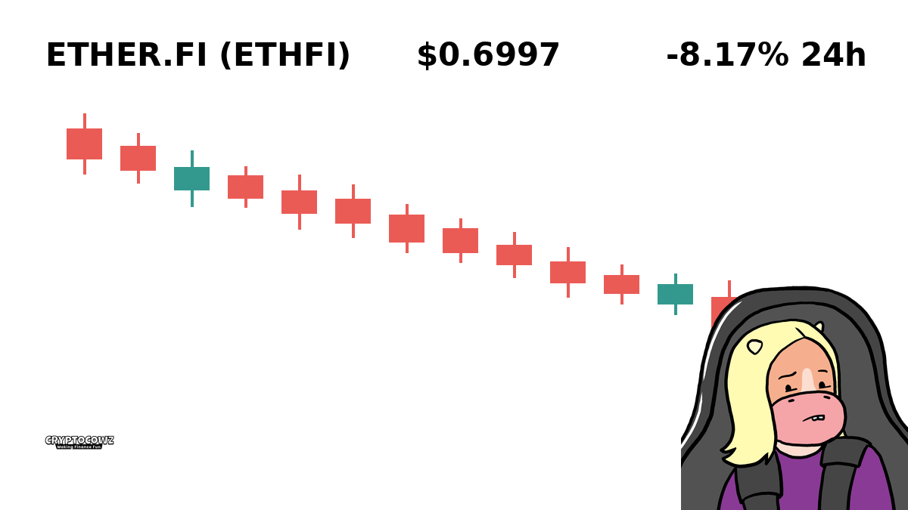

# Daily Top Movers: CMC Community Visuals & Posts

## 1. Quant ($QNT) — +54.22% (PUMP)
**Cast Member:** Skip Zinfandel
**CMC Comment:** Up 54% in a single day? I am already refinancing my third vacation home to ape into enterprise interoperability before my ex-wife's lawyer finds out.

---

## 2. Gram (prev. Toncoin) ($GRAM) — +11.37% (PUMP)
**Cast Member:** Sunshine Innocent Nimbus
**CMC Comment:** Oh wow, Gram is hopping right up! I do not know what Telegram does, but any green chart feels like a warm hug from the universe!

---

## 3. Pump.fun ($PUMP) — +10.86% (PUMP)
**Cast Member:** Frank Rizzo
**CMC Comment:** It is called Pump for a reason, pal! Buy the top, scream at your screen, and let the degens feed the machine!

---

## 4. Bitway ($BTW) — +10.48% (PUMP)
**Cast Member:** Professor Hartmut
**CMC Comment:** Mathematically speaking, a ten percent increase in Bitway merely represents a temporary localized spike in speculative irrationality.

---

## 5. Pyth Network ($PYTH) — +8.07% (PUMP)
**Cast Member:** Skip Zinfandel
**CMC Comment:** The oracle says I am going to be rich, and my tailor is already taking my measurements for a silk blazer.

---

## 6. Filecoin ($FIL) — -5.18% (DUMP)
**Cast Member:** Frank Rizzo
**CMC Comment:** Decentralized storage? The only thing stored here is my massive regret and a bag full of heavy, useless tokens.

---

## 7. Akedo ($AKE) — -5.71% (DUMP)
**Cast Member:** Sunshine Innocent Nimbus
**CMC Comment:** Akedo is taking a tiny little nap right now, but every coin deserves a restful break after trying its best!

---

## 8. Aerodrome Finance ($AERO) — -5.73% (DUMP)
**Cast Member:** Skip Zinfandel
**CMC Comment:** Down over five percent? That is fine, my private pilot told me turbulence just means we are flying close to the sun!

---

## 9. Dash ($DASH) — -6.33% (DUMP)
**Cast Member:** Professor Hartmut
**CMC Comment:** As predicted, the velocity of Dash's depreciation correlates directly with its archaic narrative in a modern DeFi ecosystem.

---

## 10. Ether.fi ($ETHFI) — -8.17% (DUMP)
**Cast Member:** Frank Rizzo
**CMC Comment:** Ether.fi? More like Ether-bye-bye to my kid's college fund! Who is dumping this garbage into my lap?!

---
