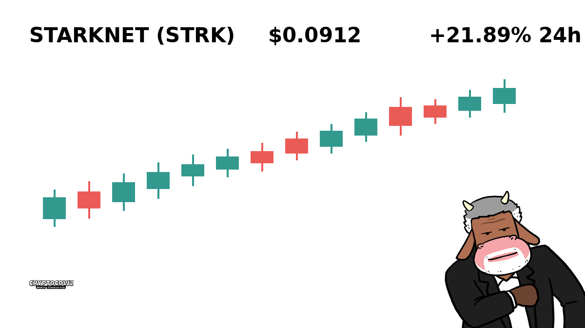
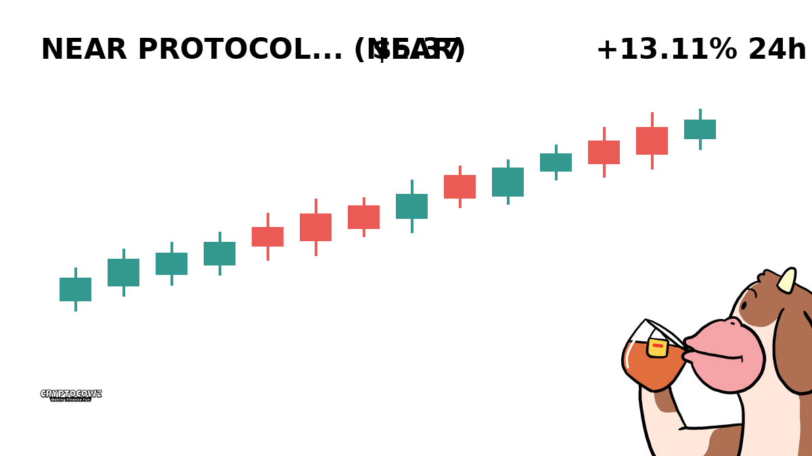
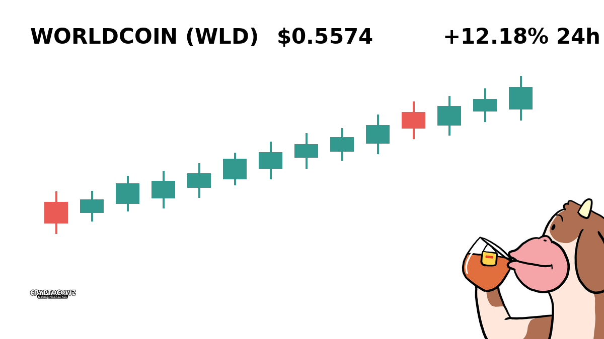
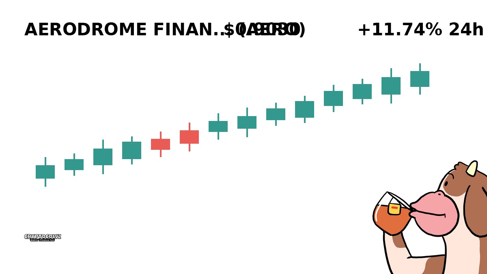
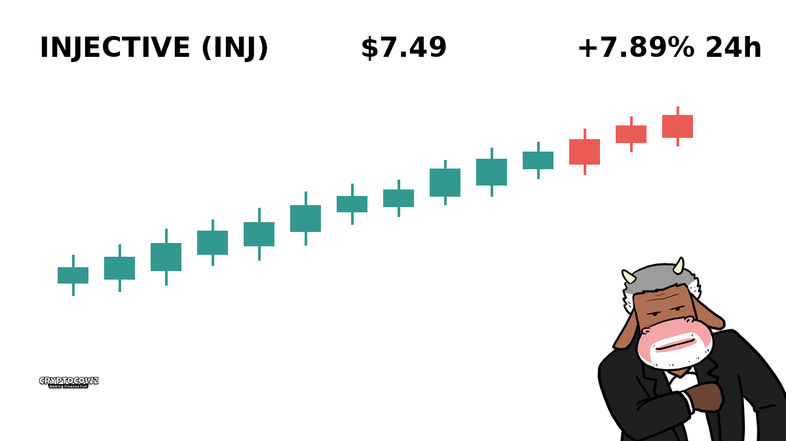
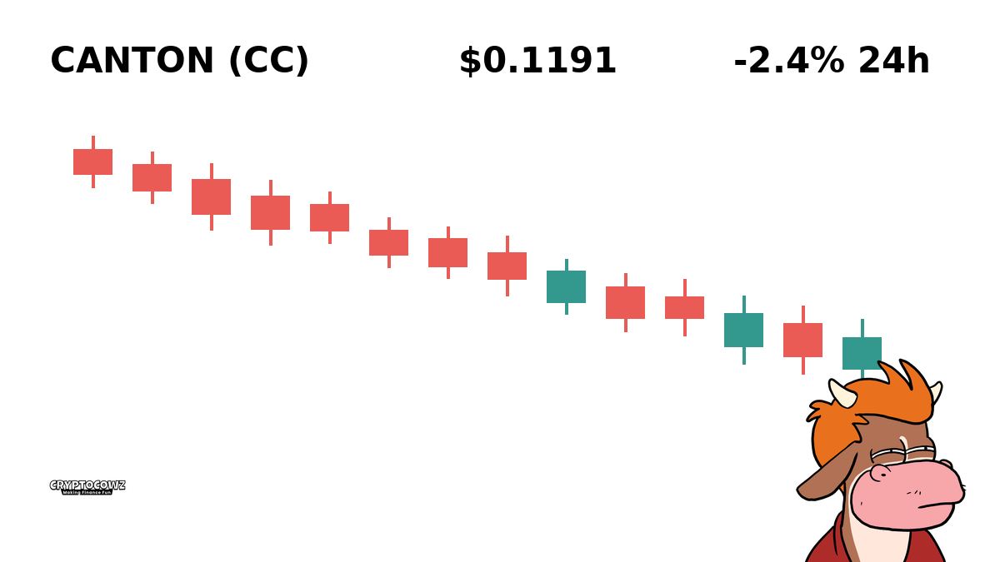
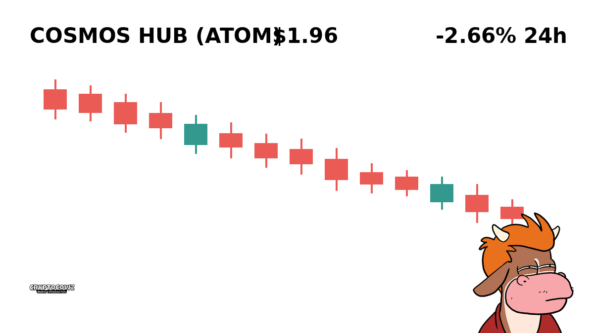
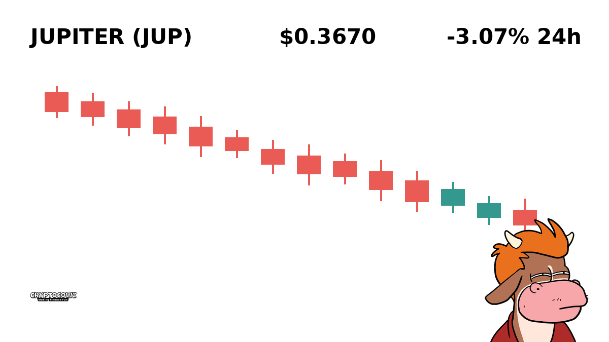
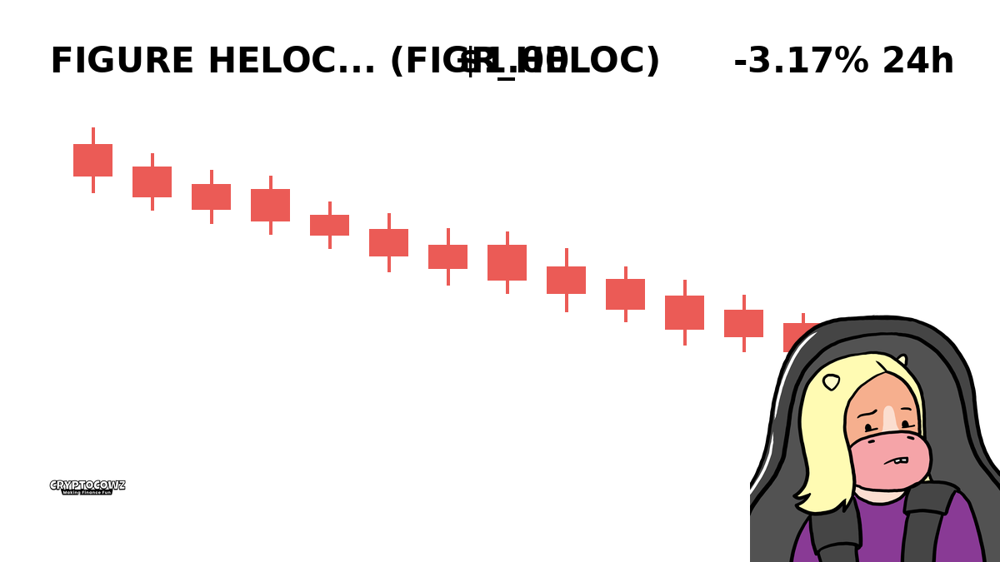

# Daily Top Movers: CMC Community Visuals & Posts

## 1. Starknet ($STRK) — +21.89% (PUMP)
**Cast Member:** Frank Rizzo
**CMC Comment:** Up 21 percent today! I just remortgaged my cousin's pizza shop to go all-in, don't tell him until we hit Mars!

---

## 2. NEAR Protocol ($NEAR) — +13.11% (PUMP)
**Cast Member:** Skip Zinfandel
**CMC Comment:** NEAR is surging and my portfolio is looking smoother than a vintage Cabernet. Time to order the gold-plated pasture gates!

---

## 3. Worldcoin ($WLD) — +12.61% (PUMP)
**Cast Member:** Professor Hartmut
**CMC Comment:** Scanning my irises for digital tokens has mathematically proven to be my highest yielding life decision. The green candles validate the dystopia!

---

## 4. Aerodrome Finance ($AERO) — +11.74% (PUMP)
**Cast Member:** Sunshine Innocent Nimbus
**CMC Comment:** The winds of profit are blowing so gently today! I made enough gains to buy organic alfalfa for the whole herd!

---

## 5. Injective ($INJ) — +7.89% (PUMP)
**Cast Member:** Frank Rizzo
**CMC Comment:** Injective is flexing hard today! Forget risk management, I'm backing the truck up and dumping everything into this green candle!

---

## 6. Canton ($CC) — -2.4% (DUMP)
**Cast Member:** Professor Hartmut
**CMC Comment:** A minor drawdown proves that retail capital allocation remains inherently irrational. I shall continue holding these heavy bags for academic research.

---

## 7. Cosmos Hub ($ATOM) — -2.66% (DUMP)
**Cast Member:** Skip Zinfandel
**CMC Comment:** Cosmos is dropping faster than my net worth at a high-stakes poker table. I am pouring a very heavy drink right now.

---

## 8. Jupiter ($JUP) — -3.07% (DUMP)
**Cast Member:** Sunshine Innocent Nimbus
**CMC Comment:** Jupiter is taking a tiny little nap right now! I am holding my bag very gently so it does not get scared away.

---

## 9. Figure Heloc ($FIGR_HELOC) — -3.17% (DUMP)
**Cast Member:** Frank Rizzo
**CMC Comment:** Down over 3 percent and my liquidation alert is ringing louder than a fire truck! I am pretending my phone is broken.

---

## 10. MemeCore ($M) — -3.49% (DUMP)
**Cast Member:** Professor Hartmut
**CMC Comment:** The decay of this meme asset highlights the inevitable thermodynamic entropy of speculative utility. My financial ruin is purely theoretical.

---
