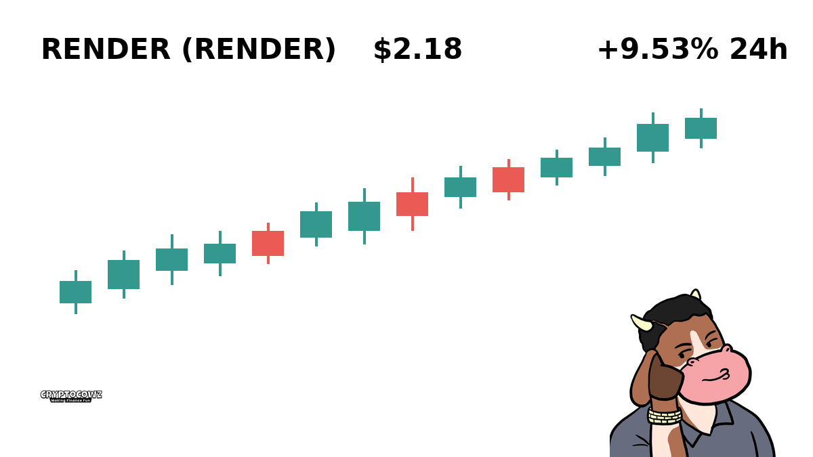
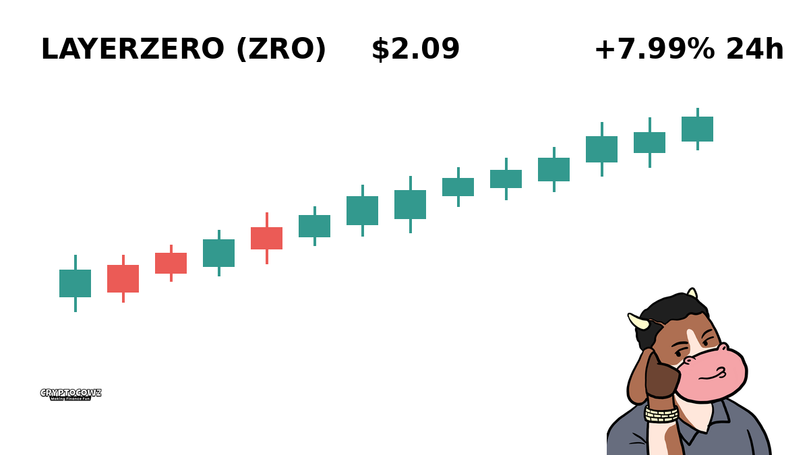
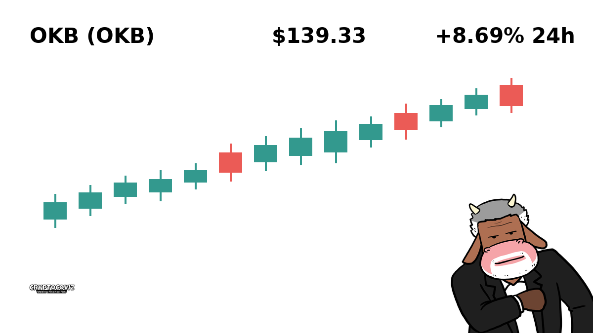
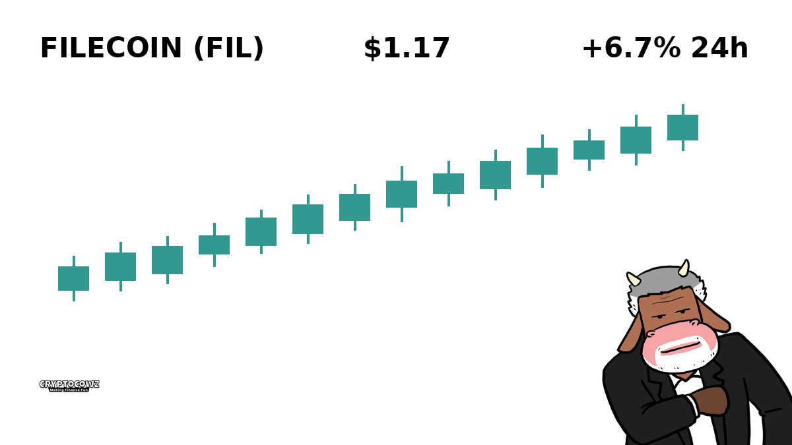
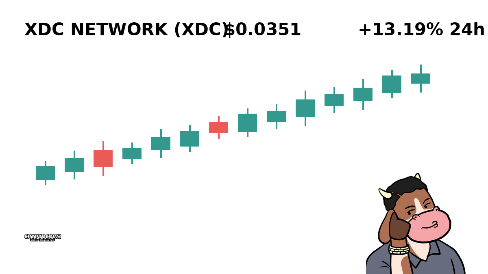
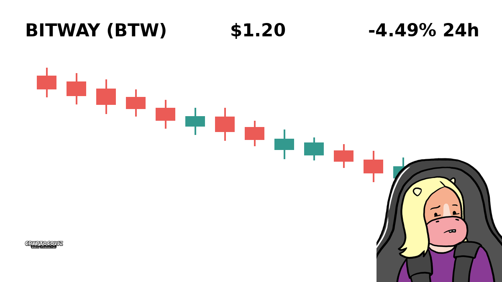
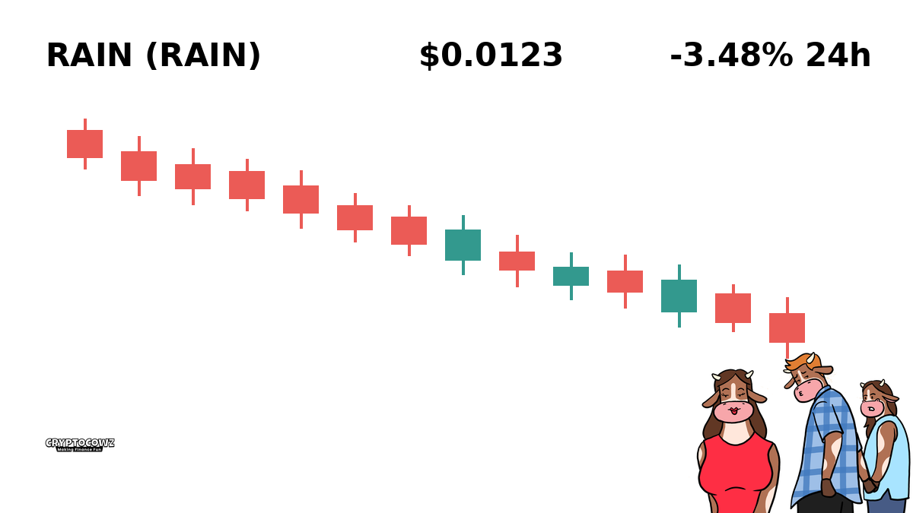
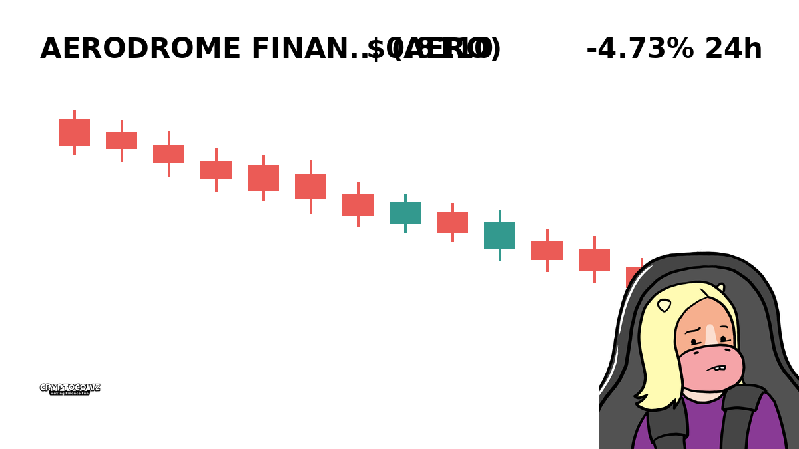
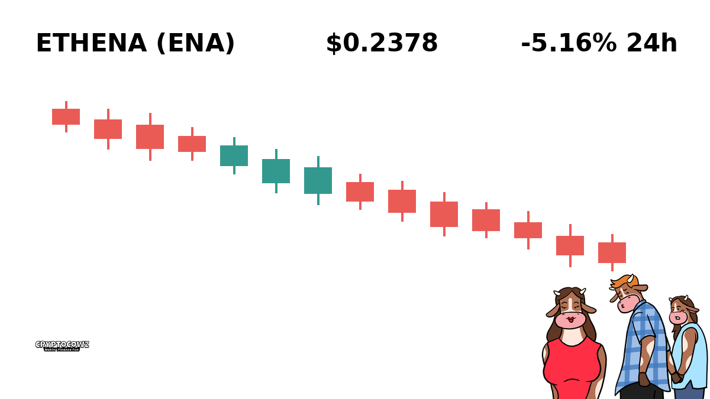
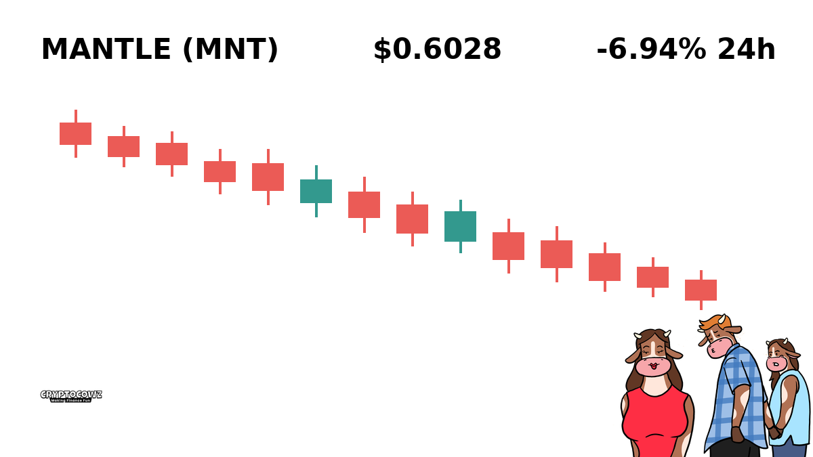

# Daily Top Movers: CMC Community Visuals & Posts

## 1. Render ($RENDER) — +9.53% (PUMP)
**Cast Member:** Skip Zinfandel
**CMC Comment:** My GPU is rendering digital profit so fast it just melted through my third mortgage paperwork! We are printing pixels straight to the moon baby!

---

## 2. LayerZero ($ZRO) — +8.89% (PUMP)
**Cast Member:** Professor Hartmut
**CMC Comment:** The empirical probability of bridging zero foundational value into absolute bullish momentum is fascinatingly irrational, yet economically delightful.

---

## 3. OKB ($OKB) — +8.69% (PUMP)
**Cast Member:** Frank Rizzo
**CMC Comment:** Hey listen to me, OKB is breaking out so fire up the steakhouse reservations and tell my landlord he gets paid when I say so!

---

## 4. Filecoin ($FIL) — +6.7% (PUMP)
**Cast Member:** Sunshine Innocent Nimbus
**CMC Comment:** I stored all my positive energy and manifestation aura on the decentralized cloud, and the cosmos returned standard green candle blessings!

---

## 5. XDC Network ($XDC) — +6.04% (PUMP)
**Cast Member:** Skip Zinfandel
**CMC Comment:** I have absolutely no idea what enterprise trade infrastructure means, but my chart drawn in green crayon says we buy the breakout!

---

## 6. Bitway ($BTW) — -4.49% (DUMP)
**Cast Member:** Frank Rizzo
**CMC Comment:** Bitway? More like Bit-go-away! I bought the dip and now the dip is digging a basement straight through my subfloor!

---

## 7. Rain ($RAIN) — -4.57% (DUMP)
**Cast Member:** Sunshine Innocent Nimbus
**CMC Comment:** It is just a temporary price shower, friends, the market is simply watering our yield crops so we can blossom tomorrow!

---

## 8. Aerodrome Finance ($AERO) — -4.73% (DUMP)
**Cast Member:** Professor Hartmut
**CMC Comment:** Aerodrome appears to be demonstrating classical rapid aerodynamic descent directly toward absolute financial rock bottom.

---

## 9. Ethena ($ENA) — -5.16% (DUMP)
**Cast Member:** Skip Zinfandel
**CMC Comment:** Synthetic dollars and very real losses! I explained delta-neutral yield to my wife, and now she is completely neutral about our marriage!

---

## 10. Mantle ($MNT) — -6.94% (DUMP)
**Cast Member:** Frank Rizzo
**CMC Comment:** Mantle is dropping faster than my pants at a casino table. Who in the world unplugged the buying bots?!

---
