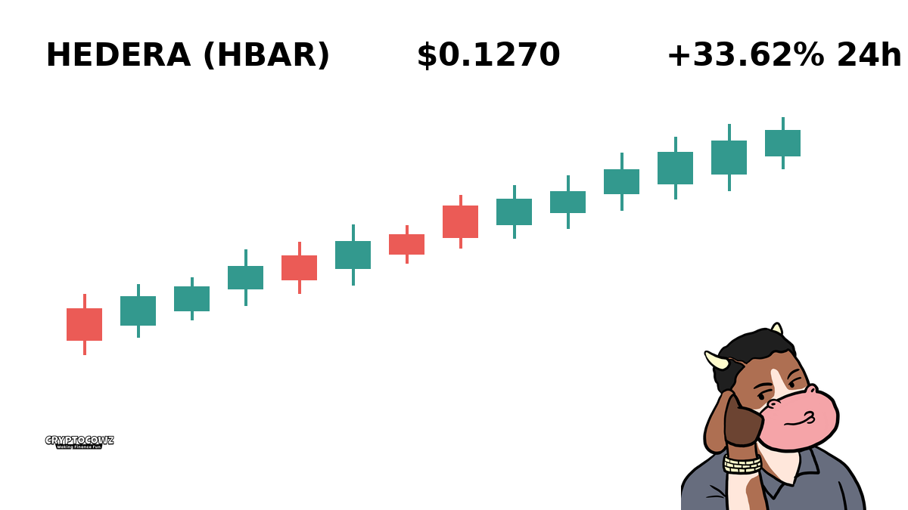
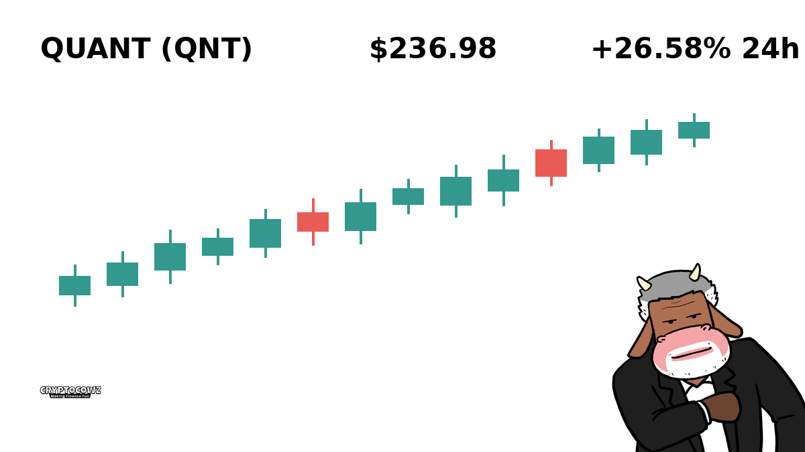
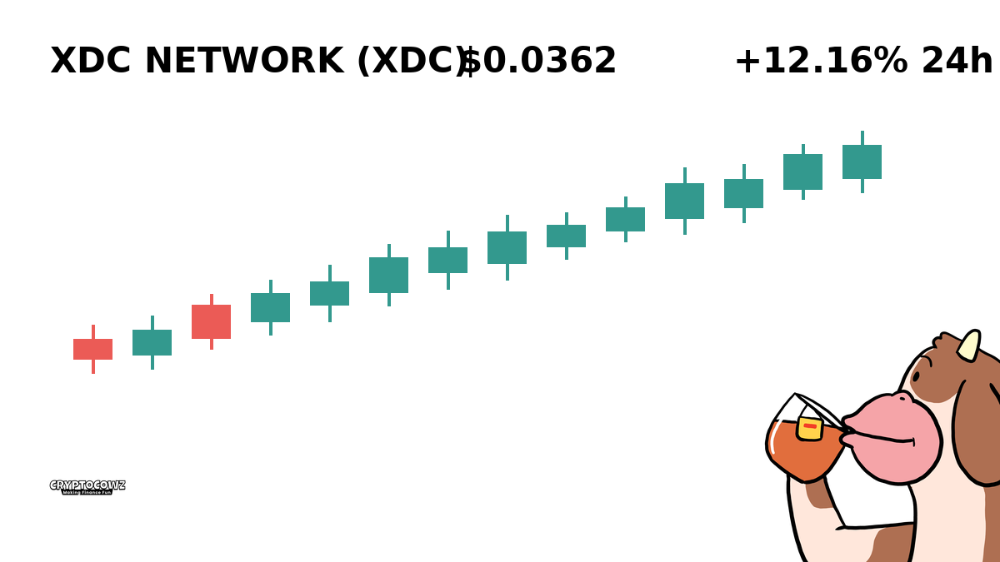
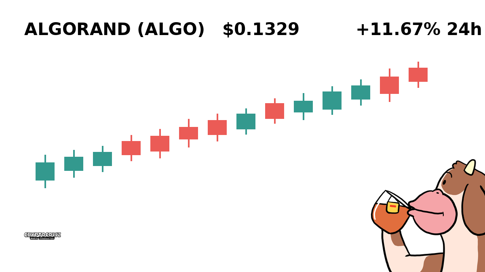
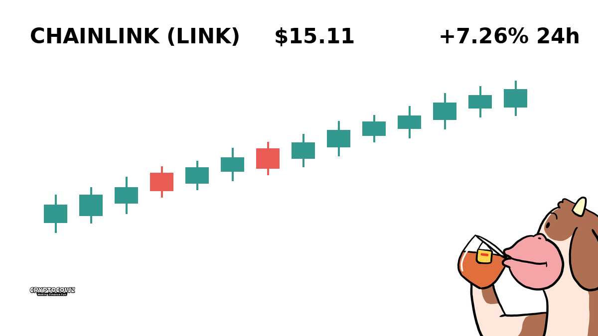
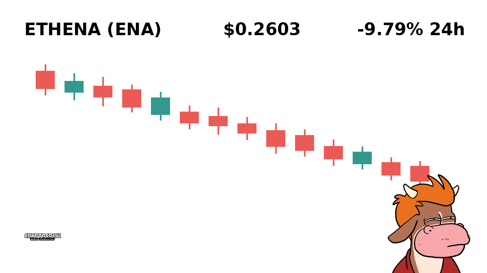
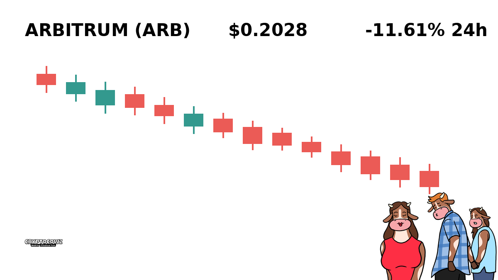
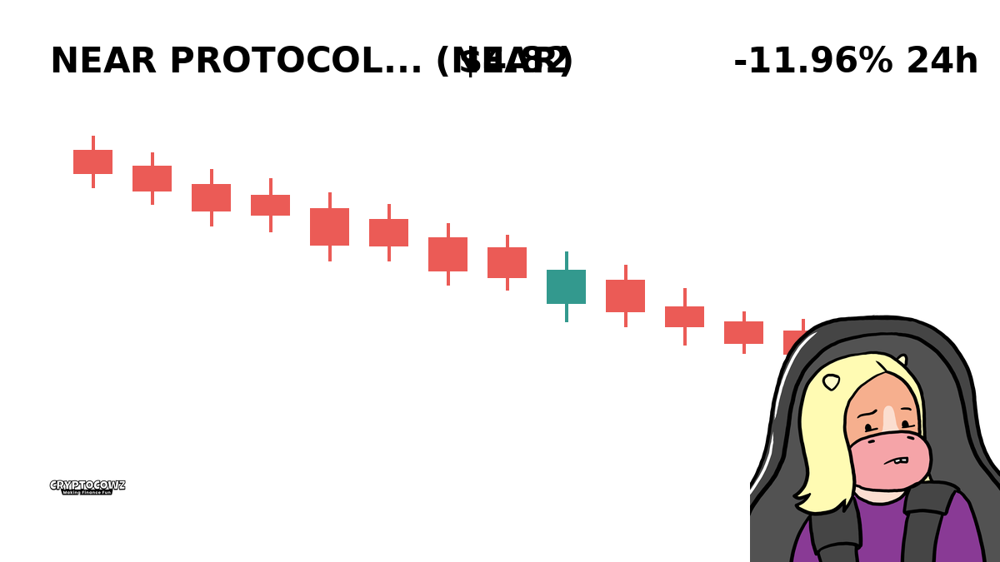
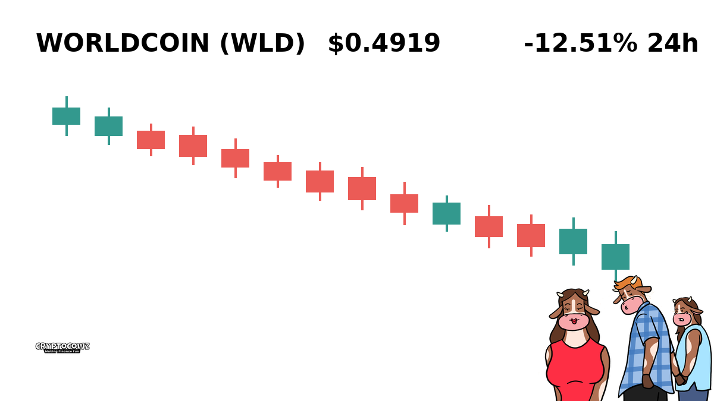

# Daily Top Movers: CMC Community Visuals & Posts

## 1. Hedera ($HBAR) — +33.62% (PUMP)
**Cast Member:** Skip Zinfandel
**CMC Comment:** Governing council? More like my personal yacht funding committee! We are printing green candles so fast my broker is sweating through his Armani suit!

---

## 2. Quant ($QNT) — +26.58% (PUMP)
**Cast Member:** Professor Hartmut
**CMC Comment:** Interoperability metrics suggest a brief parabolic trajectory before retail momentum yields to macro-economic reality. Enjoy this brief statistical anomaly.

---

## 3. XDC Network ($XDC) — +12.16% (PUMP)
**Cast Member:** Frank Rizzo
**CMC Comment:** Enterprise trade finance actually moving the needle for once. I am taking my cut and buying a truckload of meat before the inevitable drop.

---

## 4. Algorand ($ALGO) — +11.67% (PUMP)
**Cast Member:** Sunshine Innocent Nimbus
**CMC Comment:** Silvio's pure proof-of-stake is aligning our chakras with the cosmic ledger today! Breathe in the green candles, beautiful souls!

---

## 5. Chainlink ($LINK) — +7.26% (PUMP)
**Cast Member:** Skip Zinfandel
**CMC Comment:** Oracles are screaming green and so am I! Sergey's sweater collection is funding my second divorce!

---

## 6. Ethena ($ENA) — -9.79% (DUMP)
**Cast Member:** Frank Rizzo
**CMC Comment:** Synthetic dollars, real tears. I told you kids that high-yield magic trick was run by amateurs who couldn't organize a pizza party.

---

## 7. Arbitrum ($ARB) — -11.61% (DUMP)
**Cast Member:** Professor Hartmut
**CMC Comment:** Layer-2 scaling appears to have successfully scaled down your net worth by nearly twelve percent. A fascinating study in rapid liquidity dissolution.

---

## 8. NEAR Protocol ($NEAR) — -11.96% (DUMP)
**Cast Member:** Sunshine Innocent Nimbus
**CMC Comment:** The universe is merely cleansing our karma through this temporary candle of correction. Let go of the illusion of your initial investment, man.

---

## 9. Worldcoin ($WLD) — -12.51% (DUMP)
**Cast Member:** Skip Zinfandel
**CMC Comment:** I scanned my retinas into a shiny silver orb and all I got was a margin call and a ruined Tuesday!

---

## 10. Bitway ($BTW) — -16.76% (DUMP)
**Cast Member:** Frank Rizzo
**CMC Comment:** Bitway? Bit-go-away is more like it. Down seventeen percent and my cousin Vinnie says it ain't coming back.

---
