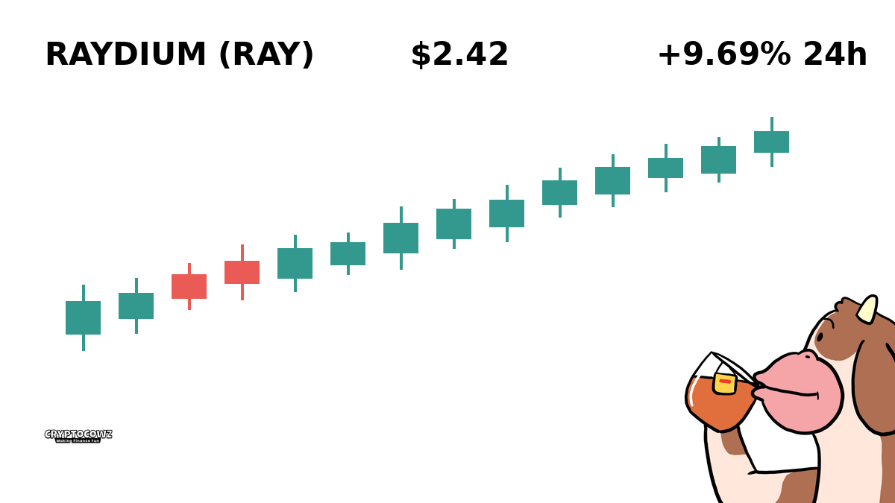
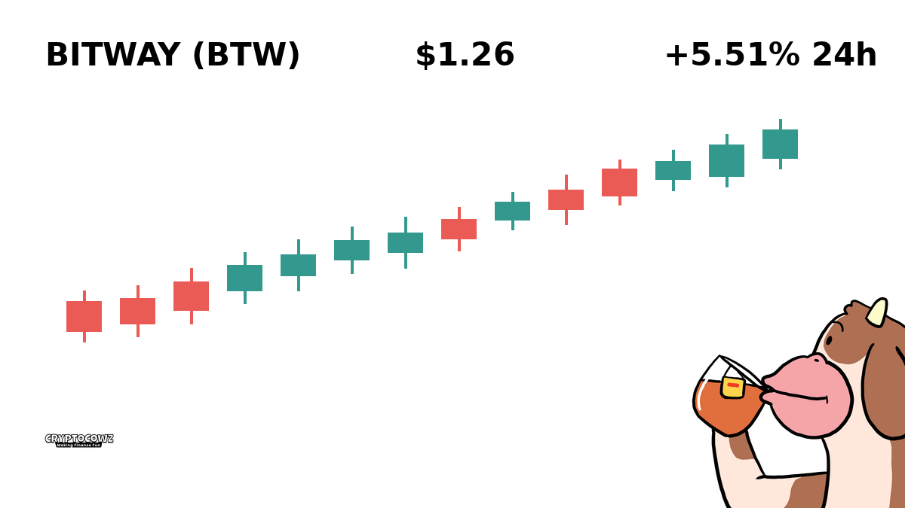
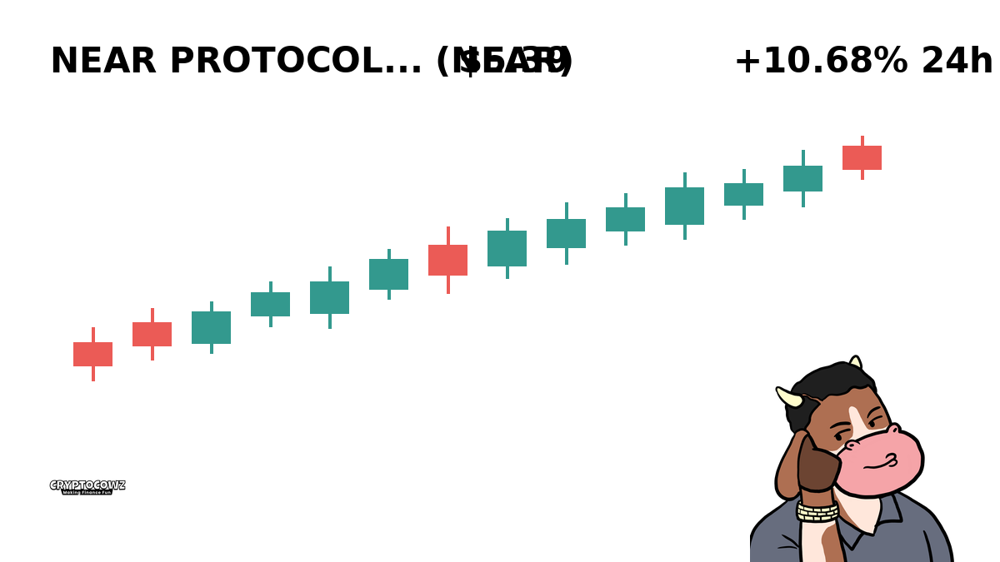
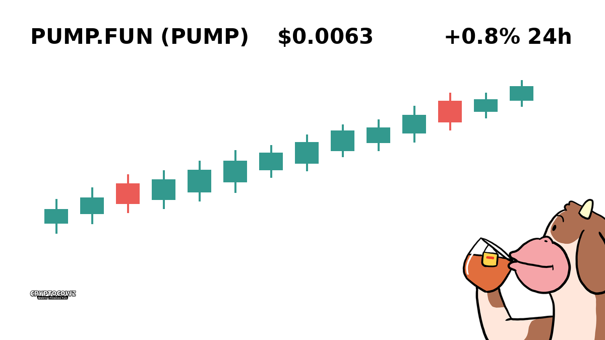
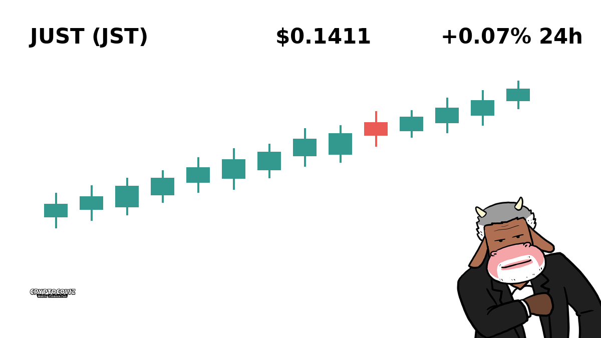
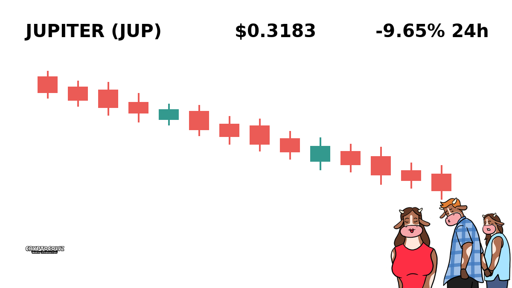
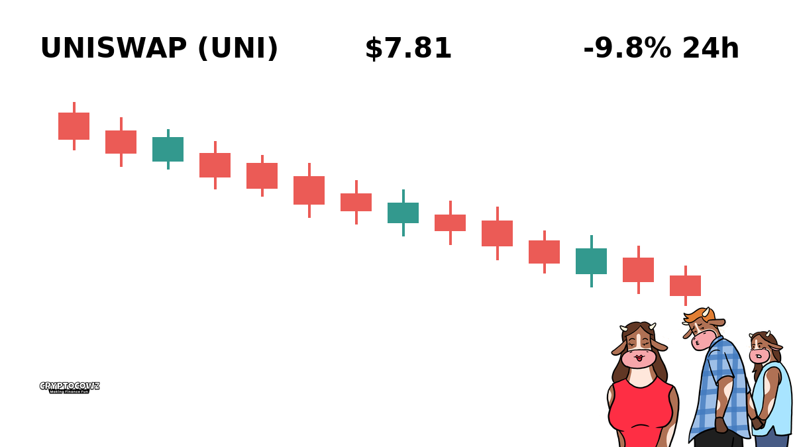
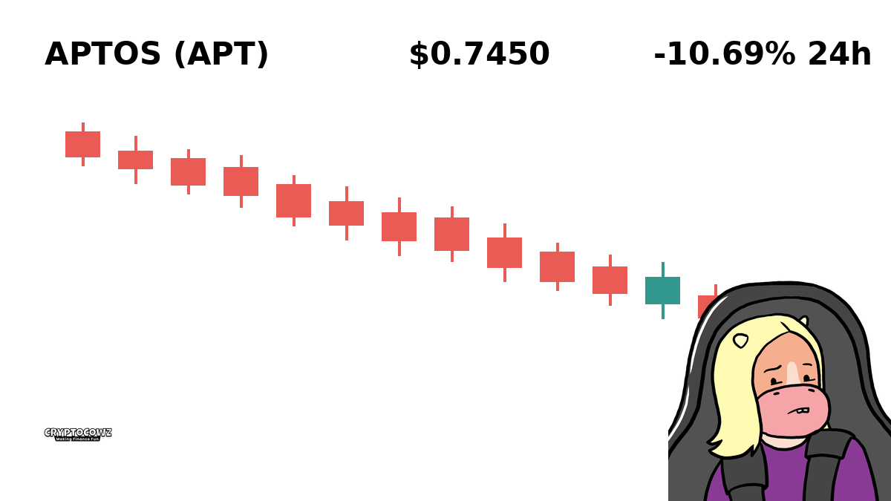
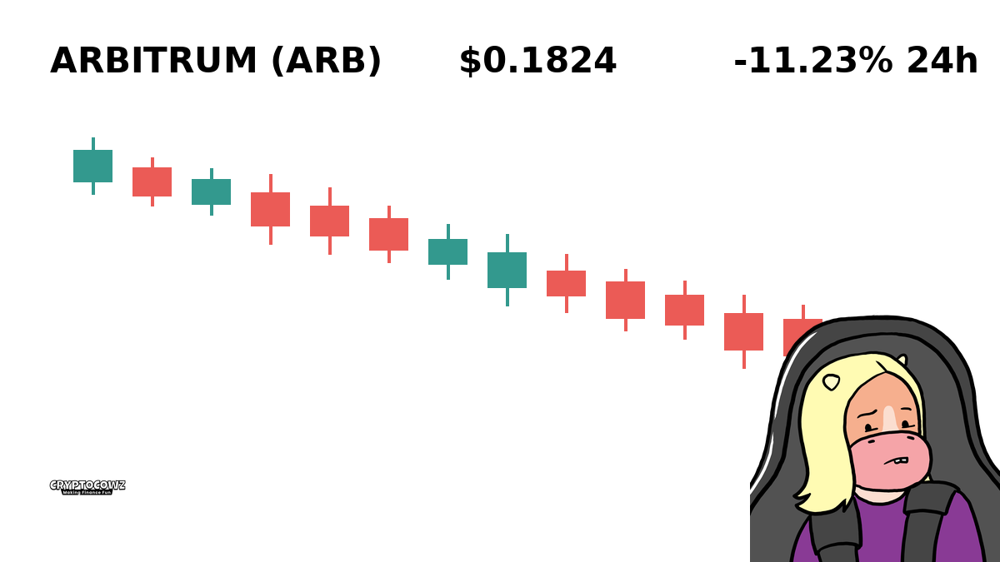
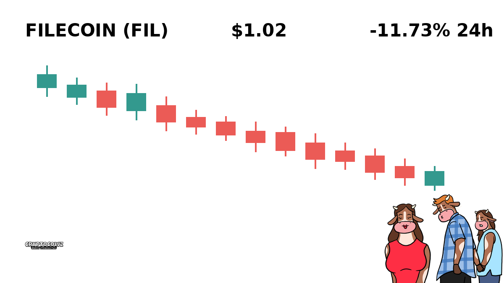

# Daily Top Movers: CMC Community Visuals & Posts

## 1. Raydium ($RAY) — +9.69% (PUMP)
**Cast Member:** Skip Zinfandel
**CMC Comment:** Up almost ten percent on Solana DEX volume alone, meaning my third ex-wife is officially calling back for alimony adjustments. We are so back, baby!

---

## 2. Bitway ($BTW) — +5.51% (PUMP)
**Cast Member:** Sunshine Innocent Nimbus
**CMC Comment:** The universe alignment is sending Bitway straight into the third eye chakra of massive gains! I can feel my wallet vibrating with pure financial enlightenment.

---

## 3. NEAR Protocol ($NEAR) — +3.04% (PUMP)
**Cast Member:** Professor Hartmut
**CMC Comment:** A modest three percent ascension indicates an algorithmic stabilization phase before systemic retail frenzy. I recommend recalculating your leverage thresholds immediately.

---

## 4. Pump.fun ($PUMP) — +0.8% (PUMP)
**Cast Member:** Frank Rizzo
**CMC Comment:** Point-eight percent green? Hey, a pump is a pump, pal, don't look a gift horse in the mouth or I'll break its knees.

---

## 5. JUST ($JST) — +0.07% (PUMP)
**Cast Member:** Skip Zinfandel
**CMC Comment:** Zero point zero seven percent green is all the confirmation bias I need to order the gold-plated jet ski. Green is green, stay rich!

---

## 6. Jupiter ($JUP) — -9.65% (DUMP)
**Cast Member:** Frank Rizzo
**CMC Comment:** Down nearly ten percent? Somebody better tell these cat-loving paper hands that Jupiter isn't supposed to crash into the ocean.

---

## 7. Uniswap ($UNI) — -9.8% (DUMP)
**Cast Member:** Professor Hartmut
**CMC Comment:** Uniswap's current trajectory exhibits a classic panic-induced liquidity exit. Statistically speaking, your bags are now heavy enough to alter localized gravitational fields.

---

## 8. Aptos ($APT) — -10.69% (DUMP)
**Cast Member:** Skip Zinfandel
**CMC Comment:** Down over ten percent in twenty-four hours! Guess my VC buddies are dumping to buy more artisanal yacht polish, but I'm holding until zero!

---

## 9. Arbitrum ($ARB) — -11.23% (DUMP)
**Cast Member:** Sunshine Innocent Nimbus
**CMC Comment:** Arbitrum is just shedding its outer physical layer to cleanse the blockchain of negative aura! Hold hands and breathe through the eleven percent discount, friends.

---

## 10. Filecoin ($FIL) — -11.73% (DUMP)
**Cast Member:** Frank Rizzo
**CMC Comment:** Filecoin is dropping faster than my cousin Vinny when the feds showed up. Store your files on a USB stick and cut your losses, pal.

---
