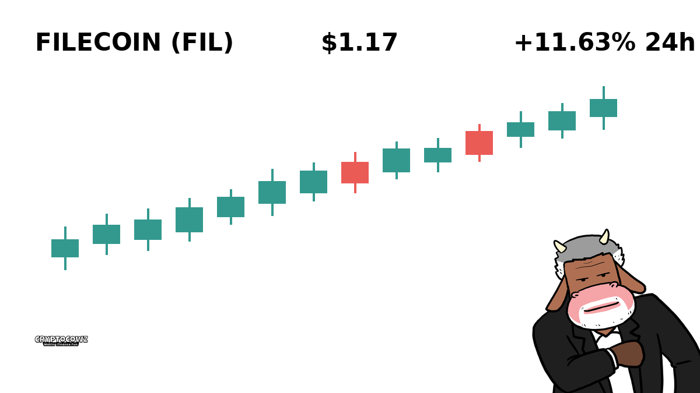
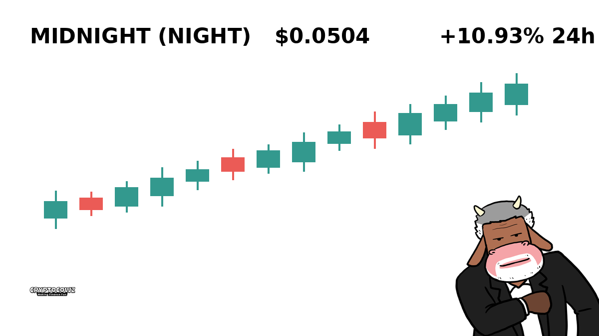
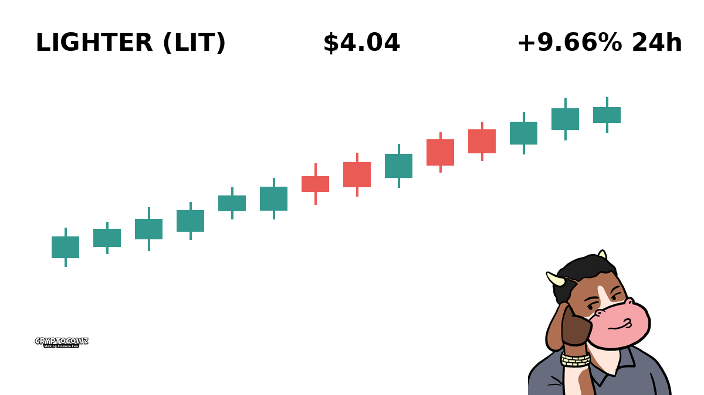
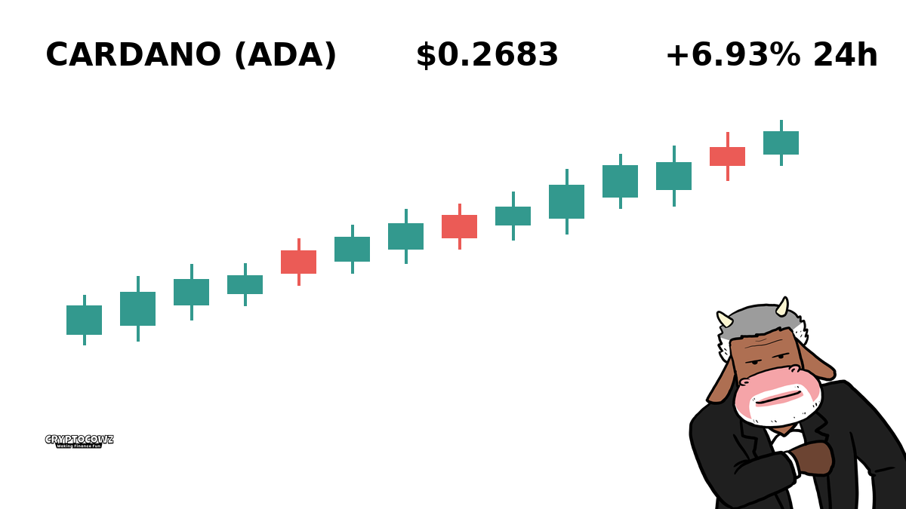
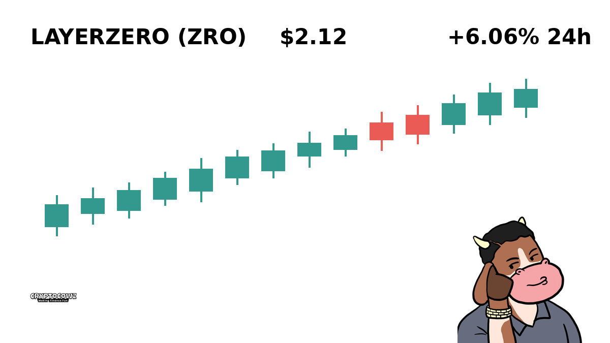
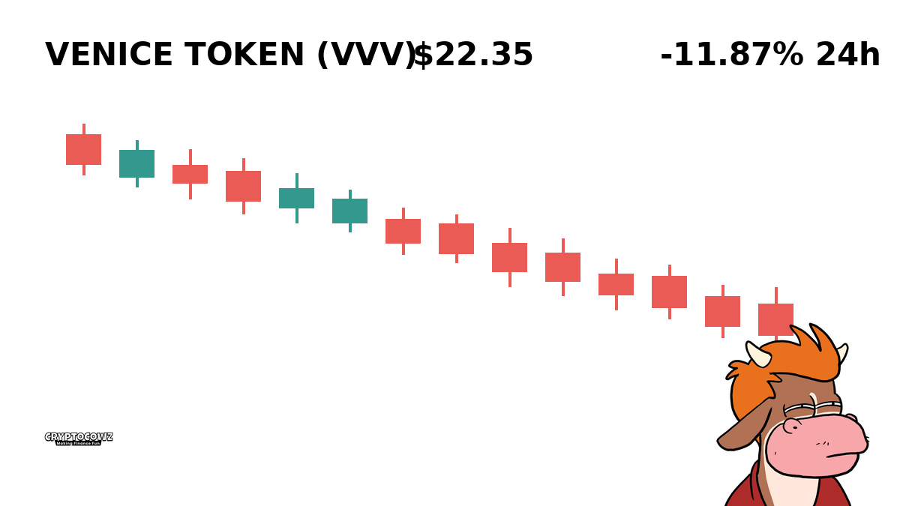
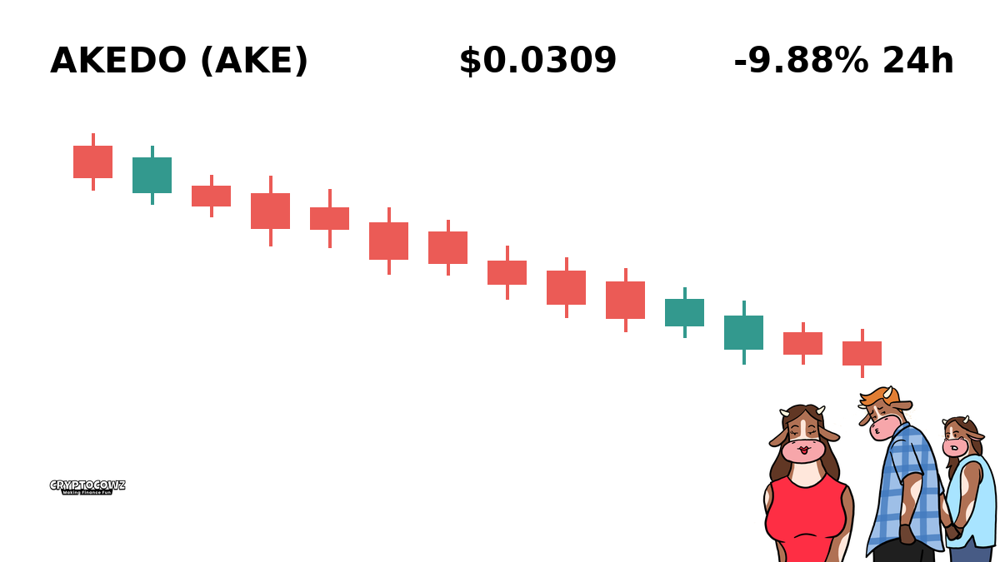

# Daily Top Movers: CMC Community Visuals & Posts

## 1. Filecoin ($FIL) — +11.63% (PUMP)
**Cast Member:** Skip Zinfandel
**CMC Comment:** Up 11%! I just uploaded my entire hard drive to Filecoin so I can store my future yacht receipts in the decentralized cloud!

---

## 2. Midnight ($NIGHT) — +10.93% (PUMP)
**Cast Member:** Sunshine Innocent Nimbus
**CMC Comment:** Midnight is pumping! The darkness is finally bringing us true financial enlightenment and a very shiny moonlit pasture!

---

## 3. Lighter ($LIT) — +9.66% (PUMP)
**Cast Member:** Frank Rizzo
**CMC Comment:** Lighter is up almost 10%! I am setting fire to my day job right now, my boss can keep the cubicle!

---

## 4. Cardano ($ADA) — +6.93% (PUMP)
**Cast Member:** Professor Hartmut
**CMC Comment:** A 6.9% increase in Cardano suggests peer-reviewed green candles are finally statistical realities. I shall celebrate with extra oats.

---

## 5. LayerZero ($ZRO) — +6.06% (PUMP)
**Cast Member:** Skip Zinfandel
**CMC Comment:** LayerZero bridged me straight into generational wealth today! Moving assets across chains faster than my ex-wife moved her clothes out.

---

## 6. Algorand ($ALGO) — -3.36% (DUMP)
**Cast Member:** Frank Rizzo
**CMC Comment:** Down 3.3%? Algorand is proof-of-stake? More like proof-of-holding-a-heavy-bag while crying in my truck!

---

## 7. Stacks ($STX) — -3.69% (DUMP)
**Cast Member:** Professor Hartmut
**CMC Comment:** The empirical evidence indicates Stacks is stacking losses today. My portfolio model requires immediate quantitative coping.

---

## 8. Venice Token ($VVV) — -3.74% (DUMP)
**Cast Member:** Sunshine Innocent Nimbus
**CMC Comment:** Venice Token is sinking faster than the real city! But do not worry, gondolas always float back up eventually right?

---

## 9. Sky ($SKY) — -7.76% (DUMP)
**Cast Member:** Skip Zinfandel
**CMC Comment:** Sky took a nosebleed plunge down nearly 8%! Turns out the sky was not the limit, it was just the altitude where my parachute failed.

---

## 10. Akedo ($AKE) — -9.88% (DUMP)
**Cast Member:** Frank Rizzo
**CMC Comment:** Down 10%! Akedo played us like a cheap arcade machine and stole my last quarter without even giving me a retry!

---
