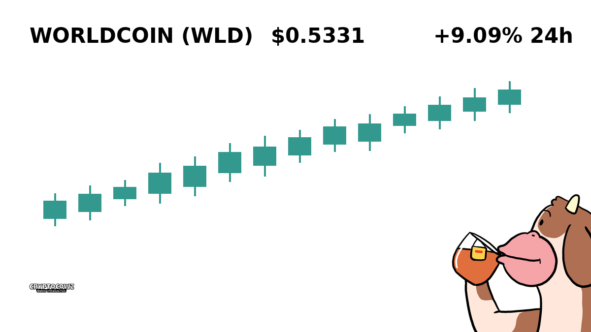
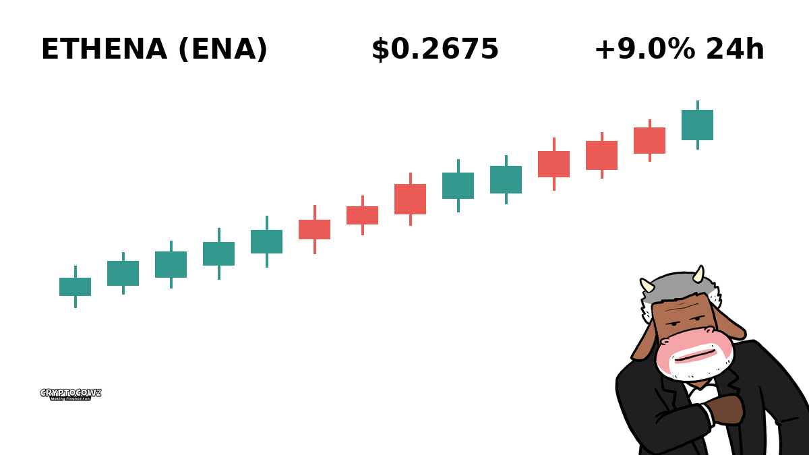
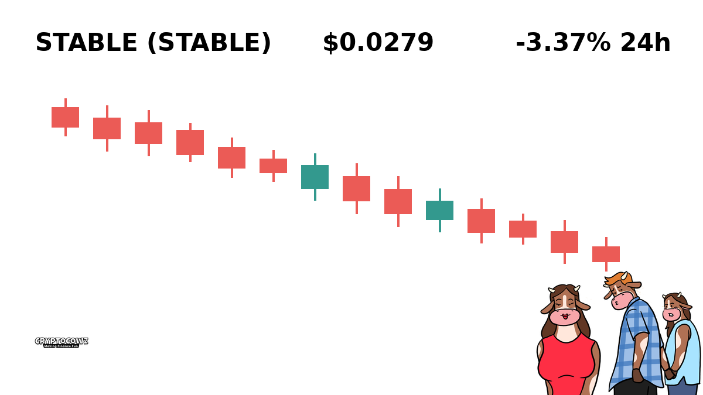
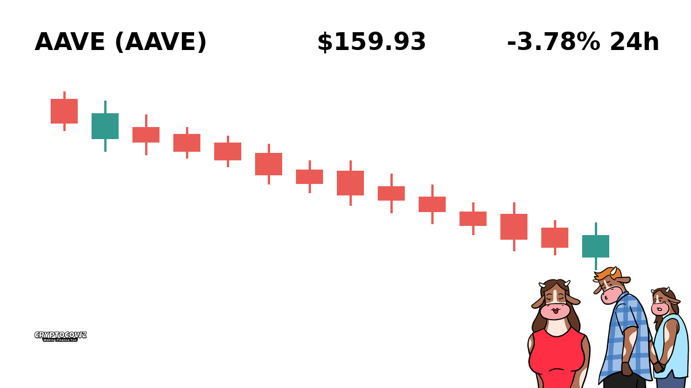
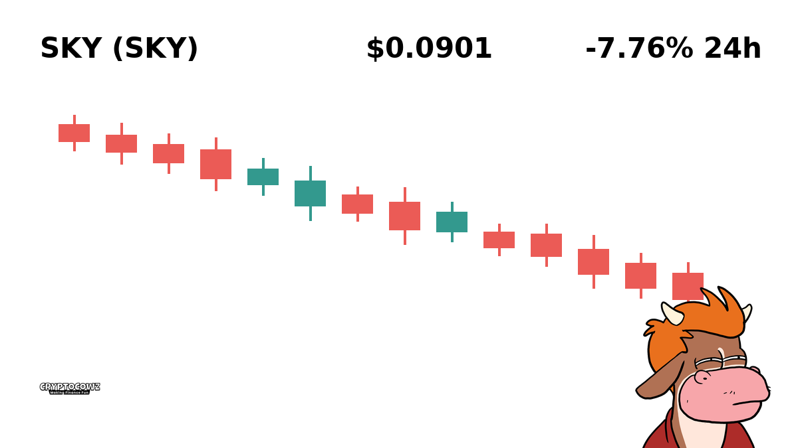
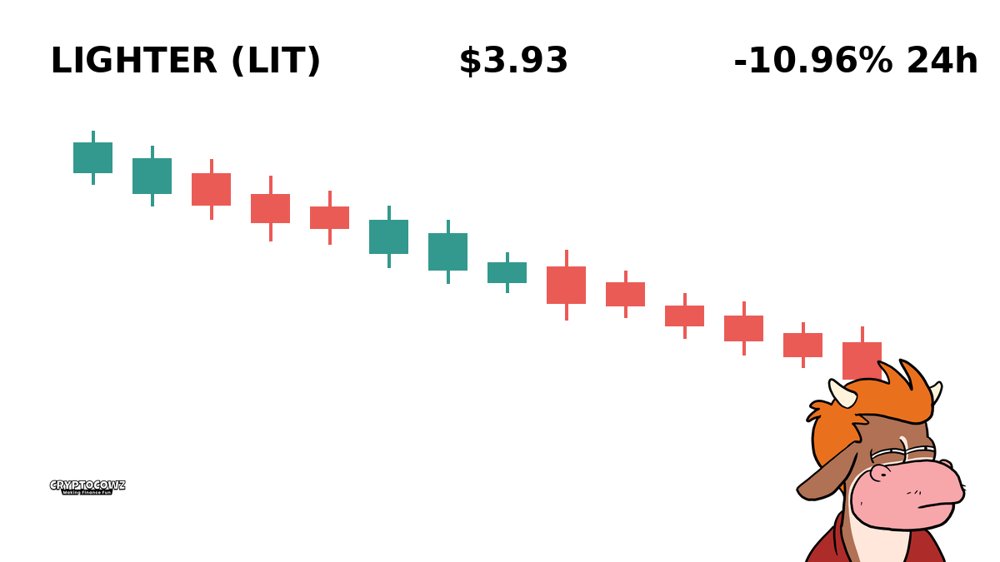

# Daily Top Movers: CMC Community Visuals & Posts

## 1. Quant ($QNT) — +20.33% (PUMP)
**Cast Member:** Skip Zinfandel
**CMC Comment:** Interoperability just bought me another jet ski! If you aren't all-in on enterprise tech, enjoy staying broke at the local kids table.

---

## 2. Stacks ($STX) — +14.72% (PUMP)
**Cast Member:** Professor Hartmut
**CMC Comment:** Smart contracts on Bitcoin represent a fundamental paradigm shift that my theoretical model predicted three whitepapers ago.

---

## 3. NEAR Protocol ($NEAR) — +10.68% (PUMP)
**Cast Member:** Sunshine Innocent Nimbus
**CMC Comment:** Wow, NEAR is getting so close to us all! I think the universe is sending us green energy arrows to heal our digital wallets.

---

## 4. Worldcoin ($WLD) — +9.09% (PUMP)
**Cast Member:** Skip Zinfandel
**CMC Comment:** I scanned both eyes and my third eye for this pump! Cybernetic perfection meets generational wealth, let's keep buying!

---

## 5. Ethena ($ENA) — +9.0% (PUMP)
**Cast Member:** Frank Rizzo
**CMC Comment:** Synthetic dollars? Listen pal, green is green and my bank account doesn't care if it came from an algorithm or a printing press.

---

## 6. ​​Stable ($STABLE) — -3.37% (DUMP)
**Cast Member:** Frank Rizzo
**CMC Comment:** Named 'Stable' and it immediately drops. Hey genius, my mother-in-law's blood pressure is more stable than this trash.

---

## 7. Rain ($RAIN) — -3.48% (DUMP)
**Cast Member:** Sunshine Innocent Nimbus
**CMC Comment:** Rain drops are falling on my portfolio... but every storm brings flowers eventually, right guys?

---

## 8. Aave ($AAVE) — -3.78% (DUMP)
**Cast Member:** Professor Hartmut
**CMC Comment:** Liquidity protocols experiencing localized yield compression is a standard macro stress test, though bagholders seem visibly agitated.

---

## 9. Sky ($SKY) — -7.91% (DUMP)
**Cast Member:** Skip Zinfandel
**CMC Comment:** Rebranded from Maker and the sky is literally falling! Time to rebrand again to 'Underground' so we can hit rock bottom properly.

---

## 10. Lighter ($LIT) — -10.96% (DUMP)
**Cast Member:** Frank Rizzo
**CMC Comment:** Down eleven percent? More like lighter on cash! Get this dumpster fire out of my sight before I blow a fuse.

---
