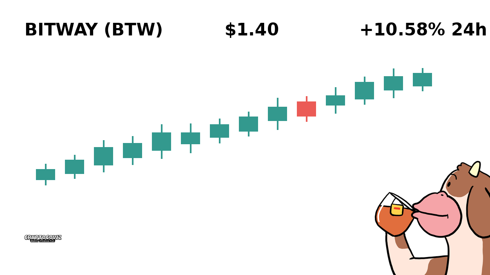
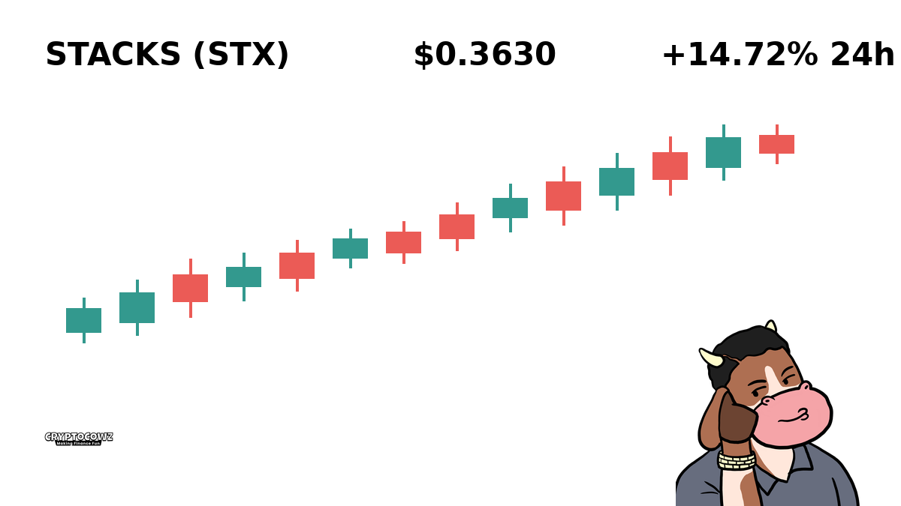
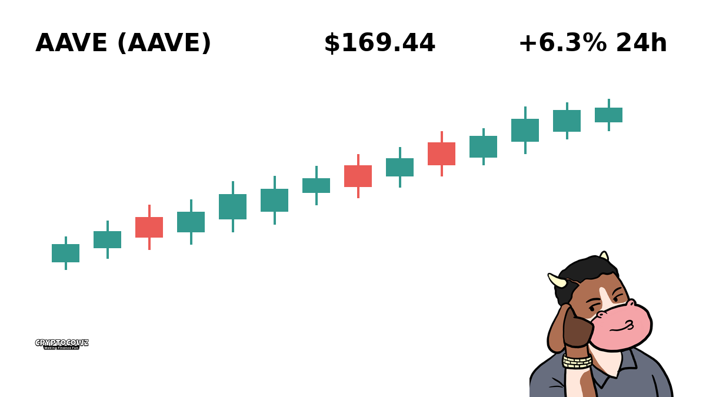
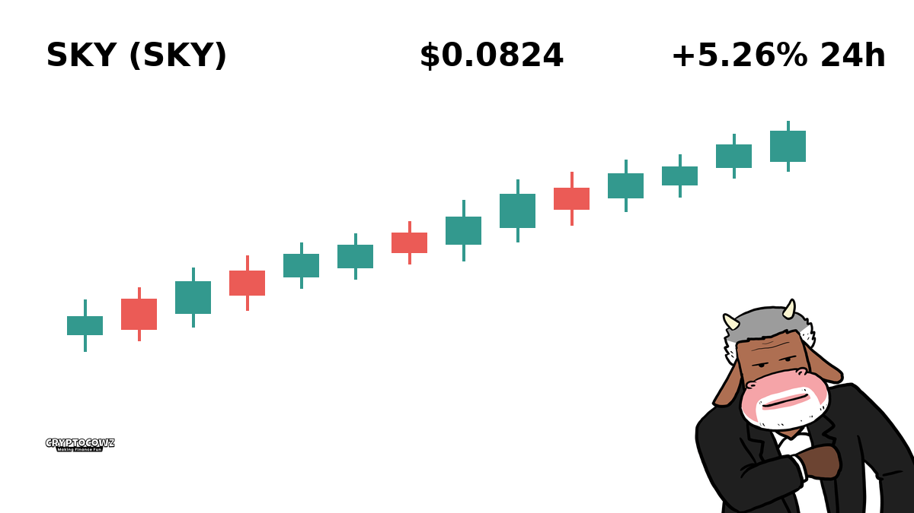
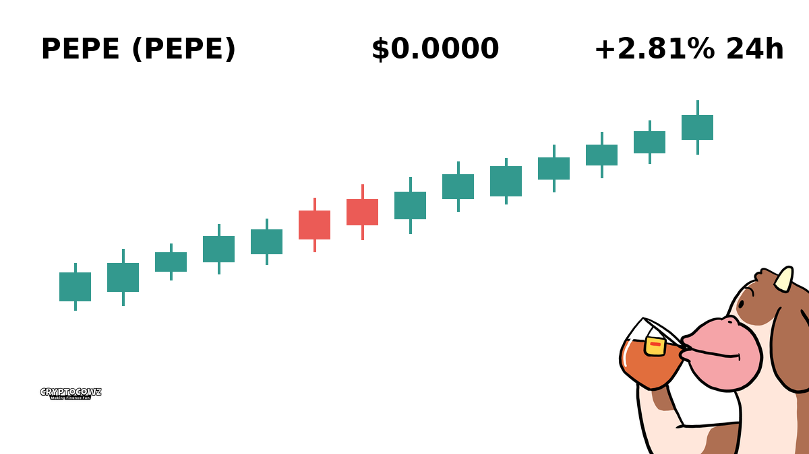
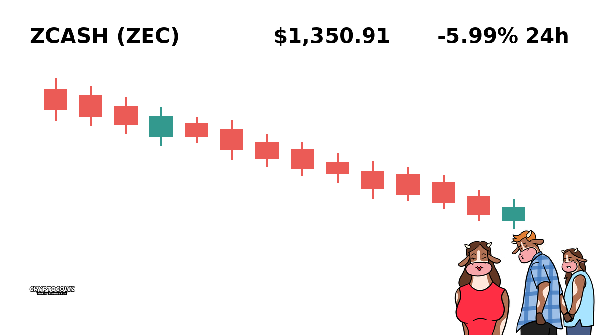
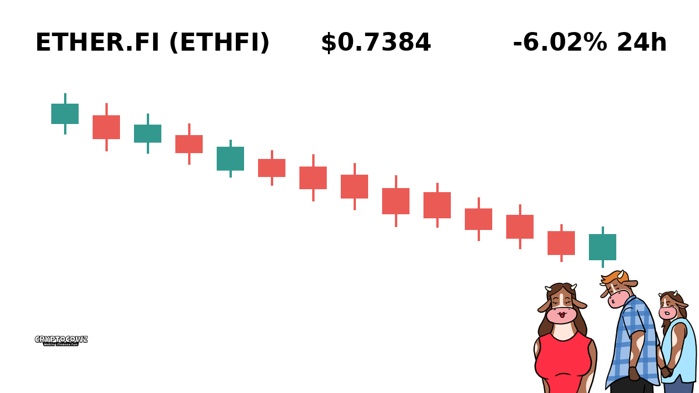
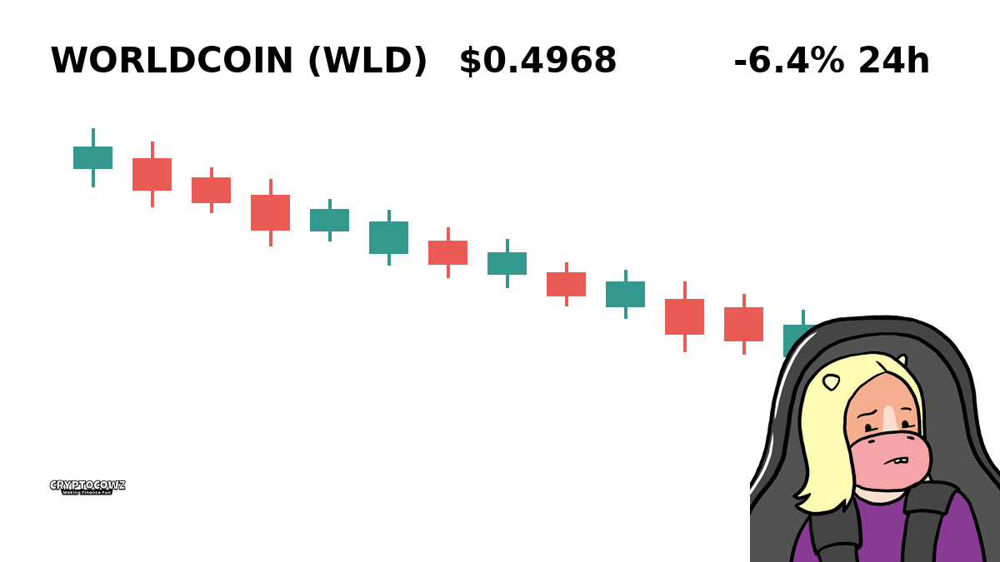
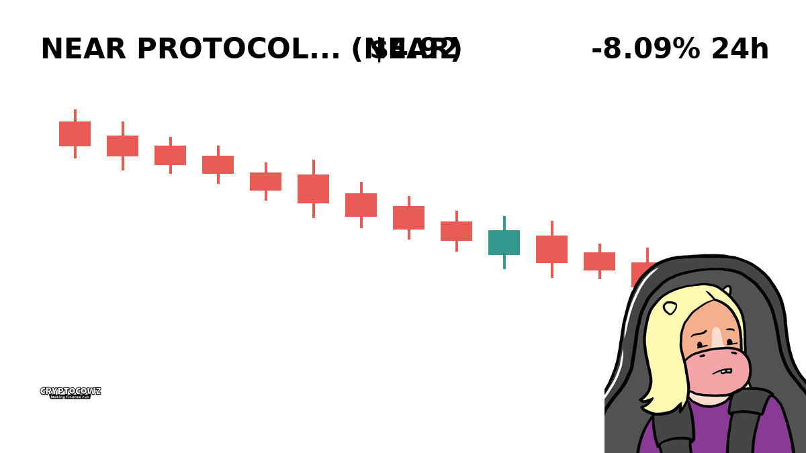
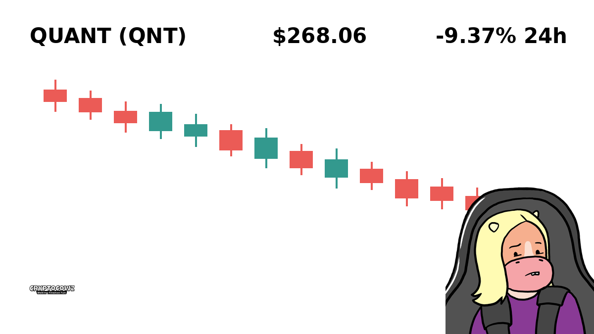

# Daily Top Movers: CMC Community Visuals & Posts

## 1. Bitway ($BTW) — +7.79% (PUMP)
**Cast Member:** Frank Rizzo
**CMC Comment:** Up nearly 8% and I've already quit my day job to focus full-time on staring at this candle.

---

## 2. Stacks ($STX) — +6.54% (PUMP)
**Cast Member:** Skip Zinfandel
**CMC Comment:** We are stacking gains so high my third ex-wife just texted me asking if I still have the keys to the boat.

---

## 3. Aave ($AAVE) — +6.3% (PUMP)
**Cast Member:** Professor Hartmut
**CMC Comment:** A fascinating liquidity surge proving that leverage is merely financial gravity waiting to be briefly defied.

---

## 4. Sky ($SKY) — +5.26% (PUMP)
**Cast Member:** Sunshine Innocent Nimbus
**CMC Comment:** The sky is literally the limit when we all believe together and ignore the sell button!

---

## 5. Pepe ($PEPE) — +2.81% (PUMP)
**Cast Member:** Skip Zinfandel
**CMC Comment:** A green frog printing green gains is the exact economic indicator my portfolio needed today.

---

## 6. Zcash ($ZEC) — -5.99% (DUMP)
**Cast Member:** Professor Hartmut
**CMC Comment:** Privacy coins allow one to lose money in absolute secrecy, which is the only dignity left in this market.

---

## 7. Ether.fi ($ETHFI) — -6.02% (DUMP)
**Cast Member:** Frank Rizzo
**CMC Comment:** Restaking my ETH just so I can earn yield on my catastrophic unrealized losses.

---

## 8. Worldcoin ($WLD) — -6.4% (DUMP)
**Cast Member:** Sunshine Innocent Nimbus
**CMC Comment:** Scanning my eyeballs didn't stop the red numbers, but at least the Orb says I have a beautiful iris!

---

## 9. NEAR Protocol ($NEAR) — -8.09% (DUMP)
**Cast Member:** Frank Rizzo
**CMC Comment:** NEAR Protocol? More like NEARly broke after watching this bag drop another 8%.

---

## 10. Quant ($QNT) — -9.37% (DUMP)
**Cast Member:** Skip Zinfandel
**CMC Comment:** Institutional adoption is coming, right after I finish liquidating my blood plasma to cover margin.

---
