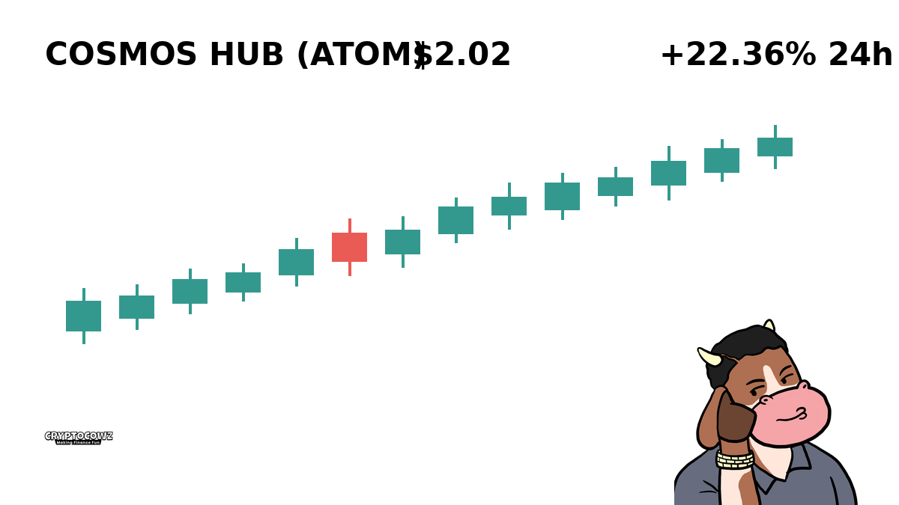
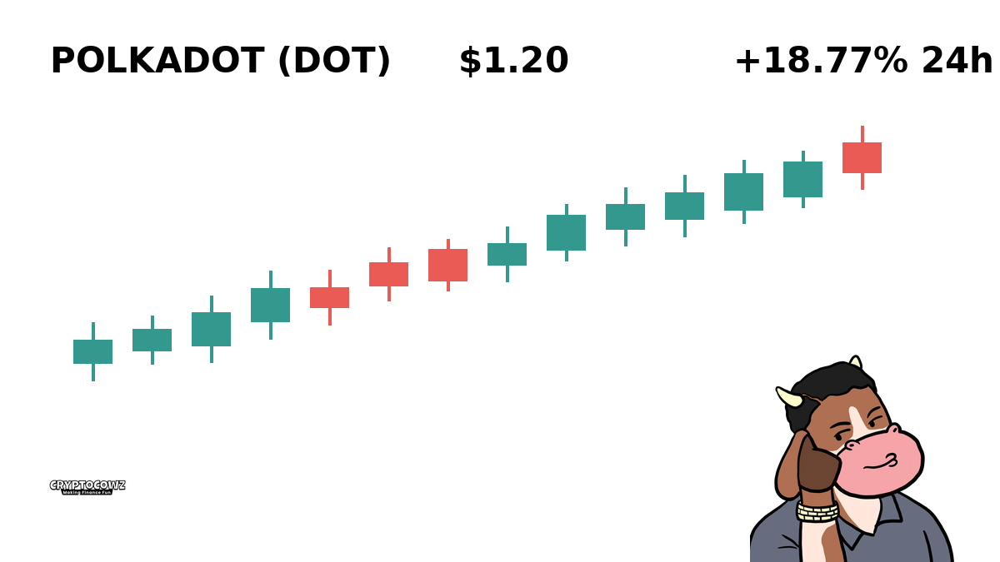
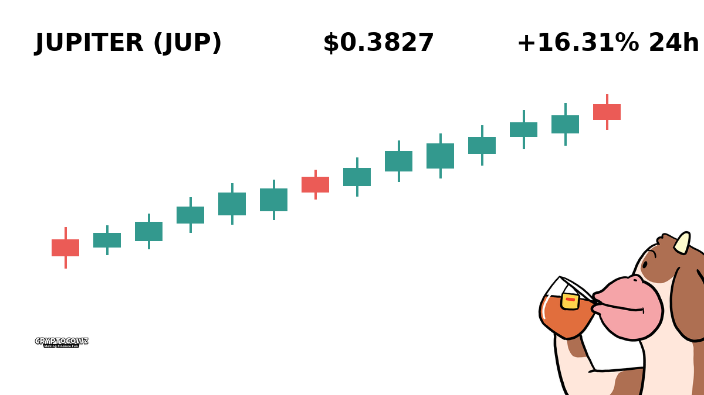
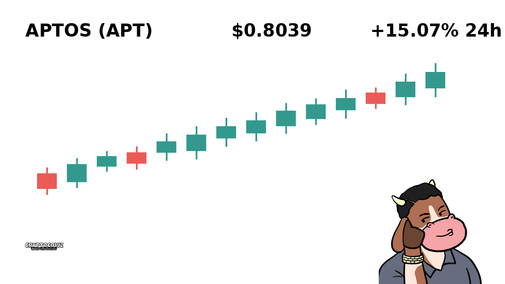
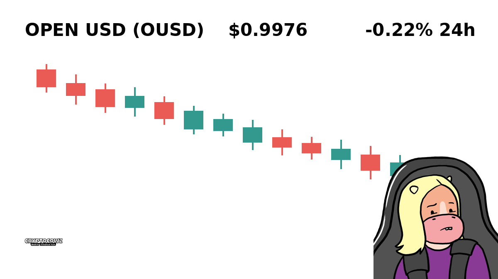
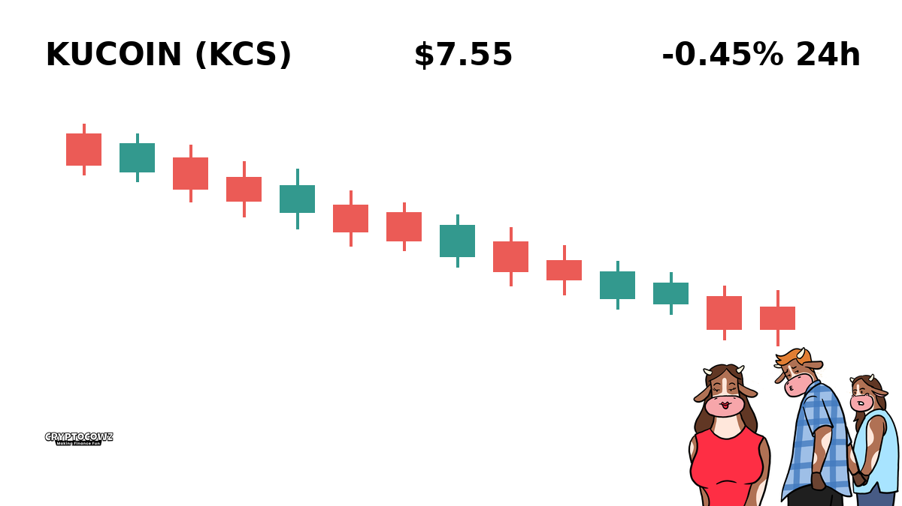
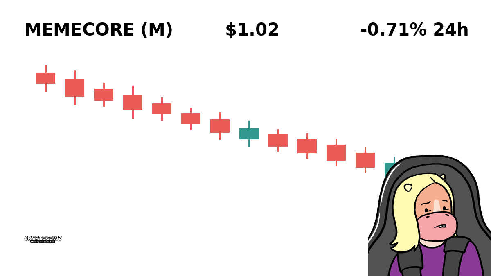
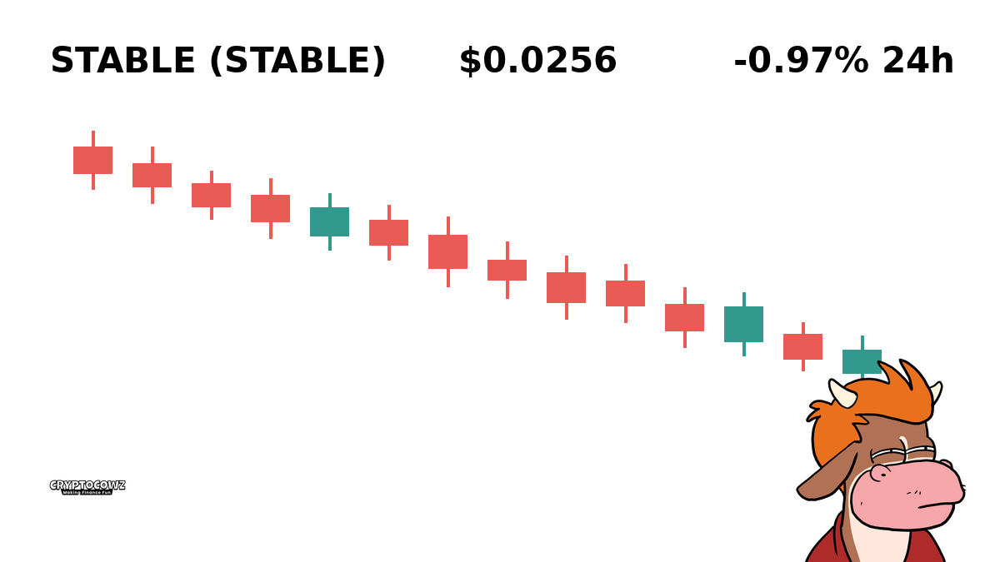

# Daily Top Movers: CMC Community Visuals & Posts

## 1. Cosmos Hub ($ATOM) — +22.36% (PUMP)
**Cast Member:** Skip Zinfandel
**CMC Comment:** ATOM is pumping so hard my third mortgage is practically paying for itself. Time to order another round of premium grass for the herd!

---

## 2. Polkadot ($DOT) — +18.77% (PUMP)
**Cast Member:** Professor Hartmut
**CMC Comment:** Mathematically speaking, this sudden upward velocity in Polkadot suggests a localized breakout of pure, unadulterated FOMO.

---

## 3. Jupiter ($JUP) — +16.31% (PUMP)
**Cast Member:** Sunshine Innocent Nimbus
**CMC Comment:** Jupiter is flying straight to the moon and bringing all the happy little bulls along for the magical ride!

---

## 4. Aptos ($APT) — +15.07% (PUMP)
**Cast Member:** Frank Rizzo
**CMC Comment:** Look at Aptos moving! I told ya, keep holding and you will be buying a whole fleet of sports tractors by next Tuesday.

---

## 5. XDC Network ($XDC) — +13.19% (PUMP)
**Cast Member:** Skip Zinfandel
**CMC Comment:** Up thirteen percent? That is what I call liquid luxury, folks. Pop the cork on the cheap champagne!

---

## 6. Open USD ($OUSD) — -0.22% (DUMP)
**Cast Member:** Professor Hartmut
**CMC Comment:** A 0.22% deviation from peg suggests micro-panic among traders who clearly lack fundamental thermodynamic discipline.

---

## 7. KuCoin ($KCS) — -0.45% (DUMP)
**Cast Member:** Frank Rizzo
**CMC Comment:** Down a tiny fraction and people are already weeping into their cereal like the sky is falling. Get a grip, jabronis!

---

## 8. MemeCore ($M) — -0.71% (DUMP)
**Cast Member:** Sunshine Innocent Nimbus
**CMC Comment:** Oh no, MemeCore dipped slightly, but I am sure it is just taking a quick little nap before its next big adventure!

---

## 9. ​​Stable ($STABLE) — -0.97% (DUMP)
**Cast Member:** Skip Zinfandel
**CMC Comment:** When a token literally named Stable starts dumping, you know it is time to hide under the barn desk.

---

## 10. Algorand ($ALGO) — -1.04% (DUMP)
**Cast Member:** Professor Hartmut
**CMC Comment:** Algorand's negative yield delta further confirms my hypothesis that emotional retail trading consistently defies rational logic.

---
