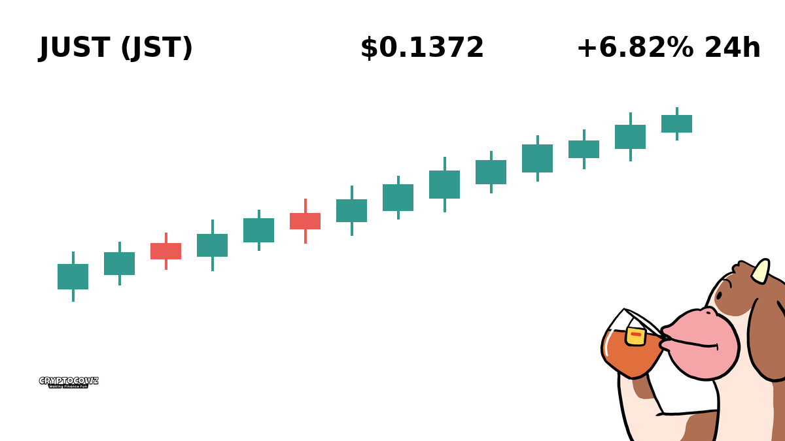
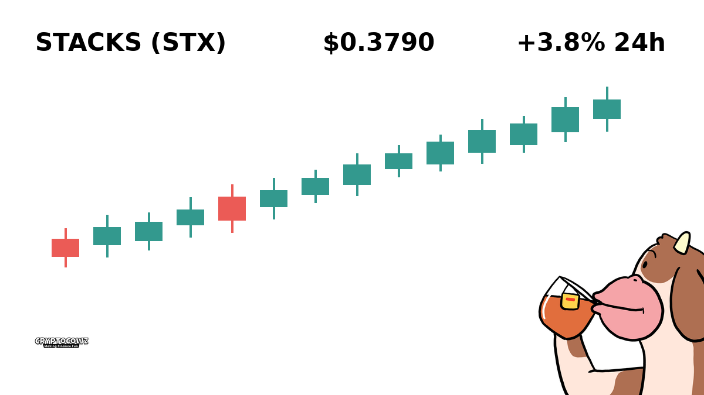
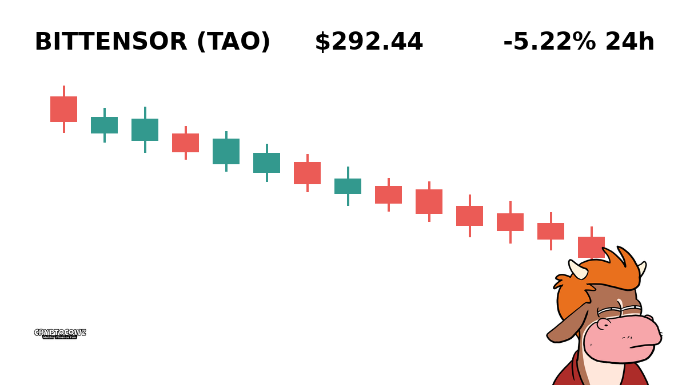
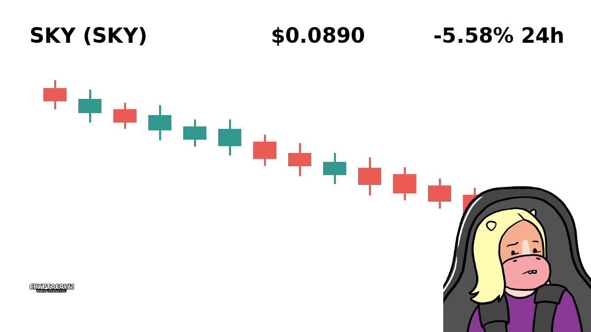
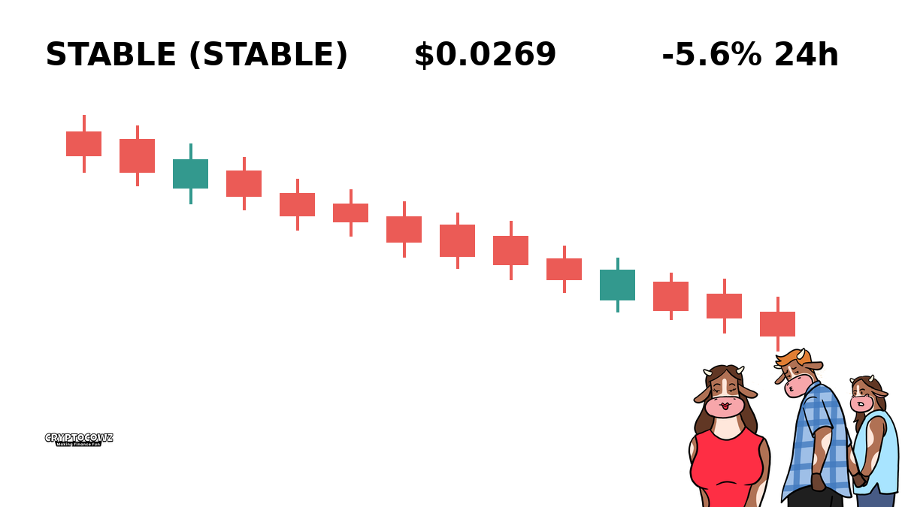
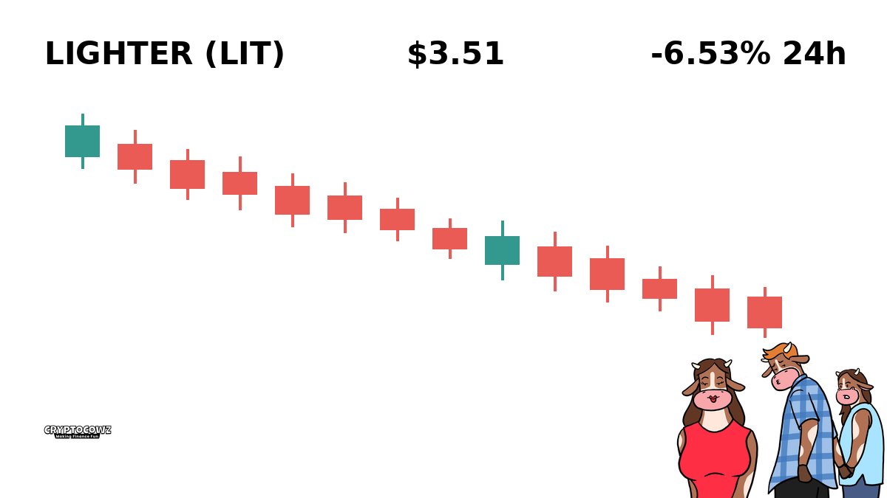

# Daily Top Movers: CMC Community Visuals & Posts

## 1. Midnight ($NIGHT) — +8.08% (PUMP)
**Cast Member:** Skip Zinfandel
**CMC Comment:** Up 8% in the dark! I've already leveraged my third mortgage because nothing screams long-term value like buying financial privacy at 2 AM.

---

## 2. LayerZero ($ZRO) — +7.99% (PUMP)
**Cast Member:** Frank Rizzo
**CMC Comment:** LayerZero bridging straight to my retirement fund, baby! I don't know what interoperability means, but my chart is green and my wife's lawyer is furious.

---

## 3. JUST ($JST) — +6.82% (PUMP)
**Cast Member:** Sunshine Innocent Nimbus
**CMC Comment:** JUST keep pumping, universe! The cosmos is aligning to make us all millionaires, or at least pay for my organic oat milk lattes.

---

## 4. Worldcoin ($WLD) — +4.06% (PUMP)
**Cast Member:** Professor Hartmut
**CMC Comment:** Scanned my retinas for a 4% pump, which statistically covers the cost of my eye drops. Truly a triumph of dystopian behavioral economics.

---

## 5. Stacks ($STX) — +3.8% (PUMP)
**Cast Member:** Skip Zinfandel
**CMC Comment:** Stacks is building on Bitcoin, which means my gains are practically backed by the founding fathers themselves. Time to order the gold-plated jet ski!

---

## 6. Bittensor ($TAO) — -5.22% (DUMP)
**Cast Member:** Professor Hartmut
**CMC Comment:** The artificial intelligence network seems to have calculated that your portfolio value should approach zero. Fascinating proof of algorithmic cruelty.

---

## 7. Sky ($SKY) — -5.58% (DUMP)
**Cast Member:** Frank Rizzo
**CMC Comment:** The sky is falling and so is my net worth. I told my cousin Vinny this was a safe play, now he won't return my lawnmower.

---

## 8. ​​Stable ($STABLE) — -5.6% (DUMP)
**Cast Member:** Sunshine Innocent Nimbus
**CMC Comment:** Irony is just the universe telling us to hold hands while we drop 5%. Remember friends, true stability lives in our hearts, not our wallet balance.

---

## 9. Lighter ($LIT) — -6.53% (DUMP)
**Cast Member:** Frank Rizzo
**CMC Comment:** Lighter? More like my pockets are lighter by six percent. Who turned down the flame on this dumpster fire?

---

## 10. Rain ($RAIN) — -7.72% (DUMP)
**Cast Member:** Skip Zinfandel
**CMC Comment:** It's raining red candles and my broker won't stop crying into his martini. I'm buying the dip with money I borrowed from my mother-in-law!

---
